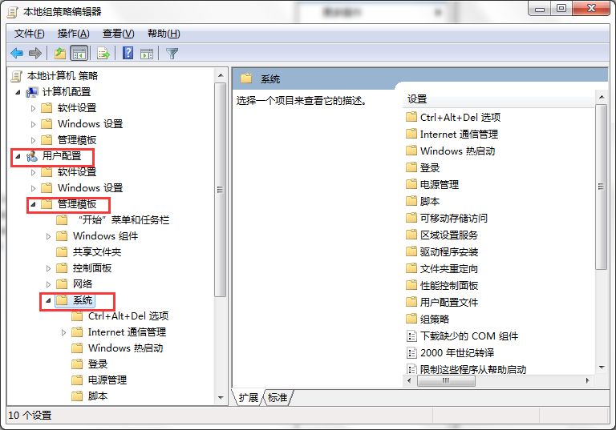
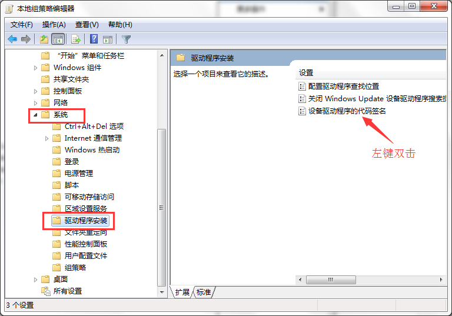

TPYBoard概述
=====================================

本地文件系统和SD卡
----------------------------

TPYBoard有小型内部文件系统，存储在微控制器的闪存，路径是 ``/flash``。
如果将SD卡插入卡槽，路径是 ``/sd``。

TPYBoard需要选择一个文件系统来引导，优先使用 ``/sd``，如果没有SD卡，它会使用内部文件系统 ``/flash``做为引导文件系统。
也可以根据需要在SD卡上创建空文件``/flash/SKIPSD``，TPYBoard将会始终使用内部文件系统启动(在这种情况下你可以使用 ``os.mount``来调用SD卡的应用程序)。

(注意：在一些旧版本上, ``/flash`` 也称 ``0:/`` 和 ``/sd`` 也称 ``1:/``).

启动文件系统主要做两件事情:检测是否通过usb线正确连接pc，再就是搜索查找 ``boot.py`` 和 ``main.py`` 文件。

内部文件系统将作为你PC的一个usb驱动器，可直接将文件保存到驱动器，可直接编辑 ``boot.py`` 和 ``main.py`` 。

*记着重置TPYBoard前要弹出(linux要unmount) usb驱动器*

启动模式
----------

正常通电或者按复位键,TPYBoard会进入标准模式: 首先执行 ``boot.py`` 文件，然后配置usb，再运行 ``main.py`` 文件。

当TPYBoard启动时，通过按住用户开关，您可以重写此启动顺序。 
按住用户开关和按复位键，然后继续按用户键，LED将以二进制计数。
当灯的状态到了你想要的模式，你就可以松开用户键,选定模式的LED将迅速闪烁，TPYBoard将启动。

模式是:

1. 绿灯, *标准启动*: 运行 ``boot.py`` 并调用 ``main.py``。
2. 黄灯, *安全启动*: 开机，不运行任何脚本。
3. 绿灯与黄灯同时亮, *文件系统重置*:将闪存文件系统重置为出厂状态，然后在安全模式下启动。

如果文件系统损坏，请使用启动模式3（文件系统重置）来修复。
重置系统后，使用损坏前可运行版本的程序，插入您的计算机不运行,你可以尝试将TPYBoard直接插到usb充电器上，或其他USB电源没有数据连接。

错误：闪烁LED
---------------------

目前你可能会看到有2种错误：
1。如果红色和绿色LED交替闪烁，则为Python脚本（例如，``main.py`` ）有错误。使用REPL来调试。
2。如果所有4个LED循环和关闭缓慢，然后有一个硬故障。这不能恢复，你需要做一个硬复位。

Win10系统如何禁用驱动程序签名强制
-----------------------------------

Windows 10系统对驱动程序的使用要求有数字签名，否则无法正常使用，但我们有时需要用到没有数字签名的驱动程序，怎么办呢？
-那就是禁用数字签名。如何禁用数字签名（驱动程序签名）强制呢？

-总结操作步骤如下：

1. 开始---运行（输入gpedit.msc）---确定，打开本地组策略编辑器；

2. 在打开的本地组策略编辑器窗口，找到(用户配置---管理模板---系统---驱动程序安装)；

3. 找到(设备驱动的代码签名，并左键双击---设备驱动的代码签名)；

4. 在打开的设备驱动的代码签名窗口，选择(已启用)；
在选项的下拉框中，有：警告、阻止、忽略供选择。

 - 警告：向用户通知未经数字签名的文件，并让用户决定是停止安装还是继续安装以及是否允许安装未经数字签名的文件。
 - 阻止：命令系统拒绝安装未经数字签名的文件。
 - 忽略：命令系统继续安装（包括安装未经数字签名的文件）。

如果我们要安装未经数字签名的驱动文件，可选择：忽略，再点击：确定。

*（我倒是建议选择警告，每次用户自己选择确定。）*
