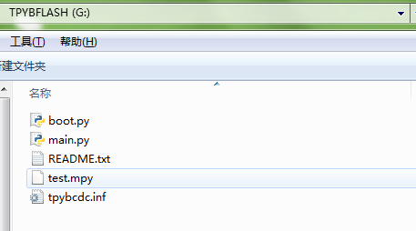

.. _quickref:

TPYBoard Micropython 保护Python脚本
====================================

接触过Python语言的人都知道，Python可以编译成.pyc文件，它是一种二进制文件，可以提高程序的加载速度，同时
也是一种保护源代码的有效方法。那么在micropython中，又该如何保护源程序呢？
贴心的micropython创始人也提供了类似的功能，可以将.py文件编译成.mpy文件。接下来，介绍一下具体的实现步骤。（本文主要以Linux Ubuntu系统为例）

搭建micropython编译环境
-------------------------
1.安装arm-none-eabi-gcc交叉编译工具和gcc编译器。

  sudo apt-get install gcc-arm-none-eabi
  sudo apt-get install gcc

2.下载micropython源码包到本地，我下载到了home目录下。

  git clone --recursive https://github.com/micropython/micropython.git

3.切换到/home/micropython/mpy-cross目录执行make，编译生成mpy-cross工具。

  make

.. image::img/1.png

.. image::img/2.png

4.在mpy-cross目录新建一下test.py文件，输入点亮LED4，用于测试。
   
   import pyb

   pyb.LED(4).on()

5.执行编译mpy文件的命令。

  ./mpy-cross test.py

其他相关功能可查看同目录下的README.md文件。

6.命令执行成功后，你就能发现同目录下出现了一个test.mpy文件。

.. image:: img/3.png

7.将test.mpy文件拷贝放到TPYBoard v10x的TPFLASH中，直接在main.py中import即可。

  import test

  
8.重置TPYBoard使其重新运行程序，大家就会看到LED4亮起来了。

**注意：**
如果运行时出现“ValueError: invalid .mpy file”错误的话，更新一下TPYboard的micropython固件就好了。

micropython官方下载地址：http://micropython.org/download

DFU-USB接口烧写固件参考：http://tpyboard.com/support/reference11/302.html

ST-LINK烧写固件参考：http://tpyboard.com/support/reference11/239.html