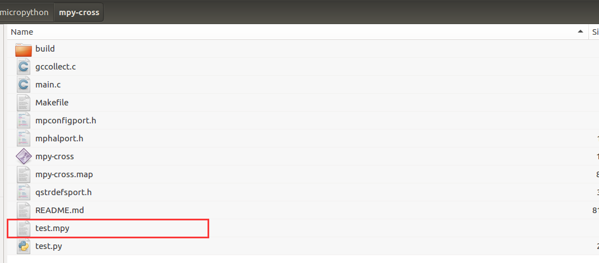

.. _quickref:

TPYBoard Micropython 保护Python脚本
====================================

接触过Python语言的人都知道，Python可以编译成.pyc文件，它是一种二进制文件，可以提高程序的加载速度，同时
也是一种保护源代码的有效方法。那么在micropython中，又该如何保护源程序呢？
micropython中提供了类似的功能，可以将.py文件编译成.mpy文件。接下来，介绍一下具体的实现步骤。（本文主要以Linux Ubuntu系统为例）

搭建micropython编译环境
-------------------------
1.安装arm-none-eabi-gcc交叉编译工具和gcc编译器。::

sudo apt-get install gcc-arm-none-eabi
sudo apt-get install gcc

2.下载micropython源码包到本地，我下载到了home目录下。::

git clone --recursive https://github.com/micropython/micropython.git

3.切换到/home/micropython/mpy-cross目录执行make，编译生成mpy-cross工具::

make

.. image::img/1.png

.. image::img/2.png

4.在mpy-cross目录新建一下test.py文件，输入一句打印Hello world，用于测试。

5.执行编译mpy文件的命令。::

mpy-cross test.py

如果提示“mpy-cross: command not found”，那就把mpy-cross的整个目录都输上，例如我的就是::

/home/micropython/mpy-cross/mpy-cross test.py

6.命令执行成功后，你就能发现同目录下出现了一个test.mpy文件。

