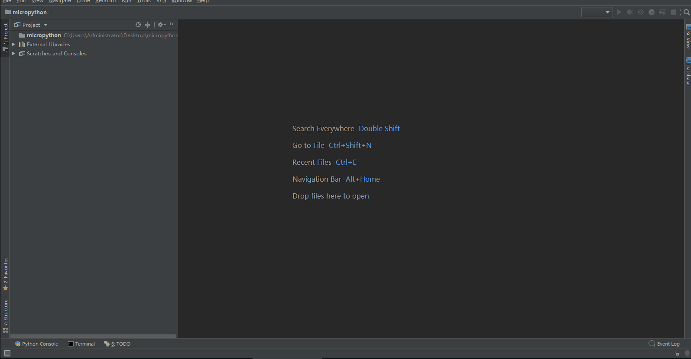
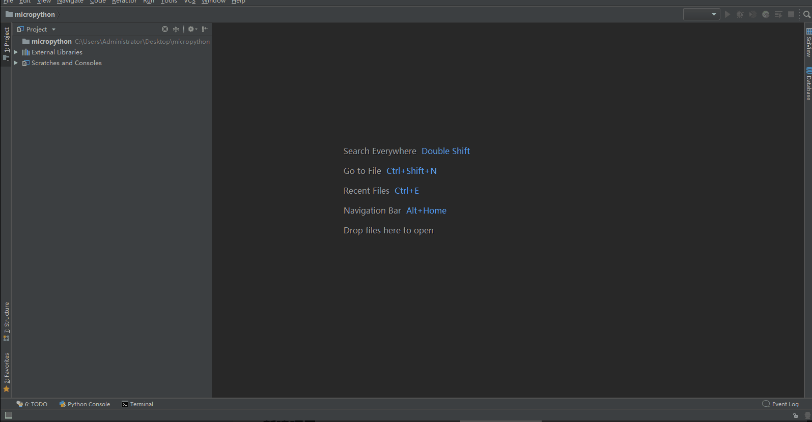
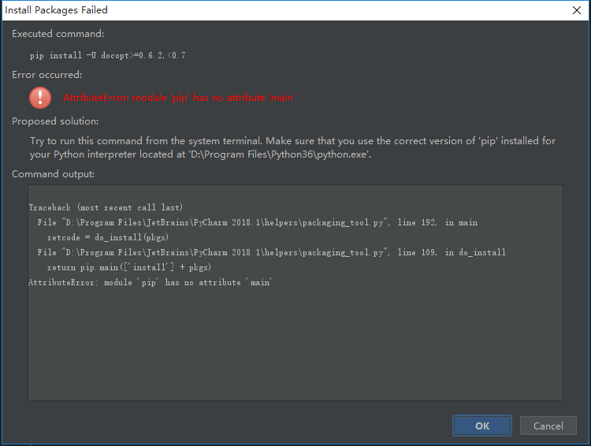
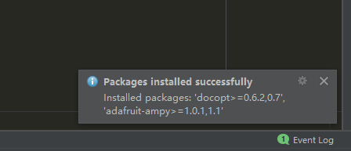
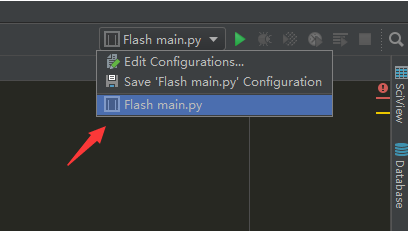
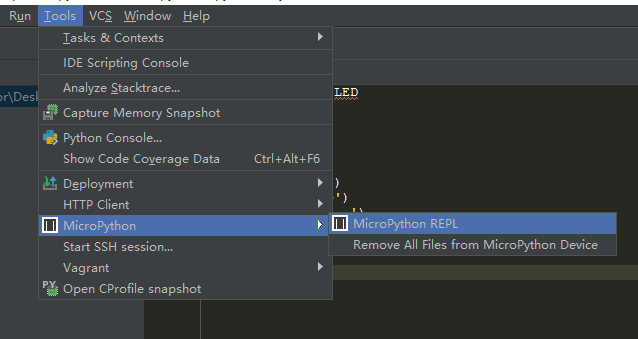
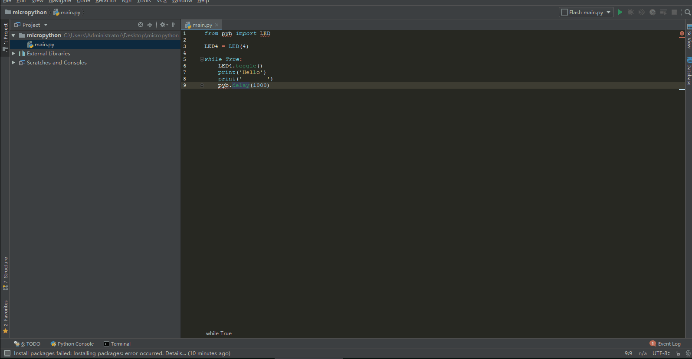

前言
--------------

PyCharm可以说是当今最流行的一款Python IDE了，大部分购买TPYBoard的小伙伴都会使用PyCharm编写MicroPython的程序。遗憾的是，只是把PyCharm当做了一种代码编辑器，调试依然还的需要其他辅助软件，比如PuTTY。其实最近也有不少小伙伴询问PyCharm中怎么安装MicroPython插件的问题，想着正好网站也缺少这部分的教程，不如实践一下总结下经验共享给大家，也好给爱好MicroPython的小伙伴提供便利。

准备工作
------------

*硬件要求*
 
 - **TPYBoard v102开发板 一块**

*电脑环境要求*
 
 - **windows系统（本教程以win10为例）**

 - **已安装Python环境（本教程Python 3.6.4）**

 - **已安装PyCharm软件**

 - **可接入网络**

PyCharm 2018专业版 安装和永久激活方法 `点击下载 <http://old.tpyboard.com/download/tool/201.html>`_ 。

动手安装
-------------------

**安装MicroPython插件**

1. 打开“PyCharm”软件，自己创建一个项目。菜单栏 *File => Settings => Plugins* ,输入 *micropython* 进行搜索，接着点击 *Search in repositories*，弹框出现MicroPython插件时点击 *Install* 进行安装，安装完毕后重启PyCharm软件。

**设置MicroPython的设备**

2. 将TPYBoard v102开发板通过USB数据线接入电脑中，然后菜单栏  *File => Settings => Languager & Frameworks => MicroPython* 勾选Enable MicroPython support，Device type选择Pyboard，Device path输入自己电脑上开发板对应的端口号，比如COM19。点击Apply进行应用，点击OK关闭对话框。

**REPL调试**

3. 安装是不是很简单，接下来测试一下。点击当前项目右键选择创建一个Python File，输入名称main。这时，PyCharm提示我需要升级docopt包，点击安装后提示错误，查看详情后如下图：

若没有遇到此问题的，可自行调到第4步。复制错误信息百度查找解决方法，找到了一个可行的方法就是：找到PyCharm的安装目录下的packaging_tool.py进行修改，packaging_tool.py在\JetBrains\PyCharm 2018.1\helpers目录下。打开packaging_tool.py文件进行修改（别用文本文档容易出错），找到do_install和do_uninstall这两个函数（错误信息里有），改为如下内容：

.. block-code:python

    def do_install(pkgs):
        try:
            try:
                from pip._internal import main
            except Exception:
                from pip import main
        except ImportError:
            error_no_pip()
        return main(['install'] + pkgs)

    def do_uninstall(pkgs):
        try:
            try:
                from pip._internal import main
            except Exception:
                from pip import main
        except ImportError:
            error_no_pip()
        return main(['uninstall', '-y'] + pkgs)

修改保存后，再点安装就好了。

4. 在main.py文件中输入以下的代码，该代码的功能就是每隔1秒反转下LED4的状态同时输出Hello字符。

.. block-code:python

    from pyb import LED

    LED4 = LED(4)

    while True:
        LED4.toggle()
        print('Hello')
        print('-------')
        pyb.delay(1000)

输入代码时你会发现，PyCharm对于pyb模块并没有代码智能提示的功能，这是因为此micropython插件并没有实现对pyb模块的支持，不过该插件已经包含了文件下载和REPL调试的功能，也是很厉害的贡献了。该插件源码的Github地址：`https://github.com/vlasovskikh/intellij-micropython <https://github.com/vlasovskikh/intellij-micropython>`_ 。

5. 编写保存后，点击软件右上角选择 *Flash main.py*，点击旁边的绿色箭头开始运行，main.py文件就会下载到板子里，下载完毕后会自动运行程序，软件下方的调试区会显示相关信息。如下：

.. image:: img/m4.png 

6. 菜单栏 *Tools => MicroPython => MicroPython REPL* 可以调出REPL调试界面，使用方法同PuTTY。每次调用时，他会先停止运行程序。

详细的操作步骤如下：

