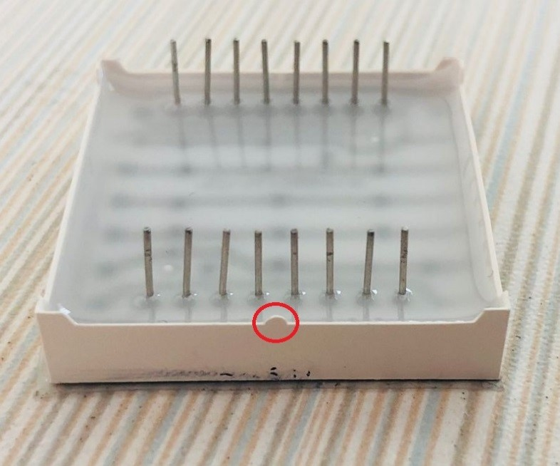
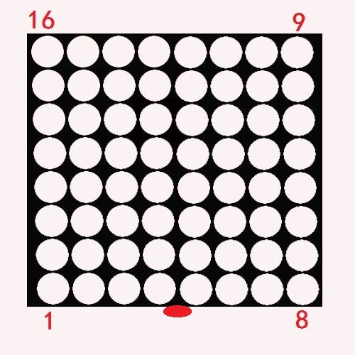

[Micropython]TPYBoard v102 跳动的心
=========================================

版权声明：翻译整理属于TPYBoard，转载时请以超链接形式标明文章原始出处和作者信息及本声明

实验目的
--------------------

- 学习在PC机系统中扩展简单I/O 接口的方法。
- 进一步学习编制数据输出程序的设计方法。
- 学习8*8点阵与TPYBoard的接线方法，点亮点阵。

所需元器件
----------------

- 8*8 LED点阵屏 1个
- TPYBoard v102板子 1块
- micro USB数据线 1条
- 杜邦线 若干

点亮8*8 LED点阵
-----------------------

8*8 LED点阵屏针脚图：

.. image:: http://old.tpyboard.com/ueditor/php/upload/image/20161031/1477879225908683.png

通过针脚图，大家可以看出点阵屏中发光二极管对应的行、列数与实际针脚编号不是顺序对应的。上图中带圆圈的数字表示的是点阵屏的针脚编号，不带圆圈的数字表示的是灯珠的行、列编号。

比如，我们要点亮第一行第一个，则将第9针脚接高电平，第13针脚接低电平，就会被点亮。如果要将第一行全部点亮，则将第9针脚接高电平，第13、3、4、10、6、11、15、16针脚接低电平，那第一行就会被全部点亮。

了解完显示原理后，接下来介绍一下点阵屏的针脚。点阵屏背面图：

大家翻到点阵屏的背面，可以看到有一侧凸出了一个小点，这个小点表示为点阵屏的底部。
通过这个小点，我们就可以区别开点阵屏的针脚，下图中用红点表示底部凸起的小点。

*不同厂家标注的方式不同，有的会直接在1号针脚旁标注1。*

针脚确认了，接下来我们就可以接线了（注意下表中小括号内的数字为点阵屏的针脚编号）。

+------------+---------------+
| 点阵屏ROW  | TPYBoard v10x |
+============+===============+
| 1(9)       | X1            |
+------------+---------------+
| 2(14)      | X2            |
+------------+---------------+
| 3(8)       | X3            |
+------------+---------------+
| 4(12)      | X4            |
+------------+---------------+
| 5(1)       | X5            |
+------------+---------------+
| 6(7)       | X6            |
+------------+---------------+
| 7(2)       | X7            |
+------------+---------------+
| 8(5)       | X8            |
+------------+---------------+

+------------+---------------+
| 点阵屏COL  | TPYBoard v10x |
+============+===============+
| 1(13)      | Y1            |
+------------+---------------+
| 2(3)       | Y2            |
+------------+---------------+
| 3(4)       | Y3            |
+------------+---------------+
| 4(10)      | Y4            |
+------------+---------------+
| 5(6)       | Y5            |
+------------+---------------+
| 6(11)      | Y6            |
+------------+---------------+
| 7(15)      | Y7            |
+------------+---------------+
| 8(16)      | Y8            |
+------------+---------------+

8*8 LED点阵显示心形
-----------------------

效果图：

.. image:: http://old.tpyboard.com/ueditor/php/upload/image/20161031/1477882469674497.jpg

我们按照上面的步骤接线完毕后，编写main.py文件，下面是显示心形图案的源代码：

.. code-block:: python

    # main.py -- put your code here!
    import  pyb
    from pyb import Pin
    x_row = [Pin(i, Pin.OUT_PP) for i in ['X1','X2','X3','X4','X5','X6','X7','X8']]
    y_col = [Pin(i, Pin.OUT_PP) for i in ['Y1','Y2','Y3','Y4','Y5','Y6','Y7','Y8']]
    tuxing = [
    #大心
    ['11111111','10011001','00000000','00000000','10000001','11000011','11100111','11111111'],
    #小心
    ['11111111','11111111','10011001','10000001','11000011','11100111','11111111','11111111']
    ]
    def displayLED(num):
        for i,j in enumerate(x_row):
            x_row[i-1].value(0)
            data = tuxing[num][i]
            for k,v in enumerate(data):
                y_col[k].value(int(v))
            j.value(1)
            pyb.delay(1)

    while True:
        for i in range(2):
            for k in range(100):
                displayLED(i)

- `下载源码 <https://github.com/TPYBoard/TPYBoard-v102>`_
