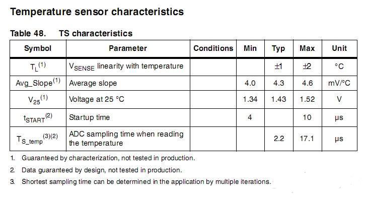
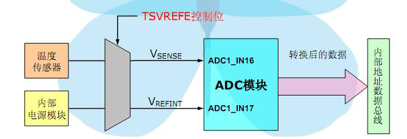

[Micropython]TPYBoardV10X 读取芯片上的温度传感器
=============================================

1TPYBoard读取芯片上的温度传感器
---------------------------------------------

1.1STM32 内部温度传感器概要
>>>>>>>>>>>>>>>>>>>>>>>>>>>>>>>>>>>>>>>>

STM32 芯片内部一项独特的功能就是内部集成了一个温度传感器, 因为是内置, 所以测试的是芯片内部的温度, 如果芯片外接负载一定的情况下, 那么芯片的发热也基本稳定, 相对于外界的温度而言, 这个偏差值也是基本稳定的. 也就是说用 STM32 内部传感器来测量外界环境的温度。
在一些恶劣的应用环境下面, 可以通过检测芯片内部而感知设备的工作环境温度, 如果温度过高或者过低了 则马上睡眠或者停止运转. 可以保证您的设备工作的可靠性。

1.2  STM32内部温度传感器参数
>>>>>>>>>>>>>>>>>>>>>>>>>>>>>>>>>>>>>>>>>>>>>>>

- 1. STM32内部温度传感器与ADC的通道16相连，与ADC配合使用实现温度测量。

- 2.测量范围–40~125℃，精度±1.5℃。

- 3.温度传感器产生一个随温度线性变化的电压，转换范围在2V < VDDA < 3.6V之间。转换公式如下图所示：

.. image:: ../img/test_211.png

手册中对于公式中的参数说明：

1.3  读取温度的实现原理
>>>>>>>>>>>>>>>>>>>>>>>>>>>>>>>>>>>>

写代码的时候, 在测量要求不怎么高的情况下, 公式可以简化。简化的公式：
  
		Temperature= (1.42 - ADC_Value*3.3/4096)*1000/4.35 + 25

程序编写：

- 1. 初始化ADC , 初始化DMA

	注意:内部温度传感器是使用了 ADC1 的第 16 通道哦.

- 2. ADC_TempSensorVrefintCmd(ENABLE); 

	使能温度传感器和内部参考电压通道 

- 3. 按照刚才列出的公式计算

	Temperature= (1.42 - ADC_Value*3.3/4096)*1000/4.35 + 25;

1.4  TPYBoard读取温度例程
>>>>>>>>>>>>>>>>>>>>>>>>>>>>>>>>>>>

main::

	# main.py -- put your code here!
	import pyb
	import time
	import stm
	from pyb import Pin

	def adcread(chan):                              # 16 temp 17 vbat 18 vref
		assert chan >= 16 and chan <= 18, 'Invalid ADC channel'
		start = pyb.millis()
		timeout = 100
		stm.mem32[stm.RCC + stm.RCC_APB2ENR] |= 0x100 # enable ADC1 clock.0x4100
		stm.mem32[stm.ADC1 + stm.ADC_CR2] = 1       # Turn on ADC
		stm.mem32[stm.ADC1 + stm.ADC_CR1] = 0       # 12 bit
		if chan == 17:
			stm.mem32[stm.ADC1 + stm.ADC_SMPR1] = 0x200000 # 15 cycles
			stm.mem32[stm.ADC + 4] = 1 << 23
		elif chan == 18:
			stm.mem32[stm.ADC1 + stm.ADC_SMPR1] = 0x1000000
			stm.mem32[stm.ADC + 4] = 0xc00000
		else:
			stm.mem32[stm.ADC1 + stm.ADC_SMPR1] = 0x40000
			stm.mem32[stm.ADC + 4] = 1 << 23
		stm.mem32[stm.ADC1 + stm.ADC_SQR3] = chan
		stm.mem32[stm.ADC1 + stm.ADC_CR2] = 1 | (1 << 30) | (1 << 10) # start conversion
		while not stm.mem32[stm.ADC1 + stm.ADC_SR] & 2: # wait for EOC
			if pyb.elapsed_millis(start) > timeout:
				raise OSError('ADC timout')
		data = stm.mem32[stm.ADC1 + stm.ADC_DR]     # clear down EOC
		stm.mem32[stm.ADC1 + stm.ADC_CR2] = 0       # Turn off ADC
		return data

	def v33():
		return 4096 * 1.21 / adcread(17)

	def vbat():
		return  1.21 * 2 * adcread(18) / adcread(17)  # 2:1 divider on Vbat channel

	def vref():
		return 3.3 * adcread(17) / 4096

	def temperature():
		return 25 + 400 * (3.3 * adcread(16) / 4096 - 0.76)

	adc = pyb.ADCAll(12)
	leds = [pyb.LED(i) for i in range(1,5)]

	sw=pyb.Switch()
	def test():
		pyb.LED(1).on()
		pyb.LED(2).on()
		pyb.LED(3).on()
		pyb.LED(4).on()
		pyb.delay(2000)
	sw.callback(test)

	for l in leds:
		l.off()

	n = 0

	try:
	   while True:
		  n = (n + 1) % 4
		  leds[n].toggle()
		  pyb.delay(50)
		  print('v33:',v33())
		  print('vbat:',vbat())
		  print('vref:',vref())
		  print('temperature:',temperature())
	finally:
		for l in leds:
			l.off()