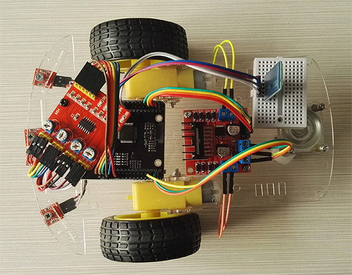
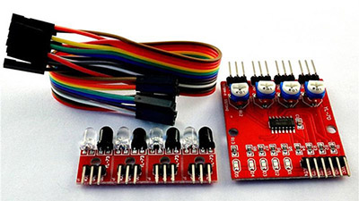
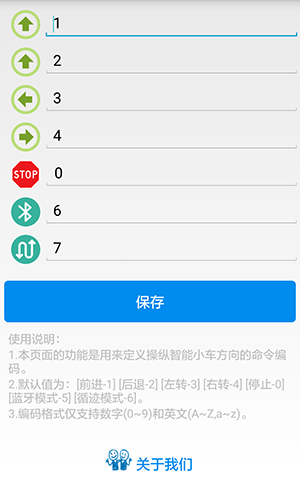
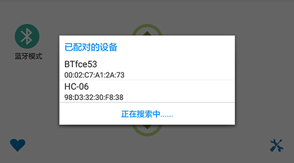
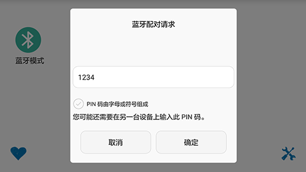

[Micropython]TPYBoard v10x 智能蓝牙+红外循迹小车
===================================================

原创版权归山东萝卜科技有限公司所有,转载必须以链接形式注明作者和原始出处。

实验目的
-----------------

	- 学习在PC机系统中扩展简单I/O 接口的方法。
	- 进一步学习编制数据输出程序的设计方法。
	- 学习蓝牙模块的接线方法及其工作原理。
	- 学习 L298N电机驱动板模块的接线方法。
	- 学习蓝牙控制小车的工作原理。

所需元器件
------------------

	- TPYBoard v102板子 1块
	- 蓝牙串口透传模块(HC-06) 1个
	- L298N电机驱动板模块 1个
	- 智能小车底盘 1个
	- 数据线 1条
	- 杜邦线 若干
    - 智能蓝牙小车APP(Android版) `点击下载 <http://tpyboard.com/download/tool/188.html>`_

蓝牙串口模块原理
--------------------------

.. image:: http://www.tpyboard.com/ueditor/php/upload/image/20161215/1481791173622577.png

(1)引出接口包括EN,5V,GND,TX,RX,STATE,我们小车只用到RX,TX,GND,5V四个针脚

(2)模块默认波特率位9600，默认配对密码为1234，默认名称位为HC-06

(3)led指示蓝牙连接状态，闪烁表示没有蓝牙连接，常亮表示蓝牙已连接并打开了端口，当我们用安卓手机软件发送指令时,通过串口给TPYBoard发送指令，TPYBoard收到指令通过L298BN模块来驱动小车前进，后退，向左，向右或者停止。

如下表接线:

	+-------------------+-------------------+
	|  蓝牙模块(HC-06)  |   TPYBoardv10x    |
	+===================+===================+
	|  5V               |   VIN(+5V)        | 
	+-------------------+-------------------+
	|  GND              |   GND             | 
	+-------------------+-------------------+
	|  RX               |   Y9(UART(3)-TX)  |
	+-------------------+-------------------+
	|  TX               |   Y10(UART(3)-RX) |
	+-------------------+-------------------+

四路红外循迹模块
----------------------------------------

(1)当模块检测到前方障碍物信号时，电路板上红色指示灯点亮，同时OUT端口持续输出低电平信号,该模块检测距离2～60cm，检测角度35°，检测距离可以通过电位器进行调节，顺时针调电位器，检测距离增加；逆时针调电位器，检测距离减少。 

(2)传感器属于红外线反射探测,因此目标的反射率和形状是探测距离的关键。其中黑色探测距离最小,白色最大;小面积物体距离小,大面积距离大。 

(3)传感器模块输出端口OUT可直接与单片机IO口连接即可， 也可以直接驱动一个5V继电器模块或者蜂鸣器模块；连接方式： VCC-VCC、GND-GND、OUT-IO。 

(4)比较器采用LM339，工作稳定。

(5)可采用3.3V-5V直流电源对模块进行供电。当电源接通时， 绿色电源指示灯点亮。

四路红外感应探头的安装
^^^^^^^^^^^^^^^^^^^^^^^^^^^^^^

寻迹的原理其实就光的吸收，反射和散射。大家都知道，白色反射所有颜色的光，而黑色吸收所有颜色的光，这就为小车寻迹提供了有力的科学依据。在小车的车头上安装上红外探头（我是安装了四个），一字顺序排开。哪个探头接收不到反射或者散射回来的光时，说明这个探头此时正在黑色的寻迹带上。

判断反馈的信号
^^^^^^^^^^^^^^^^^^^^^^^

如果要是正前方的探头接收不到光，那么说明小车此时走在黑色的寻迹带上。可以使小车直线行走。如果左面的探头接收不到光，那么说明小车左面出现了黑色寻迹带，此时小车应该执行左转弯。右转弯同左转弯原理。
如果要是小车前面，左面，右面三个方向全都接收不到光，或者是两个方向上的探头都接收不到光，到底是左转弯，右转弯还是继续直行，这个就要看你自己在程序里怎么做判断了。

探头的安装与接线
^^^^^^^^^^^^^^^^^^^^

四路红外探头接线很简单，虽然有十八根线，但是有十二根是三根三根的分成四组，一一对应接线，其余的六根，是VCC和GND。还有四根是接到TPYBoard v10x开发板的IO口上的，用于接收四路红外循迹模块反馈的信号。

接线OK后，编写main.py，给TPYBoard通电就ok了，下面是源代码。

源代码
--------------------

.. code-block:: python

    # main.py -- put your code here!
    import pyb
    from pyb import UART
    from pyb import Pin

    N1 = Pin('X1', Pin.OUT_PP)
    N2 = Pin('X2', Pin.OUT_PP)
    N3 = Pin('X3', Pin.OUT_PP)
    N4 = Pin('X4', Pin.OUT_PP)

    M1 = Pin('Y1', Pin.IN)
    M2 = Pin('Y2', Pin.IN)
    M3 = Pin('Y3', Pin.IN)
    M4 = Pin('Y4', Pin.IN)

    blue=UART(3,9600)
    mode='1'#1:表示蓝牙模式 2:循迹模式

    def Stop():
        N1.low()
        N2.low()
        N3.low()
        N4.low()
    def Back():
        N1.high()
        N2.low()
        N3.high()
        N4.low()
    def Go():
        N1.low()
        N2.high()
        N3.low()
        N4.high()
    def Left():
        N1.high()
        N2.low()
        N3.low()
        N4.high()
    def Right():
        N1.low()
        N2.high()
        N3.high()
        N4.low()
    while True:
        if blue.any()>0:
            data=blue.read().decode()
            print(data)
            if data.find('0')>-1:
                #stop
                Stop()
                mode="1"
                print('stop')
            if data.find('1')>-1:
                Go()
                print('go')
            if data.find('2')>-1:
                Back()
                pyb.delay(500)
                Stop()
            if data.find('3')>-1:
                Left()
                pyb.delay(250)
                Stop()
            if data.find('4')>-1:
                Right()
                pyb.delay(250)
                Stop()
            if data.find('5')>-1:
                mode="1"
                Stop()
            if data.find('6')>-1:
                mode="2"
        else:
            if mode=="2":
                print('循迹模式')
                if(M1.value() and M2.value() and M3.value()):
                    Stop()
                    mode="1"
                if(M2.value() or M3.value()):
                    pyb.LED(2).on()
                    pyb.LED(3).off()
                    pyb.LED(4).off()
                    Go()
                if M1.value():
                    pyb.LED(3).on()
                    pyb.LED(2).off()
                    pyb.LED(4).off()
                    Right()
                    pyb.delay(10)
                if M4.value():
                    pyb.LED(4).on()
                    pyb.LED(2).off()
                    pyb.LED(3).off()
                    Left()
                    pyb.delay(10)

                
- `下载源码 <https://github.com/TPYBoard/TPYBoard-v10x>`_

智能蓝牙小车APP的使用
-------------------------------

下载安装后，打开[蓝牙智能小车]APP，进入操作界面。如下：

点击左下角的桃心图标，进入自定义编码界面。通过这个界面，我们可以自定义操作界面中各个按键发出去的指令内容。如下：

点击页面下方的关于我们，可以加入我们的技术交流群和关注微信公众号。如下：

接下来，回到一开始的操作界面，点击右下角的设置图标，进行蓝牙模块的连接。首先先点击[搜索蓝牙设备]，界面会自动加载搜索到的蓝牙设备，当出现HC-06时，点击进行连接。

如果是第一次连接，需要进行配对，配对的密码默认1234。

提示连接成功后，我们就可以通过四个方向键来操纵智能蓝牙小车了。

大家可以看到，右上角的图标，可以进行蓝牙模式和循迹模式的切换。当按下时，两种模式来回切换。当处于循迹模式时，界面如下。

