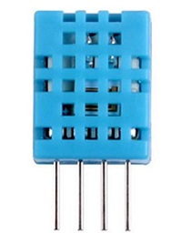
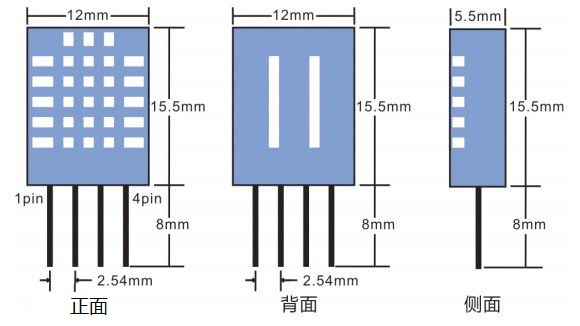
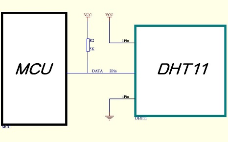

[Micropython]TPYBoard v10x 驱动DHT11模块获取温湿度
==============================================================

一、实验器件
-----------------------

 - TPYBoard v102 1块
 - DHT11温湿度模块 1个 
 - micro USB 数据线 1根
 - 面包板 1块
 - 杜邦线 若干

二、器件说明
-----------------------------

DHT11温湿度传感器说明
>>>>>>>>>>>>>>>>>>>>>>>>>>>>>>>>>>>>>>

DHT11是一款有已校准数字信号输出的温湿度传感器。 精度湿度+-5%RH， 温度+-2℃，量程湿度20-90%RH， 温度0~50℃。

**引脚说明**

正面朝上，引脚依次从左到右编号为1~4。

+------+---------+------------------+
| Pin  | 名称    | 说明             |
+======+=========+==================+
| 1    | VDD     | 供电 3－5.5VDC   |
+------+---------+------------------+
| 2    | DATA    | 串行数据，单总线 |
+------+---------+------------------+
| 3    | NC      | 空脚，请悬空     |
+------+---------+------------------+
| 4    | GND     | 接地，电源负极   |
+------+---------+------------------+

**使用说明**

MCU（单片机）与DHT11之间连接线长度小于20米时，应在第2引脚（数据引脚）上接入5K的上拉电阻（大于20米时根据实际情况接入合适的上拉电阻）。
为了使用方便，我们本次直接采用DH11温湿度模块，上面已经做好了上拉电阻的处理。

.. image:: img/DHT11.png

DHT11温湿度模块共有3个引脚，具体参照如下：

.. image:: img/DHT112.png

三、接线方式
-------------------------------

TPYBoard v102连接DHT11

.. image:: img/102+DHT11.png

四、源代码
--------------------------

TPYBoard v102 main.py文件内容如下：

::

    import pyb
    from pyb import Pin
    from dht11 import DHT11

    dht = DHT11('X12')
    def readTaHData():
        DATA = dht.read_data()#读取温湿度的值
        print(DATA[0],'℃')
        print(DATA[1],'%')
    while True:
        readTaHData()

- `下载源码 <https://github.com/TPYBoard/developmentBoard/tree/master/TPYBoard-v10x-master>`_