[Micropython]TPYBoard v10x 结合ESP8266模块实现TCP通信
==========================================================

版权声明：翻译整理属于TPYBoard，转载时请以超链接形式标明文章原始出处和作者信息及本声明

实验目的
------------------

	- 学习ESP8266模块（ESP-01）的使用。
	- 进一步学习TPYBoardv10x中UART模块的使用。
	- 结合ESP-01模块完成局域网内的TCP通信实验。

所需元器件
-------------------

	- ESP-01 WIFI模块 1个
	- TPYBoard v102板子 1块
	- USB转TTL 1个
	- micro USB数据线 1条
	- 杜邦线 若干

本实验采用TPYBoardv102串口AT指令的方式，去连接控制ESP8266模块（型号ESP-01）。

第一步：烧写AT指令的固件
---------------------------

**下载AT指令相应固件**

这里我下载了一个AiCloud 2.0 AT （512+512map）版本的，版本号：v0.0.0.6。
`点击下载 <http://wiki.ai-thinker.com/_media/aicloud/sdk/ai-thinker_esp8266_dout_aicloud_v0.0.0.6_20170517.7z>`_

安信可科技关于ESP8266相关模组的资料地址。`点击进入 <http://wiki.ai-thinker.com/esp8266>`_

AT指令固件其他版本下载。`点击下载 <http://wiki.ai-thinker.com/esp8266/sdk>`_

**下载烧写工具ESPFlashDownloadTool**

`点击下载 <http://wiki.ai-thinker.com/_media/esp8266/flash_download_tools_v3.6.4.rar>`_

**硬件连接**

ESP-01模块的引脚图：

.. image:: img/esp8266/pin.jpg

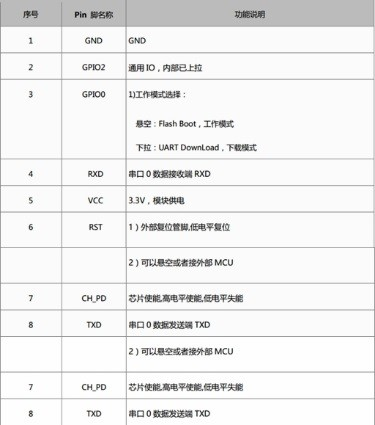

烧写固件还需用到USB转TTL，ESP-01模最好使用其他外部器件进行供电。这里，我用的TPYBoardv102开发板。但是，别忘记了开发板与TTL之间需要共地。

接线图：

+------------+------------------+---------------+
| ESP-01模块 | TPYBoard v102    | USB TO TTL    |
+============+==================+===============+
| VCC        | 3V3              |  --           |
+------------+------------------+---------------+
| GND        | GND              |  --           |
+------------+------------------+---------------+
| CH_PD      | 3V3              |  --           |
+------------+------------------+---------------+
| --         | GND              | GND           |
+------------+------------------+---------------+
| TXD        | --               | RX            |
+------------+------------------+---------------+
| RXD        | --               | TX            |
+------------+------------------+---------------+
| GPIO 2     | 悬空             | --            |
+------------+------------------+---------------+
| GPIO 0     | GND              | --            |
+------------+------------------+---------------+
| GND        | GND              | --            |
+------------+------------------+---------------+

**开始烧写**

USB转TTL插上电脑，设备管理器查看端口号。

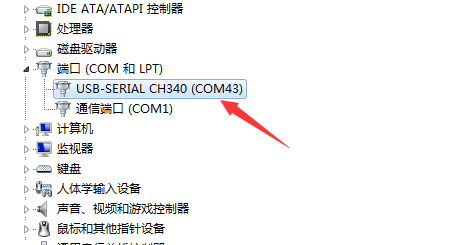

打开ESPFlashDownloadTool工具，选择【ESP8266 DownloadTool】。

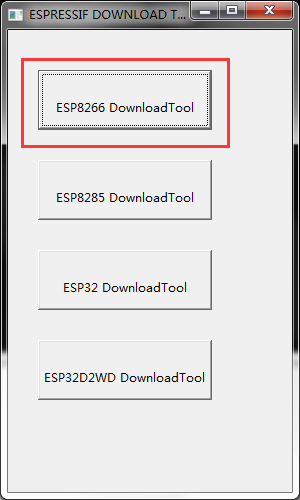

我这里下载的是合成的固件，所以地址直接设置为0x00000，其他设置参考如下：

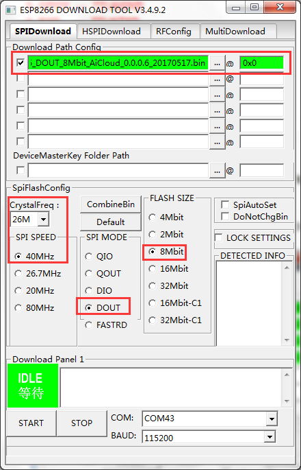

选择好端口，点击【START】开始烧写。

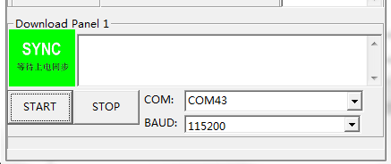

出现等待上电同步，这时给ESP-01模块上电，或者复位一下，等待下载成功。

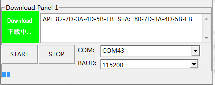

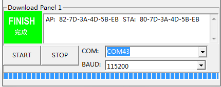

测试AT指令
------------------

烧写固件完成之后，将GPIO 0 连接的线拔掉，使其悬空，ESP-01模块会进入正常模式。
打开串口助手工具 `点击下载 <http://old.tpyboard.com/download/tool/198.html>`_ ，默认波特率115200。
ESP-01模块启动时，会输出一堆乱码。（其实不是乱码，是一些内部信息）如下：

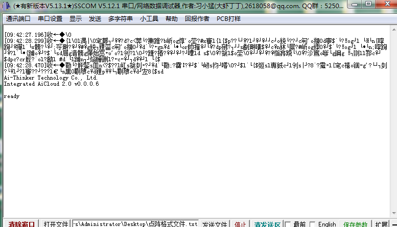

出现乱码的原因，如下：

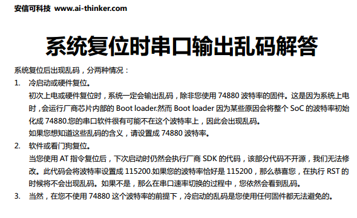

输出的内部信息，我们可以忽略掉，只要输出ready，就说明模块一切正常。

**进入AT指令模式**

AT指令说明文档、AT固件、烧写工具。`点击下载 <http://old.tpyboard.com/download/tool/ESP-01.rar>`_

*发送指令：AT*

（注意：后面需跟一个回车换行，选择在工具中勾选加回车换行）
模块返回AT\\r\\nOK，说明模块已经成功进入AT指令模式。

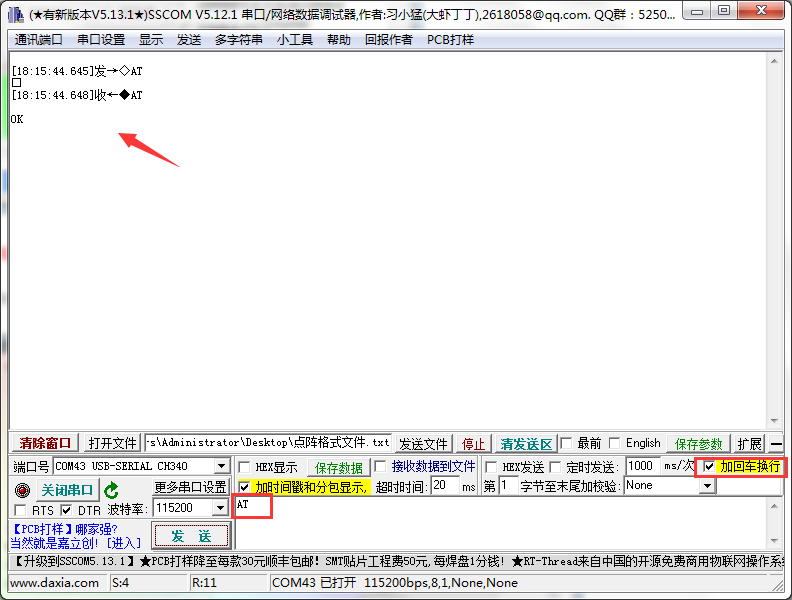

**查询固件版本**

*发送指令：AT+GMR*
 

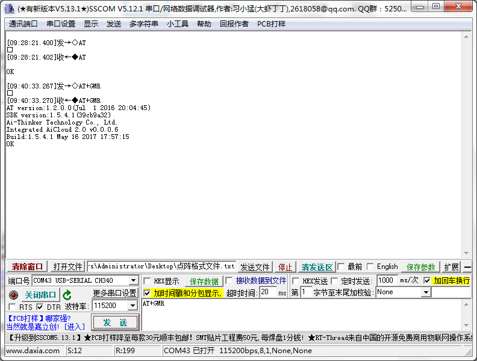

第三步：局域网TCP通信测试
-------------------------------

1、首先，让ESP-01接入我们的路由器。

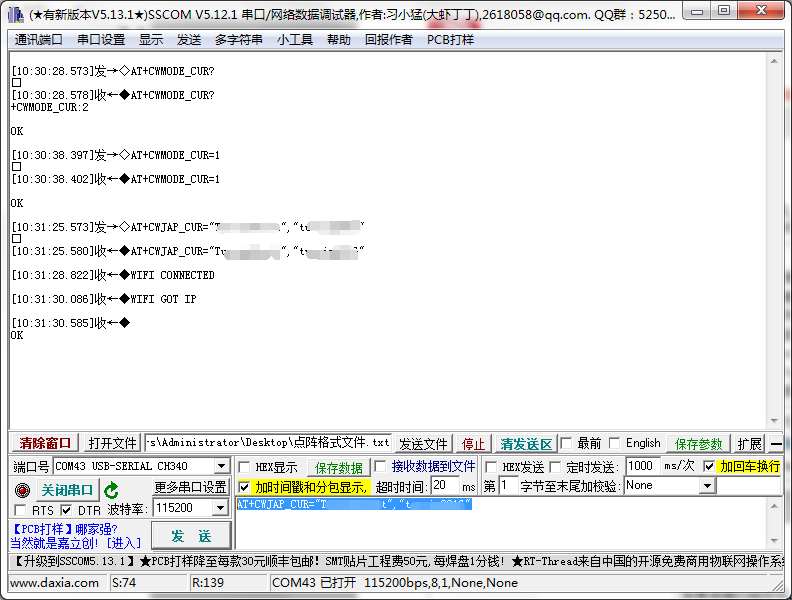

+-----------------------------------+---------------------------+
| AT指令                            | 功能                      |
+===================================+===========================+
|AT+CWMODE_CUR?	                    | 查询当前WIFI模式          |
|                                   |   1 : station 模式        |
|                                   |   2 : softAP 模式         |
|                                   |   3 : softAP+station 模式 |
+-----------------------------------+---------------------------+
|AT+CWMODE_CUR=1                    | 设置WIFI为station 模式    |
+-----------------------------------+---------------------------+
|AT+CWJAP_CUR="essid","password"    | 连接AP                    |
+-----------------------------------+---------------------------+

2、接下来，我们做一个局域网内TCP通信的测试。本地用网络调试助手建立一个TCP Server如下：

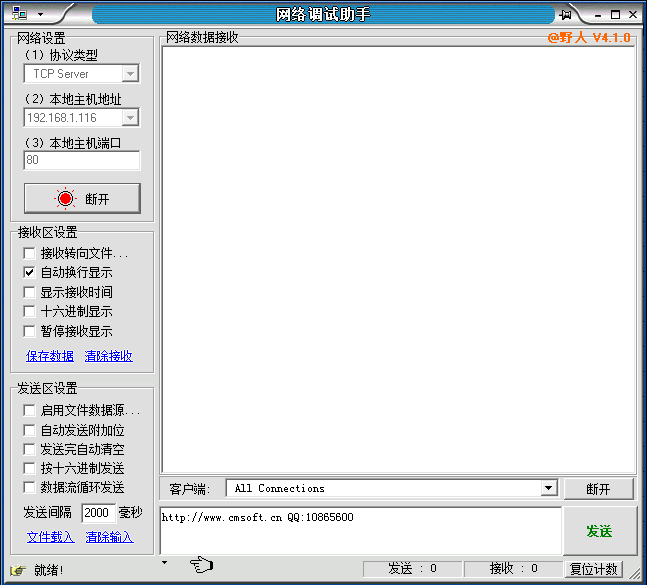

ESP-01作为TCP Client连接Server。发送指令AT+CIPSTART="TCP","192.168.101.116",80

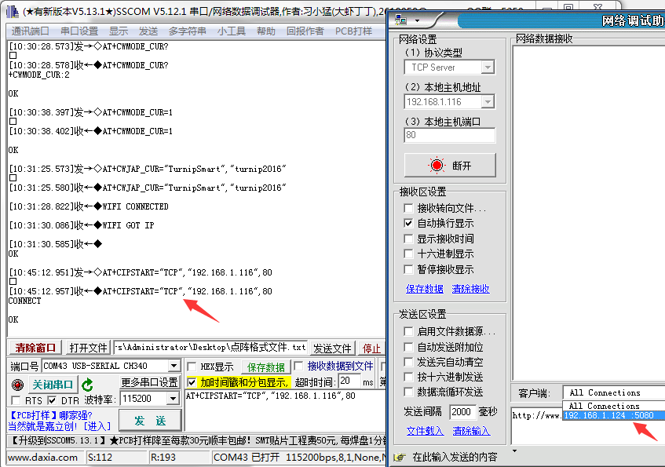

TCP链接建立，开始发送数据。单路链接时发送指令为AT+CIPSEND=x，x为发送的字节数。出现符号">"后就可以发送数据了。

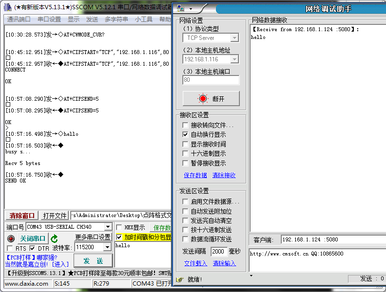

模块会把收到的数据自动通过串口透传过来。

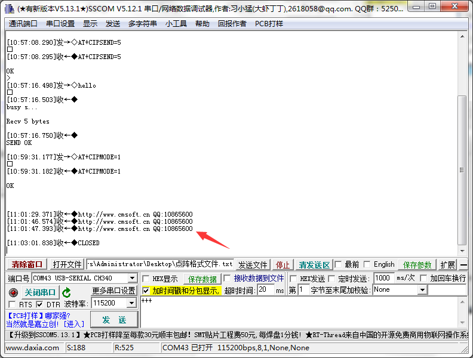

以上，我们都是结合USB转TTL实现的AT指令转发。接下来，我们通过TPYBoardv102开发板实现上面的功能。

接线图：

+-------------+--------------+
|ESP-01模块   | TPYBoard v102|
+=============+==============+
|VCC	      | 3V3          |
+-------------+--------------+
|GND	      | GND          |
+-------------+--------------+
|CH_PD	      | 3V3          |
+-------------+--------------+
|GPIO 0	      | GND          | 
+-------------+--------------+
|GPIO 2       | 悬空         |
+-------------+--------------+
|TXD	      | X2(UART 4 )  |
+-------------+--------------+
|RXD	      | X1(UART 4 )  |
+-------------+--------------+

程序源码：

.. code-block:: python

	from pyb import UART
	from pyb import LED

	#等待ESP-01模块初始化，忽略启动时的内部信息
	pyb.delay(1000)

	ESP_UART = UART(4,115200,timeout=100)

	def sendToUart(msg):
		ESP_UART.write(msg+'\r\n')

	CWMODE_CUR = 'AT+CWMODE_CUR=1'
	CWJAP_CUR = 'AT+CWJAP_CUR="TurnipSmart","turnip2016"'
	CIPSTART = 'AT+CIPSTART="TCP","192.168.1.116",80'
	CIPSEND = 'AT+CIPSEND=%s'
	msg = 'Hello,I am TPYBoard.'

	if __name__  == '__main__':
		sendToUart('AT')
		while True:
			if ESP_UART.any()  > 0:
				buf = ESP_UART.read().decode().replace('\r','').replace('\n','').replace(' ','')
				print(buf)
				if buf.find('busyp') > -1 or buf.find('ERROR') > -1:
					# AT指令执行失败
					# 结束程序排查原因
					break
				elif buf.find('ATOK') > -1:
					# 说明AT指令执行成功
					#if 'ATOK' in buf:
					# 成功进入AT指令模式
					# 设置WIFI模式
					sendToUart(CWMODE_CUR)
				elif buf.find(CWMODE_CUR) > -1:
					# 设置sta模式成功，连接AP
					sendToUart(CWJAP_CUR)
					LED(1).on()
				elif buf.find('WIFIGOTIP') > -1:
					# 连接AP成功
					# 连接TCP Server成功，发送数据
					pyb.delay(150)
					sendToUart(CIPSTART)
					LED(2).on()
				elif buf.find(CIPSTART) > -1:
					# 连接TCP Server成功，发送数据
					CIPSEND = CIPSEND % str(len(msg))
					sendToUart(CIPSEND)
					LED(3).on()
				elif buf.find('>') > -1:
					# 发送数据
					sendToUart(msg)
					LED(4).on()

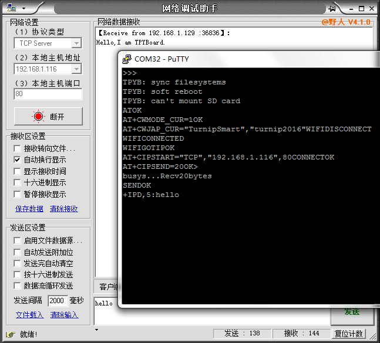

**注意：ESP-01模块上电启动时电流比较大，会导致板子的REPL无反应。关闭putty等工具，按板子的RST复位一下，再连接就好。最好方式采用外部电源给ESP-01模块供电，注意要与板子共地。**

综上，TCP的测试实验完毕。本实验只是做了一些简单的示例，大家可根据自己的想法结合文档开发出更有意思的作品，比如智能控制开关、智能WIFI小车等。

- `下载源码 <https://github.com/TPYBoard/developmentBoard/tree/master/TPYBoard-v10x-master>`_
