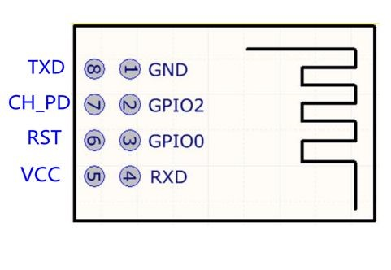
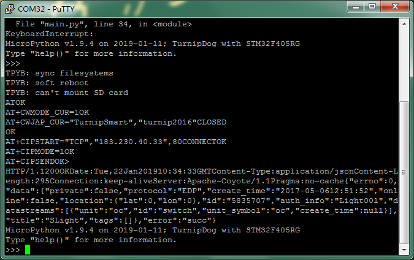

[Micropython]TPYBoard v10x 结合ESP8266模块实现HTTP请求实例
===========================================================

版权声明：翻译整理属于TPYBoard，转载时请以超链接形式标明文章原始出处和作者信息及本声明

实验目的
------------------

	- 学习ESP8266模块（ESP-01）的使用。
	- 进一步学习TPYBoardv10x中UART模块的使用。
	- 结合ESP-01模块完成HTTP请求实例。

所需元器件
-------------------

	- ESP-01 WIFI模块 1个
	- TPYBoard v102板子 1块
	- USB转TTL 1个
	- micro USB数据线 1条
	- 杜邦线 若干

上一篇文档《TPYBoard v10x 结合ESP8266模块实现TCP通信》中，实现了局域网中的TCP通信。本次，我们来实现简单的HTTP请求。

1、硬件连接
-----------------
ESP-01模块的引脚图：

+-------------+--------------+
|ESP-01模块   | TPYBoard v102|
+=============+==============+
|VCC	      | 3V3          |
+-------------+--------------+
|GND	      | GND          |
+-------------+--------------+
|CH_PD	      | 3V3          |
+-------------+--------------+
|GPIO 0	      | 悬空         | 
+-------------+--------------+
|GPIO 2       | 悬空         |
+-------------+--------------+
|TXD	      | X2(UART 4 )  |
+-------------+--------------+
|RXD	      | X1(UART 4 )  |
+-------------+--------------+

2、程序编写
---------------

ESP8266使用AT指令开发示例：`点击进入 <http://wiki.ai-thinker.com/esp8266/examples/at_demo>`_

打开上面的AT指令开发示例，查看【二. HTTP通信示例】。根据上面的示例，完成HTTP请求的实验。

2.1 发送GET请求
^^^^^^^^^^^^^^^^

程序如下：

.. code-block:: python

	from pyb import UART
	from pyb import LED

	#等待ESP-01模块初始化，忽略启动时的内部信息
	pyb.delay(1000)

	ESP_UART = UART(4,115200,timeout=100)

	def sendToUart(msg):
		ESP_UART.write(msg+'\r\n')

	CWMODE_CUR = 'AT+CWMODE_CUR=1'
	CWJAP_CUR = 'AT+CWJAP_CUR="TurnipSmart","turnip2016"'
	CIPSTART = 'AT+CIPSTART="TCP","183.230.40.33",80'
	CIPSEND = 'AT+CIPSEND=%s'

	post = """POST /devices/5835707/datapoints HTTP/1.1
	api-key: xUrvOCDB=iRuS5noq9FsKrvoW=s=
	Host:api.heclouds.com
	Content-Length:60\r\n
	{"datastreams":[{"id":"switch","datapoints":[{"value":1}]}]}
	"""
	if __name__  == '__main__':
		#退出透传
		ESP_UART.write('+++')
		pyb.delay(500)
		sendToUart('AT')
		isConn = 0
		while True:
			if ESP_UART.any()  > 0:
				buf = ESP_UART.read().decode().replace('\r','').replace('\n','').replace(' ','')
				print(buf)
				pyb.delay(200)
				if buf.find('busyp') > -1 or buf.find('ERROR') > -1:
					# AT指令执行失败
					# 结束程序排查原因
					break
				elif buf.find('ATOK') > -1:
					# 说明AT指令执行成功
					#if 'ATOK' in buf:
					# 成功进入AT指令模式
					# 设置WIFI模式
					sendToUart(CWMODE_CUR)
				elif buf.find(CWMODE_CUR) > -1:
					# 设置sta模式成功，连接AP
					sendToUart(CWJAP_CUR)
					LED(1).on()
				elif buf.find(CWJAP_CUR) > -1:
					isConn = 1
				elif buf.find('OK') > -1 and isConn:
					# 连接AP成功
					# 连接TCP Server
					sendToUart(CIPSTART)
					LED(2).on()
					isConn = 0
				elif buf.find('WIFIGOTIP') > -1:
					# 连接AP成功
					# 连接TCP Server
					sendToUart(CIPSTART)
					LED(2).on()
				elif buf.find('CONNECTOK') > -1:
					# 连接TCP Server成功，发送数据
					LED(3).on()
					sendToUart('AT+CIPMODE=1')#透传
				elif buf.find('AT+CIPMODE=1') > -1:
					sendToUart('AT+CIPSEND')#启动传输
				elif buf.find('>') > -1:
					# 发送数据
					sendToUart(get)
					LED(4).on()
				elif buf.find('HTTP') > -1:
					#退出透传
					ESP_UART.write('+++')
					pyb.delay(500)
					break

实现效果：

2.2 发送POST请求
^^^^^^^^^^^^^^^^

主要就是增加了一个post请求的字符串，具体内容如下：

.. code-block:: python

	post = """POST /devices/5835707/datapoints HTTP/1.1
	api-key: xUrvOCDB=iRuS5noq9FsKrvoW=s=
	Host:api.heclouds.com
	Content-Length:60\r\n
	{"datastreams":[{"id":"switch","datapoints":[{"value":1}]}]}
	"""

实现效果：

- `下载源码 <https://github.com/TPYBoard/TPYBoard-v102>`_
