[MicroPython]TPYBoard v102 串口触摸屏的使用
=================================================================

版权声明：翻译整理属于TPYBoard，转载时请以超链接形式标明文章原始出处和作者信息及本声明

准备器件
----------------------
 - TPYBoard v102开发板 1块
 - 串口触摸屏（USART HMI） 1块
 - USB转TTL模块 1个
 - USB数据线 1条
 - 杜邦线 若干

串口触摸屏（USART HMI）
----------------------

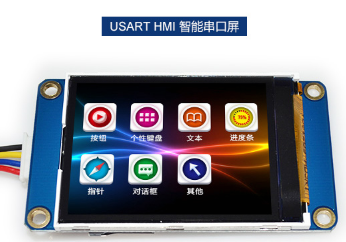

**功能特征**

 - 16位真彩色RGB显示。
 - 支持多种组态控件：按钮控件、进度条控件、文本控件、指针控件。
 - 带字库：可以自定义任怠WINDOWS字库。
 - 支持基本的GUI指令（画点、画线、画矩形等）。
 - 支持图片格式BMP、JPG、JPEG、PNG。
 - 支持上位软件自动升级、设备固件自动升级。
 - 100级背光调光，有休眠模式，休眠电流20MA ,支持触摸喚醒功能。
 - 支持串口下载和SD卡下载两种方式，支持PC端模拟调试，支持模拟器和设备同步调试。

串口触摸屏的界面设计
----------------------

在使用串口屏之前，我们需要先通过它的上位机软件创建一个工程，工程中进行串口屏界面的设计，包括文本控件、按钮控件等。

`串口屏相关资料下载 <http://old.tpyboard.com/downloads/docs/USART HMI.rar>`_

*创建工程*

首先，在电脑上安装串口屏的上位机软件，安装包在上面的资料中有。安装完成后，双击打开。点击菜单栏中的新建，创建一个新的工程。

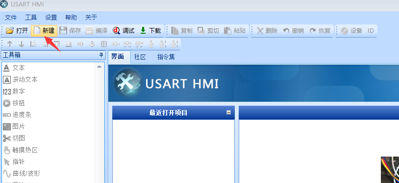

点击之后会弹框让你选择保存的路径以及工程名，这个根据自己喜好设置即可，没有要求。我这里的工程名设置为test。

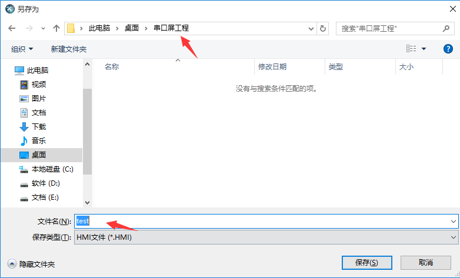

接着会让你选择产品型号，串口屏对应的型号在背面可以看到。

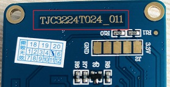

我手里的这款就是基本型的，型号为TJC3224T024_011，在软件中选择对应的型号即可。

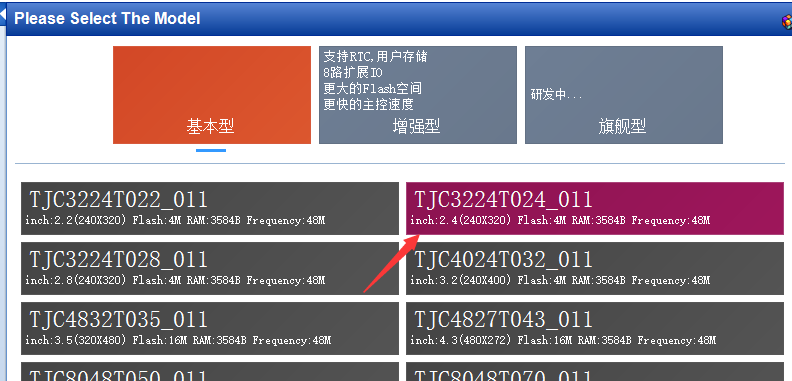

我个人比较喜欢横屏显示，所以在显示选项中选择了横屏90度，大家也可以根据喜好自行设置。设置完点击OK完成创建。

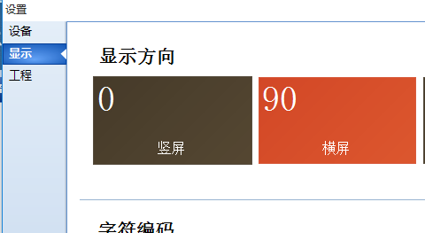

*制作工程*

软件左侧可以看到工具箱选区，这里我们添加一个滚动文本控件。点击滚动文本，该控件会自动添加到软件中间的界面区域中。

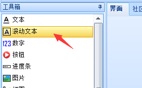

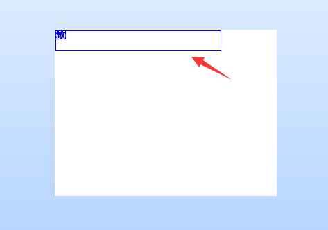

接下来我们需要设置要显示的文本，找到软件的右下角控件属性区，修改txt属性的值就是要显示的文本。

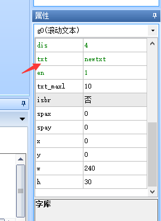

但是改了之后，发现界面中还是没有文字显示，这是因为我们还需要添加字库。第一次用的话，需要我们制作一个新的字库。若不是，软件左下角字库区点击“+”即可添加现有字库。
这里我们制作一个新字库，点击菜单栏工具->字库制作。

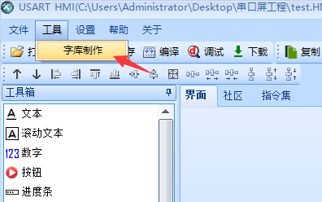

选择字体、字高，其它默认，输入字库名称，点击生成字库。选择保存的本地目录。

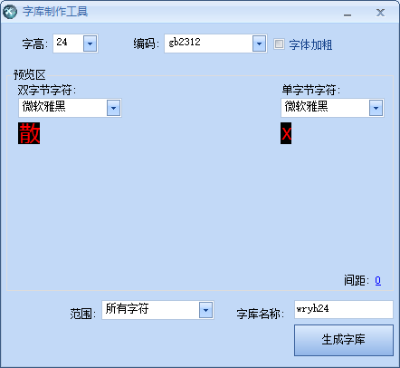

保存后，提示是否添加刚才生成的字库，点击是进行添加。

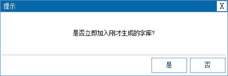

添加后，你会看到字库区多了一条字库信息，第一个字符0表示字库唯一ID，后面是刚才输入的字库名称，括号内是一些我们设置的参数。

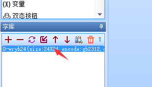

这时我们回到控件的属性区，修改的文字就可以在界面中显示了。这里我把txt改为Hello TPYBoard。提示超出字符长度的话，把txt_maxl改大点就行。

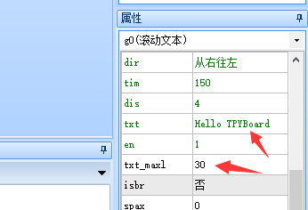

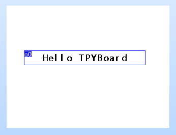

如果你想更换字库的话，在控件属性修改font的值，这个值填写的是字库的ID，默认为0。

串口触摸屏的下载
----------------------

界面设置完成后，点击编译进行编译，软件左下角输出框会显示编译信息，确保工程无错误无警告。

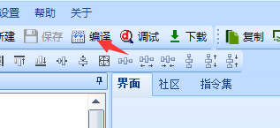

编译成功后，将串口屏与USB转TTL连接起来，购买串口屏时，里面都有配的线。

+---------+-------------+
| 串口屏  |USB转TTL模块 |
+=========+=============+
| +5V     | 5V          |
+---------+-------------+
| TX      | RXD         |
+---------+-------------+
| RX      | TXD         |
+---------+-------------+
| GND     | GND         |
+---------+-------------+

确保接线正确后，将USB转TTL模块插入电源，可以在设备管理器中看到增加的端口。

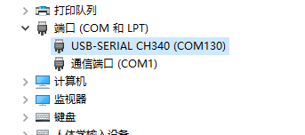

若提示没有驱动的话，根据USB转TTL模块上的芯片下载驱动进行安装。比如，我用的就是CH340芯片的。`点击这里直接下载 <http://old.tpyboard.com/downloads/2017_CH34x.zip>`_

接下来准备下载，点击软件菜单栏中的下载，弹出下载界面，选择与设备管理器中一致的端口号，波特率默认。

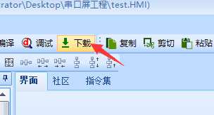

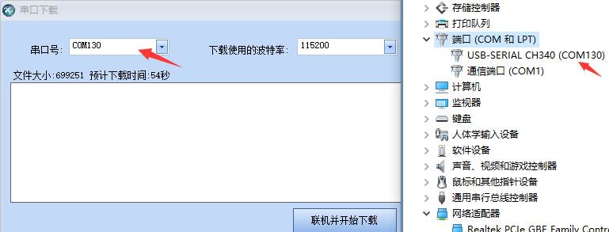

点击联机并开始下载，软件和串口屏上都可以看到下载进度。

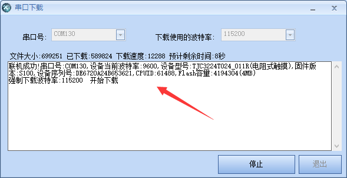

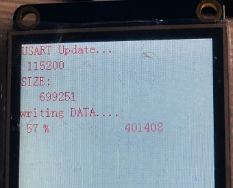

等待下载完毕，观察串口屏会看到滚动显示的Hello TPYBoard。

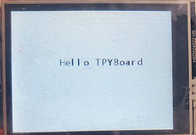

串口触摸屏与TPYBoard的交互实验
---------------------------------

通过上面的学习，我们已经学会了串口屏的使用。接下来，我们将串口屏与TPYBoard v102结合起来，通过点击串口屏来发送命令给开发板。设计了一个简单的界面如下，两个文本框和两个按钮。

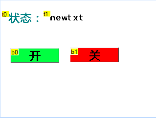

控件的背景或字体颜色都可以在属性里设置。使用按钮时，需要勾选按下事件中的发送键值选项，这样的话，我们就可以判断按下的是哪个按钮了。

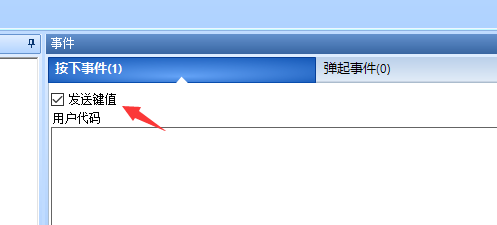

设置完成后，进行编译下载。下载完成后，将串口屏与开发板进行相连。

+---------+-------------+
| 串口屏  |TPYBoard v102|
+=========+=============+
| +5V     | VIN         |
+---------+-------------+
| TX      | X4(UART2-RX)|
+---------+-------------+
| RX      | X3(UART2-TX)|
+---------+-------------+
| GND     | GND         |
+---------+-------------+

TPYBoard v102程序如下，关于串口屏的指令集在资料中都有，可以参考。

.. code-block:: python

    from pyb import LED
    from pyb import UART

    END_CMD = b'\xFF\xFF\xFF' #发给串口屏指令的结束符，不可更改
    txt = 't1.txt="{}"'       #改变文本框文字的命令

    uart = UART(2,9600,timeout=50) #串口屏通信波特率默认9600
    #通过开关按钮控制板载LED4亮灭，LED4默认情况下为灭
    #那程序一开始就把文本改为关
    CMD = txt.format('关').encode() + END_CMD
    uart.write(CMD)

    while True:
        if uart.any() > 0:
            data = uart.read()
            print('revFromHMI:',data)
            #开：65 00 03 01 FF FF FF 点击开按钮时 我们从串口读取到的十六进制数据
            #关: 65 00 04 01 FF FF FF 点击关按钮时 我们从串口读取到的十六进制数据
            #需要注意一点micropython从串口读取数据时返回的是bytes类型的数据，它会把一些16进制数据转为相应的ascii字符
            #也就是说我们在程序中实际接收到的开按钮的数据是这样的，b'e\x00\x03\x01\xff\xff\xff'
            if data[:2] == b'e\x00' and data[4:] == END_CMD:
                if data[2] == 3: #bytes在通过索引获取元素值时会默认转为十进制数
                    CMD = txt.format('开').encode() + END_CMD
                    uart.write(CMD)
                    print('sendToHMI:',CMD)
                    pyb.LED(4).on()
                elif data[2] == 4:
                    CMD = txt.format('关').encode() + END_CMD
                    uart.write(CMD)
                    print('sendToHMI:',CMD)
                    pyb.LED(4).off()
                else:
                    print('Error:',data)

*如果串口屏显示中文为乱码，把main.py文件编码改成ANSI编码格式即可*

- `下载源码 <https://github.com/TPYBoard/TPYBoard-v102>`_

