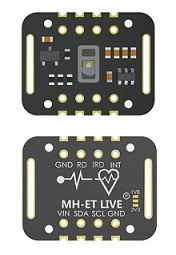
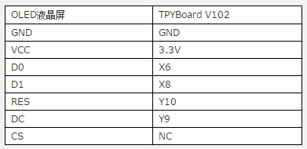
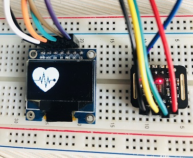
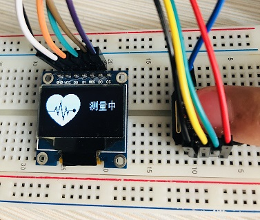

[MicroPython]TPYBoard v102 心率监测器(基于MAX30102模块)
===========================================================

版权声明：翻译整理属于TPYBoard，转载时请以超链接形式标明文章原始出处和作者信息及本声明

前言
----------------

这几年智能穿戴设备大火，尤其是手环类，从AppleWatch到荣耀手环，再到不知名的某些品牌，智能穿戴设备是铺天盖地的来了。而其中心率监测基本上是所有穿戴设备的“标配”，为啥会如此重视心率监测？心率监测到底有必要吗？

**1.持续的心率监测有助于诊断疾病**

人每一次脉搏的搏动，都代表一次有效的心脏跳动，每分钟心脏跳动的次数就是心率。心率是最直接反映我们心脏健康的标志。心脏是血液泵出的动力，也是各器官系统以及整个身体正常运行的保证。

**2.心率是最好的运动"导师"**

如果是经常做运动的朋友应该都知道，平时运动时可以根据心率数据更好地控制运动强度，因为心率和吸氧量及最大摄氧量呈线性关系，而且最大心率百分比也和最大摄氧量的百分比呈线性关系，所以在跑步过程中，使用心率控制运动强度是最简单易行的方法。

心率监测的方法
---------------------

**1、PPG光电容积法**

由于人体的皮肤、骨骼、肌肉、脂肪等对于光的反射是固定值，而毛细血管和动脉、静脉由于随着脉搏容积不停变大变小，所以对光的反射值是波动值，而这个波动值正好与心率一致，所以光电容积法正是通过这个波动的频率来确定使用者的心率数据。

目前市面上绝大多数的智能手环/手表都采用这种方式监测心率，而且这种方式的技术方案已经比较成熟，所以价格也相对较低。

**2、心电信号测量法**

还有一种就是心电信号测量法，它通过智能穿戴设备上搭载的传感器捕捉人每次心跳时微小的电极变化，再经过算法还原出心率跳动的频率，原理和心电图类似原理。目前已经很少有智能穿戴设备采用这种方式了。

TPYBoard心率监测器的制作过程
--------------------------------------

上面叨叨了这么多，接下来就进入正题。开始心率监测器的制作。首先先来介绍，里面最重要的器件-MAX30102心率模块。

**MAX30102心率模块介绍**

MAX30102是一个集成的脉搏血氧仪和心率监测仪生物传感器的模块。它集成了一个红光 LEO 和一个红外光 LEO 、光电检测器、光器件，以及带环境光抑制的低噪声电子电路。MAX30102采用一个 1.8V电源和一个独立的 5.0V 用于内部 LEO 的电源，应用于可穿戴设备进行心率和血氧采集检测，佩戴于手指、耳垂和手腕等处。标准的I2C兼容的通信接口可以将采集到的数值传输给Arduino、STM32 等单片机进行心率和血氧计算。此外，该芯片还可通过软件关断模块，待机电流接近为零，实现电源始终维持供电状态。

参考了各种资料，用micropython写了个MAX30102模块的驱动，这里不就不贴源码，给个地址(文章末)大家自己去下载学习，里面也有各种手册、STM32单片机以及Arduino实现的源码。现在可以监测心率数据，但是还需要一个显示屏来进行显示，这里我选择用OLED显示屏。先参照下面信息，把硬件连接起来。

+----------------+---------------+
| TPYBoard v102  |MAX30102模块   |
+================+===============+
| 3V3            | VIN           |
+----------------+---------------+
| Y10            | SDA           |
+----------------+---------------+
| Y9             | SCL           |
+----------------+---------------+
| GND            | GND           |
+----------------+---------------+
| Y12            | INT           |
+----------------+---------------+   

接好线了之后，把MAX30102模块的相关驱动文件拷贝到TPYBFLASH磁盘中，然后编写main.py。保存完毕，使用PuTTY软件启动运行程序，确认程序无错误。

演示效果
----------------

1. 程序运行后，显示屏会显示一个心形的图案,同时MAX30102模块上的红色LED灯会亮起；

2. 将手指放置模块红色LED处，按下板载的USR按键启动测量，显示屏会提示测量中；

3. 确保手指接触良好的情况下，大约等待40秒左右，显示屏会显示测量出的心率值，此时就可以把手拿开了。

.. image:: img/max30102/5.jpg

总结
---------------------

使用MAX30102测量的心率值与荣耀手环4测量的心率值接近（大概有2-3值的差别）。程序中也有对血氧饱和度的测试，大家可以从程序中提取出来显示在显示屏上。但是需要注意的是，因为是基于查找表来确定血氧含量，所以每个血氧传感器都需要和专业仪器进行标定才准确。此外，RED LED的波长尤其容易受到环境温度影响，所以程序上要考虑到温度对血氧精确度的影响，这也是MAX30102本身带有温度传感器功能的主要原因。所以程序中的血氧饱和度是仅供参考，并不准确。

- `下载源码 <https://github.com/TPYBoard/TPYBoard-v102>`_

- `MAX30102参考资料 <http://old.tpyboard.com/downloads/docs/MAX30102参考资料.rar>`_

