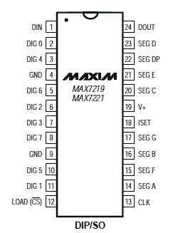
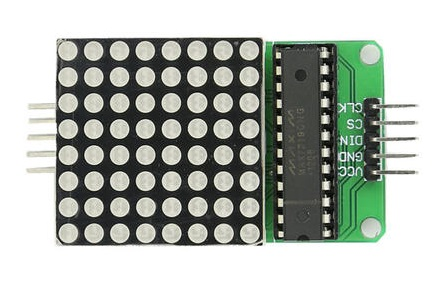
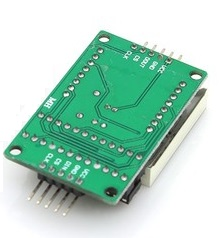

[MicroPython]TPYBoard v102 制作表白女神神器(基于MAX7219点阵模块)
=================================================================

版权声明：翻译整理属于TPYBoard，转载时请以超链接形式标明文章原始出处和作者信息及本声明

前言
--------------

又是一年毕业季，只有到了毕业季才会意识到自己又离青春远了一大步。毕业后，大家都各奔东西了，如果这个时候有喜欢的人还是藏在心底的话，不免会给人生留下遗憾。为了不留遗憾，不老套，制作一款表白神器，是不是会更容易表白成功呢？前面使用8*8LED点阵模块做过一款跳动的心，因为是直接用的点阵模块，所以控制就用了16个IO，未免有些繁琐，浪费资源。最近发现了一个好东西——MAX7219多位LED 显示驱动器。使用该驱动器加上点阵屏或者数码管，驱动起来特别方便简单，而且加上电源脚也不过就5根线而已。

MAX7219介绍
---------------

MAX7219 是美国MAXIM 公司推出的多位LED 显示驱动器，采用3 线串行接口传送数据，可直接与单片机接口连接，用户能方便修改其内部参数，以实现多位LED 显示。它内含硬件动态扫描电路、BCD译码器、段驱动器和位驱动器。此外，其内部还含有8X8 位静态RAM,用于存放8个数字的显示数据。显然，它可直接驱动64 段LED点阵显示器。当多片MAX7219 级联时，可控制更多的LED点阵显示器。显示的数据通过单片机数据处理后，送给MAX7219 显示。

**引脚图：**

当然了，直接拿到这个驱动器一时也不知道该怎么用，于是就直接买了现成的MAX7219驱动器结合8*8LED点阵屏模块。

看反面图可以看出，该模块不仅有DIN输入端口还有DOUT输出端口，用于多个模块级联。使用的单个模块时，开发板只接入模块的输入端口即可；当多个模块级联时，第一个模块的输出端口接第二个模块的输入端口，第二个输出端口接第三个输入端口，依次类推。

制作过程
--------------

话不多说了，马上动手实践起来。接线很简单，见下表：

+----------------+---------------+
| TPYBoard v102  |MAX7219点阵模块|
+================+===============+
| VIN            | VIN           |
+----------------+---------------+
| GND            | GND           |
+----------------+---------------+
| X3             | DIN           |
+----------------+---------------+
| X2             | CS            |
+----------------+---------------+
| X1             | CLK           |
+----------------+---------------+ 

**源码呈上**

主程序 main.py。

.. code-block:: python

    import MAX7219 #导入模块

    #CLK -> X1,CS -> X2,DIN -> X3
    #num级联的模块数量
    led = MAX7219.Lattice('X1','X2','X3',num=1)
    #要显示的内容,显示的内容根据字库文件而定，见font_max7219.py。
    #大家也可以自定义图案添加上。
    msg = 'LOVE大小'

    while True:
        #显示
        led.display(msg)

字库文件 font_max7219.py。

.. code-block:: python

    FONT8_8= {
    '0':[0x3C,0x42,0x42,0x42,0x42,0x42,0x42,0x3C],#0
    '1':[0x10,0x18,0x14,0x10,0x10,0x10,0x10,0x10],#1
    '2':[0x7E,0x2,0x2,0x7E,0x40,0x40,0x40,0x7E],#2
    '3':[0x3E,0x2,0x2,0x3E,0x2,0x2,0x3E,0x0],#3
    '4':[0x8,0x18,0x28,0x48,0xFE,0x8,0x8,0x8],#4
    '5':[0x3C,0x20,0x20,0x3C,0x4,0x4,0x3C,0x0],#5
    '6':[0x3C,0x20,0x20,0x3C,0x24,0x24,0x3C,0x0],#6
    '7':[0x3E,0x22,0x4,0x8,0x8,0x8,0x8,0x8],#7
    '8':[0x0,0x3E,0x22,0x22,0x3E,0x22,0x22,0x3E],#8
    '9':[0x3E,0x22,0x22,0x3E,0x2,0x2,0x2,0x3E],#9
    'A':[0x8,0x14,0x22,0x3E,0x22,0x22,0x22,0x22],#A
    'B':[0x3C,0x22,0x22,0x3E,0x22,0x22,0x3C,0x0],#B
    'C':[0x3C,0x40,0x40,0x40,0x40,0x40,0x3C,0x0],#C
    'D':[0x7C,0x42,0x42,0x42,0x42,0x42,0x7C,0x0],#D
    'E':[0x7C,0x40,0x40,0x7C,0x40,0x40,0x40,0x7C],#E
    'F':[0x7C,0x40,0x40,0x7C,0x40,0x40,0x40,0x40],#F
    'G':[0x3C,0x40,0x40,0x40,0x40,0x44,0x44,0x3C],#G
    'H':[0x44,0x44,0x44,0x7C,0x44,0x44,0x44,0x44],#H
    'I':[0x7C,0x10,0x10,0x10,0x10,0x10,0x10,0x7C],#I
    'J':[0x3C,0x8,0x8,0x8,0x8,0x8,0x48,0x30],#J
    'K':[0x0,0x24,0x28,0x30,0x20,0x30,0x28,0x24],#K
    'L':[0x40,0x40,0x40,0x40,0x40,0x40,0x40,0x7C],#L
    'M':[0x81,0xC3,0xA5,0x99,0x81,0x81,0x81,0x81],#M
    'N':[0x0,0x42,0x62,0x52,0x4A,0x46,0x42,0x0],#N
    'O':[0x3C,0x42,0x42,0x42,0x42,0x42,0x42,0x3C],#O
    'P':[0x3C,0x22,0x22,0x22,0x3C,0x20,0x20,0x20],#P
    'Q':[0x1C,0x22,0x22,0x22,0x22,0x26,0x22,0x1D],#Q
    'R':[0x3C,0x22,0x22,0x22,0x3C,0x24,0x22,0x21],#R
    'S':[0x0,0x1E,0x20,0x20,0x3E,0x2,0x2,0x3C],#S
    'T':[0x0,0x3E,0x8,0x8,0x8,0x8,0x8,0x8],#T
    'U':[0x42,0x42,0x42,0x42,0x42,0x42,0x22,0x1C],#U
    'V':[0x42,0x42,0x42,0x42,0x42,0x42,0x24,0x18],#V
    'W':[0x0,0x49,0x49,0x49,0x49,0x2A,0x1C,0x0],#W
    'X':[0x0,0x41,0x22,0x14,0x8,0x14,0x22,0x41],#X
    'Y':[0x41,0x22,0x14,0x8,0x8,0x8,0x8,0x8],#Y
    'Z':[0x0,0x7F,0x2,0x4,0x8,0x10,0x20,0x7F],#Z
    '大':[0x00,0x66,0xFF,0xFF,0x7E,0x3C,0x18,0x00],#大心
    '小':[0x00,0x00,0x66,0x7E,0x3C,0x18,0x00,0x00],#小心
    '中':[0x8,0x7F,0x49,0x49,0x7F,0x8,0x8,0x8],#中
    '国':[0xFE,0xBA,0x92,0xBA,0x92,0x9A,0xBA,0xFE],#国
    }

模块驱动程序max7219.py就不在这里呈现了，文章末有链接，大家可以去下载。

演示效果
--------------------

`点击观看演示视频 <https://v.qq.com/x/page/n08814kmrfc.html>`_

无线遥控升级版
---------------------

这样虽然已经很炫了，不过加上无线遥控的效果是不是就更棒了。于是，找来了以前买的HC-05（HC-06也一样）蓝牙模块，结合一下整上。

+----------------+----------------+
| TPYBoard v102  |HC-05/06蓝牙模块|
+================+================+
| VIN            | +5V            |
+----------------+----------------+
| GND            | GND            |
+----------------+----------------+
| Y1             | RXD            |
+----------------+----------------+
| Y2             | TXD            |
+----------------+----------------+

其他文件不用动，改动下main.py，增加上串口读写操作即可。

.. code-block:: python

    import MAX7219 #导入模块
    from pyb import UART
    #初始化串口参数，使用串口6 波特率9600 超时时间50毫秒
    #串口6 TX->Y1 RX->Y2 
    #其他串口对应的引脚编号详见针脚图：http://old.tpyboard.com/document/documents/10x/TPYBoardv10xPCBpng.pdf
    uart = UART(6,9600,timeout=50)

    #CLK -> X1,CS -> X2,DIN -> X3
    #num级联的模块数量
    led = MAX7219.Lattice('X1','X2','X3',num=1)
    led.display('大')                   #默认显示大心图案
    while True:
        if uart.any() > 0:              #any()返回串口缓存区的数据长度，返回值大于0即表示有数据
            DATA = uart.read().decode() #读取缓存区全部数据，返回值为bytes，decode()转为字符串
            led.display(DATA)           #进行显示

蓝牙串口调试助手（Android） `点击下载 <http://old.tpyboard.com/download/tool/164.html>`_

- `下载源码 <https://github.com/TPYBoard/TPYBoard-v102>`_

