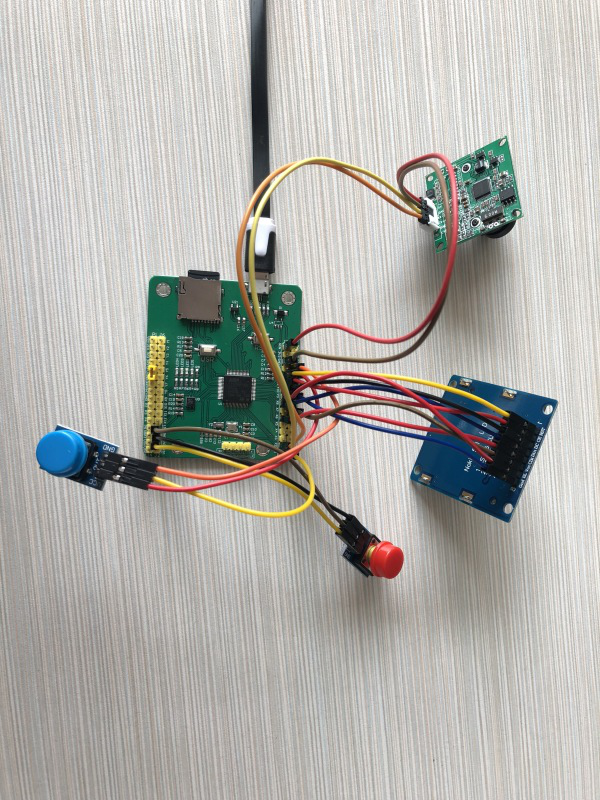

[Micropython]TPYBoard v102 DIY照相机
========================================================

版权声明：翻译整理属于TPYBoard，转载时请以超链接形式标明文章原始出处和作者信息及本声明

所需元器件
---------------------

 - TPYBoard v102板子 1块
 - PTC06 串口摄像头模块1个
 - 杜邦线 若干
 - 5110显示屏1个
 - 按键模块2个
 - USB数据线1条	
	

什么是摄像头模块
---------------------

PTC06 串口摄像头模块简介
~~~~~~~~~~~~~~~~~~~~~~~~~~~~~

PTC06 串口摄像头模块是一款集图像采集、拍摄控制、数据压缩、串口传输于一体的图像采集 处理模块。其内置的高性能数字信号处理芯片实现了对原始图像的高比例压缩。产品图像输 出采用标准 JPEG 格式，方便地兼容各种图像处理软件；采用 3 线制TTL 电平 UART 通 信接口，可以方便地实现与单片机或其他微处理器连接。默认波特率为 115200，其它可选波特率有9600，19200，38400 和 57600。 其中对于串口控制拍照，读取静态图片的应用中，只需要用到 GND，RX，TX，VCC 这4 个信号线。 如果是要输出模拟视频的应用，才需要将 CVBS 信号。 注意： TX 和 RX 是 3.3v 的 TTL 电平信号。

硬件的接线方法
~~~~~~~~~~~~~~~~~~~~~~~~~~~~

TPYBoard v102 --摄像头模块
^^^^^^^^^^^^^^^^^^^^^^^^^^^^^^

VIN ----------------5V

GND ------------ - GND

X1(UART 4 TX)------ RX

X2(UART 4 RX) ------TX

TPYBoard v102------按键模块黑色（复位键）
^^^^^^^^^^^^^^^^^^^^^^^^^^^^^^

3.3V----------------GND

GND-----------------VCC

RST-----------------OUT

TPYBoard v102---------按键模块黄色（拍摄键）
^^^^^^^^^^^^^^^^^^^^^^^^^^^^^^

GND-------------------VCC

3.3V------------------GND

X17-------------------OUT

TPYBoard v102---------5110显示屏
^^^^^^^^^^^^^^^^^^^^^^^^^^^^^^

Y12-------------------RST

Y11-------------------CE

Y10-------------------DC

Y9--------------------LIGHT

Y8--------------------DIN

Y6--------------------CLK

3.3V------------------VIN

GND-------------------GND

接线图
~~~~~~~~~~~~~~~~~~~~~~~~~~~~

实物接线图
~~~~~~~~~~~~~~~~~~~~~~~~~~~~

此时所有器件已连接完毕，只需要给我们核心板TPYBoard v102 编写代码，并
导入fond.py 和upcd8544.py就可以运行了。

源代码
---------------------

.. code-block:: python

	import pyb
	from pyb importUART,Switch
	import upcd8544

	#-----command---------#
	initcmd=b'\x56\x00\x26\x00'#复位
	clearcmd=b'\x56\x00\x36\x01\x02'#清除缓存
	photocmd=b'\x56\x00\x36\x01\x00'#拍照
	lengthcmd=b'\x56\x00\x34\x01\x00'#获取图片长度
	readcmd=b'\x56\x00\x32\x0C\x00\x0A\x00\x00'#获取图片数据
	responseCmd=b'\x76\x00\x32\x00\x00'#返回的图片数据固定头和尾
	#---------------------------------#
	isFlag=0#标识是否初始化
	isPhoto=0#标识是否发送拍照命令
	num=0
	f_name='/sd/photo%s.jpeg'
	nBytes=2048#每次读取的字节数
	#---------------------------------#
	uart=UART(4,115200,timeout=100)#X1(UART4 TX) X2(UART 4 RX)
	#-------十进制转16进制------------#
	defconvert_Data(num):
	   if num>255:
		   num_h=hex(num)
		   if len(num_h)<6:
			   num_h_a=num_h[:3]
			   num_h_b='0x'+num_h[3:]
		   else:
			   num_h_a=num_h[:4]
			   num_h_b='0x'+num_h[4:]
		  byte_num=bytes([int(num_h_a,16),int(num_h_b,16)])
	   else:
		   byte_num=b'\x00'+bytes([num])
	   return byte_num
	defget_photo(add,readlen):
	   global readcmd,responseCmd
	  
	  cmd=readcmd+add+b'\x00\x00'+readlen+b'\x00\xFF'
	   uart.write(cmd)
	   while uart.any()<=0:
		   continue
	   data=uart.read()
	   #print('data:',data)
	   #print('data[0:5]:',data[0:5])
	   #print('data[-5:]:',data[-5:])
	   if data[0:5]==responseCmd anddata[-5:]==responseCmd:
		   revdata=data[5:-5]
		   print('revdata:',revdata)
	   else:
		   revdata=0
	   return revdata
	def test():
	   global num,isPhoto
	   pyb.delay(30)
	   if(sw()):
		   sw.callback(None)
		   isPhoto=0
		   num+=1
		   pyb.LED(3).on()
		   #清除缓存
		   uart.write(clearcmd)
	#-------LCD5110Init-----------#
	SPI    = pyb.SPI(1) #DIN=>X8-MOSI/CLK=>X6-SCK
	RST    = pyb.Pin('Y12')
	CE     = pyb.Pin('Y11')
	DC     = pyb.Pin('Y10')
	LIGHT  = pyb.Pin('Y9')
	lcd_5110 =upcd8544.PCD8544(SPI, RST, CE, DC, LIGHT)
	lcd_5110.lcd_write_bmp()
	#------------------------------#      
	print('wait......')
	pyb.delay(2800)
	print('initstart.......')
	uart.write(initcmd)
	sw=Switch()
	sw.callback(test)
	while True:
	   if uart.any()>0:
		   data=uart.read()
		   print('revdata:',data)
		   if isFlag==0:
			   #说明接收的是复位后的信息
			   if data==b'Init end\r\n':
				   #复位完毕
				   print('init ok.......')
				   pyb.delay(2000)
				   isFlag=1
				   pyb.LED(2).on()
				   lcd_5110.lcd_write_bmp(0)
		   else:
			   if len(data)>=5:
				   if data[0]==118:#0x76
					   if data[2]==54:#0x36
						   if isPhoto==0:
							   #清除缓存返回
							   print('-----clearbuffer ok----')
							   isPhoto=1
							  uart.write(photocmd)
							   lcd_5110.clear()
							  lcd_5110.lcd_write_bmp(1)
						   else:
							   #拍照返回
							   print('-----takingpictures ok----')
							  uart.write(lengthcmd)
					   if data[2]==52:#0x34
						   print('photolength:',data[7],'-',data[8])
						  tlen=data[7]*256+data[8]
						   t_c=tlen//nBytes
						   t_y=tlen%nBytes
						   add=0
						   #256=[0x01,0x00]512=[0x02,0x00]
						  length=convert_Data(nBytes)
						   name=f_name % str(num)
						   print('filename:',name)
						   offset=0
						   for i in range(0,t_c):
							   offset_a=i//4
							   ifoffset<offset_a:
								   offset=offset_a
								   lcd_5110.clear()
								  lcd_5110.lcd_write_bmp(1,offset)
							  add=convert_Data(i*nBytes)
							  revdata=get_photo(add,length)
							   if revdata!=0:
								  f=open(name,'a')
								  f.write(revdata)
								   f.close()
							   pyb.LED(4).toggle()
							   print('-------------',i)
							   pyb.delay(100)
						  add=convert_Data(t_c*nBytes)   
						  revdata=get_photo(add,convert_Data(t_y))
						   if revdata!=0:
							   f=open(name,'a')
							   f.write(revdata)
							   f.close()
						   pyb.LED(3).off()
						   pyb.LED(4).off()
						   pyb.delay(100)
						   print('*========================================*')
						   lcd_5110.clear()
						  lcd_5110.lcd_write_bmp(2)
						   sw.callback(test)
			   else:
				   print('-----data lengtherror-----')

- `下载源码 <https://github.com/TPYBoard/TPYBoard-v102>`_
