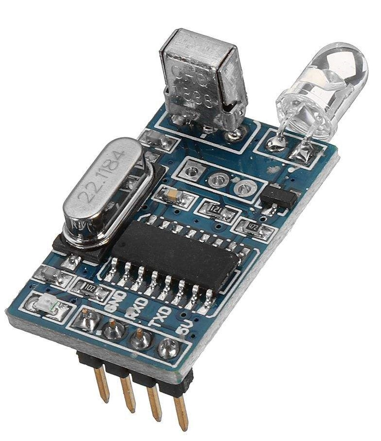
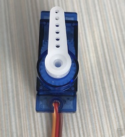

[MicroPython]TPYBoard v102 无线红外遥控舵机(基于红外解/编码模块)
=================================================================

版权声明：翻译整理属于TPYBoard，转载时请以超链接形式标明文章原始出处和作者信息及本声明

红外解码/编码模块介绍
----------------------

模块上搭载了红外接收头、红外发射器以及编码芯片。
1、具备红外发射功能。
2、具备红外编码功能。
3、带红外发射头扩展接口。
4、具备串口通信功能，通信电平为TTL。
5、可控制红外格式设备，包括电视机、电风扇等电子电器设备。
6、支持编码芯片
7、可作为红外无线数据通信、数据传输、红外控制等功能

该模块使用方法非常简单，只需要掌握基本的单片机TTL串口通信知识即可。将模块与开发板进行串口连接，通过串口发送指定的指令进行控制模块发射；通过串口接收方式进行红外解码操作，获取遥控编码信息。 

**解码**

解码时不需要发送任何指令，只需要拿起遥控对准模块的接收头按下某一个键，这时模块的串口就会输出该键的红外编码值给开发板，开发板只要从串口里读取到数据，进行分析就会得出按下的是哪一个键。

**编码(发射)**

编码时需要根据一定格式发送指令，通过串口发送5个字节的指令，就可以将对应编码的红外信号发送出去。利用这红外的收发功能，我们可以做红外数据传输和控制，使用2个就可以完成收发操作了。

红外解码/编码模块相关资料 `下载<http://old.tpyboard.com/downloads/docs/YS-NEC.zip>`_

本次教程仅来学习解码功能。开发板写个串口读取的程序，先来看下遥控器按下之后，我们到底能接收到什么样的数据。这里，我们选取开发板UART3（TX-Y9,RX-Y10）。

**接线图**

+----------------+---------------+
| TPYBoard v102  |红外解/编码模块|
+================+===============+
| VIN            | 5V            |
+----------------+---------------+
| GND            | GND           |
+----------------+---------------+
| Y10            | TXD           |
+----------------+---------------+
| Y9             | RXD           |
+----------------+---------------+

.. block-code:: python

    from pyb import UART

    uart = UART(3,9600,timeout=50)

    while True:
        if uart.any() > 0:
            print(uart.read())

程序保存后运行，打开PuTTY工具，按下遥控器左上角的第一个键CH-。

PuTTY打印::
    b'\x00\xffE'

    
micropython进行串口读取时，返回的是bytes类型，是一种不可变序列，跟字符串类似。返回了3个字节的内容，多按几个键你就会发现，前面2个字节是固定不变的，也就是说我们只要判断第3个字节就可以找到对应的键。bytes中可以直接通过索引来获取元素，也支持负数的索引。比如-1，就是从右向左数的第一个，依次类推。这里需要注意一点，获取某个元素时，他返回的是对应的十进制的数值。

例如::

    >>> b = b'\x00\xffE'
    >>> b[1]
    255
    >>> b[-1]
    69

咦？最后一个元素E为什么是69呢？这是因为在bytes保存的就是原始的字节（二进制格式）数据，它会将一些16进制的值转换为对应的ascii字符。ascii中大写的E对应的十进制就是69。如果你用电脑接红外解编码模块的话，串口调试助手里打印的就应该是 00 FF 45。

根据上面的经验，总结了键值对应关系表，大家可以直接拿到程序中用。

+-------------------------+--------+
| 按键   |16进制/ascii字符| 10进制 |
+=========================+========+
| CH-    |    0x45(E)     | 69     |
+--------+----------------+--------+
| CH     |    0x46(F)     | 70     |
+--------+----------------+--------+
| CH+    |    0x47(G)     | 71     |
+--------+----------------+--------+
| |<<    |    0x44(D)     | 68     |
+--------+----------------+--------+
| >>|    |    0x40(@)     | 64     |
+--------+----------------+--------+
| >||    |    0x43(C)     | 67     |
+--------+----------------+--------+
| —      |    0x07        |  7     |
+--------+----------------+--------+
| +      |    0x15        | 21     |
+--------+----------------+--------+
| EQ     |    0x09(\t)    |  9     |
+--------+----------------+--------+
| 0      |    0x16        | 22     |
+--------+----------------+--------+
| 100+   |    0x19        | 25     |
+--------+----------------+--------+
| 200+   |    0x0D(\r)    | 13     |
+--------+----------------+--------+
| 1      |    0x0C        | 12     |
+--------+----------------+--------+
| 2      |    0x18        | 24     |
+--------+----------------+--------+
| 3      |    0x5E(^)     | 94     |
+--------+----------------+--------+
| 4      |    0x08        |  8     |
+--------+----------------+--------+
| 5      |    0x1C        | 28     |
+--------+----------------+--------+
| 6      |    0x5A(Z)     | 90     |
+--------+----------------+--------+
| 7      |    0x42(B)     | 66     |
+--------+----------------+--------+
| 8      |    0x52(R)     | 82     |
+--------+----------------+--------+
| 9      |    0x4A(J)     | 74     |
+--------+----------------+--------+

接下来，结合舵机做个实例。用遥控器上的|<<快进键和快退键>>|，控制舵机进行正反方向的转动。micropython中Servo类使用参考 
`点击查看 <http://docs.tpyboard.com/zh/latest/library/pyb.Servo/?highlight=servo#class-servo>`_

+----------------+------------------+
| TPYBoard v102  | 舵机             |
+================+==================+
| VIN            | 电源正（红色线） |
+----------------+------------------+
| GND            | 电源负（棕色线） |
+----------------+------------------+
| X1             | 信号线（橙色线） |
+----------------+------------------+

首先，将舵机通过程序设置到0角度的状态，安上个小翅子方便查看转动效果。

.. block-code:: python

    from pyb import Servo

    #舵机信号线接X1，可以创建4个Servo，分别是1~4，对应的引脚是X1~X4
    s1 = Servo(1)
    #调整舵机转动到0角度的位置
    s1.angle(0)

程序增加上对按键的判断，每按一次转动15度，整体代码如下。

.. block-code:: python

    from pyb import UART,Servo

    #舵机信号线接X1，可以创建4个Servo，分别是1~4，对应的引脚是X1~X4
    s1 = Servo(1)
    #调整舵机转动到0角度的位置
    s1.angle(0)

    uart = UART(3,9600,timeout=10)

    def setServoTurn(flag):
        turn_angle = s1.angle()
        if flag:
            #逆时针 值递增 最大值90度
            turn_angle += 15 #每按一次转15度
            if turn_angle <= 90:
                s1.angle(turn_angle)
        else:
            #顺时针 值递减 最小值-90度
            turn_angle -= 15
            if turn_angle >= -90:
                s1.angle(turn_angle)
    while True:
        if uart.any() > 0:
            val = uart.read()[-1]
            if val == 68:
                setServoTurn(True)
            elif val == 64:
                setServoTurn(False)

- `下载源码 <https://github.com/TPYBoard/TPYBoard-v102>`_

