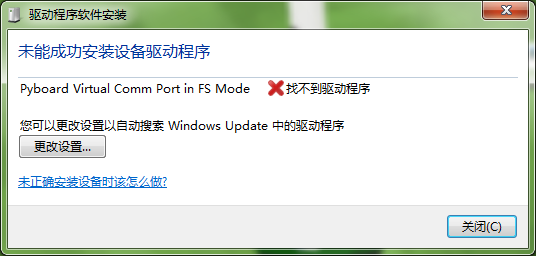
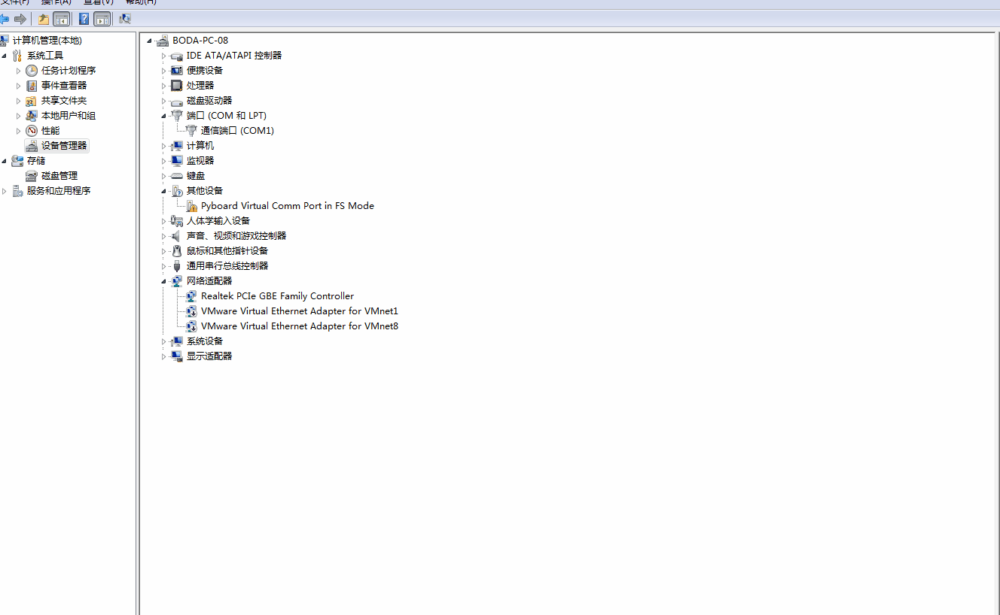
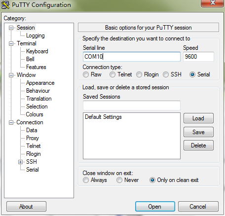
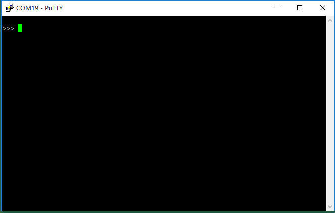
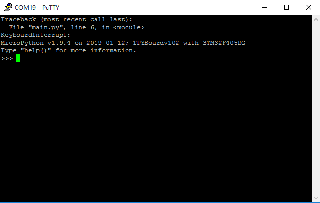
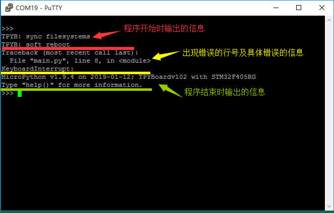
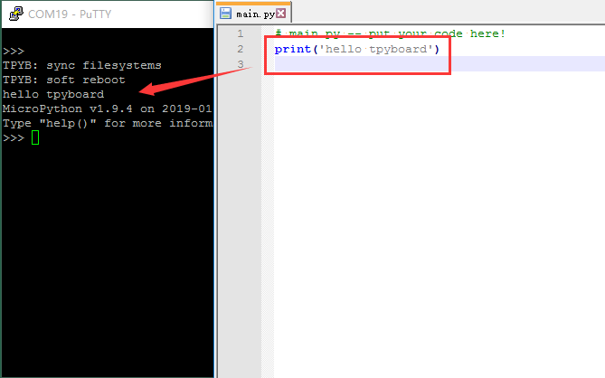

[Micropython]TPYBoard v102 获取REPL提示信息
=============================================

版权声明：翻译整理属于TPYBoard，转载时请以超链接形式标明文章原始出处和作者信息及本声明

前言
----------------------

REPL（交互式解释器）全称是 Read Evaluate Print Loop，TPYBoard 允许用户和 MicorPython 的交互式连接。 使用REPL是迄今为止来测试你的代码、获取程序错误信息和运行命令的最简单的方法。

REPL调试
----------------------

使用REPL需安装USB转串口的驱动，不同的系统不同的安装方式。

Windows
>>>>>>>>>>>>>

大部分win10系统会自动安装驱动。安装完成后，打开【设备管理器】就可以看到安装的端口号。

.. image:: img/win10.png

其他情况下，会出现下面的提示。

这时就需要我们去【设备管理器】进行手动安装。【其他设备】下看到一个带黄色感叹号图标的设备，右键选择更新驱动程序文件，定位到    ``TPYBFLASH`` 目录即可。

但是，有的朋友的电脑可能会安装失败，主要有两种情况：

 - 提示“没有INF签名的驱动程序”，这是因为有的电脑开启了驱动强制签名的设置，把此设置关闭即可。`解决方案 <http://docs.tpyboard.com/zh/latest/tpyboard/general/#win10>`_

 - 提示“系统找不到指定的文件”等类似的问题，这是因为有些电脑是通过GHOST方式装的系统，它会删减一些系统文件。`解决方法 <http://old.tpyboard.com/download/tool/197.html>`_

Windows下我们使用PuTTY软件进行REPL交互。
`下载PuTTY软件 <http://old.tpyboard.com/download/tool/3.html>`_

打开Putty软件，【Connection type】分类中选择【Serial】串口模式，输入串口端口号和波特率（默认波特率：9600）。例如端口号是COM10 *（这里的端口号是指自己设备管理器对应的端口号）* 。

点击【Open】，进行连接。连接成功后，如下图：

.. image:: img/putty1.png

有时打开时无任何信息，就看见一个光标和空屏幕，如下图：

.. image:: img/151.png

出现这种情况下，不用担心，并不是没有连接成功，而是当前没有信息输出而已。这时，你按下CTRL+C键出现">>>"提示符就好了。

有时可能会多输出一些信息，如下图：

这是因为开发板此时正在运行程序，我们通过外部快捷键CTRL+C强行停止运行，所以出现了上图错误的信息，大家可以忽略这个错误，它并不妨碍我们的正常使用。

那么问题来了，我们在PuTTY软件中看到的这些信息都是什么呢？

我们在程序中调用print()函数，打印的信息也会出现在PuTTY上。

REPL交互模式下，我们不仅可以看到输出的信息，也可以输入一些简单的程序进行交互。例如：

.. code-block:: python

    >>> print("hello tpyboard!")
    hello tpyboard!

在上面的例子中用户不需要敲入">>>"字符，而是应该在">>>"字符后写入内容。输入print("hello tpyboard!")文本并按下回车键，输出结果将在屏幕上，如上。
如果你已经知道一些Python知识，你也可以尝试一些基本的命令在这里。

.. code-block:: python

    >>> pyb.LED(1).on()
    >>> pyb.LED(2).on()
    >>> 1 + 2
    3
    >>> 1 / 2
    0.5
    >>> 20 * 'py'
    'pypypypypypypypypypypypypypypypypypypypy'

**PuTTY常用快捷键**

 - Ctrl+C：停止运行程序

 - Ctrl+D：重新运行程序(软复位)

**注意：**

  - 1.在使用Ctrl+D快捷键时，需要保证程序是停止运行的状态才会有效。
  
  - 2.有时必须按下RST键进行硬件复位时，需先关闭PuTTY再进行操作，否则下次连接会出错。如果出错了，就再硬复位一次重新打开PuTTY就好了。

**常见的程序格式错误**

如果出现“SyntaxError: invalid syntax“错误：可能就是tab和空格没对齐的问题。

如果出现“IndentationError: unindent does not match any outer indentation level”错误：可能就是使用的缩进方式不一致。

Linux(Ubuntu)
>>>>>>>>>>>>>>>

执行查看端口命令

.. code-block:: c

  ls -a /dev/ttyA*

使用picocom，若没有安装的，请执行下面命令进行安装。

.. code-block:: c

 apt-get install picocom

执行命令打开picocom，连接端口。例如端口号为ttyACM1。

.. code-block:: c

 picocom /dev/ttyACM1

提示输入配置参数，基本配置如下：

 - 波特率：9600 
 - 校验位：none 
 - 数据位：8 
 - 停止位：1

退出关闭-组合键Ctrl+A+Q。

MacOS
>>>>>>>>>>>>>>>

打开一个终端并运行

.. code-block:: c

  screen /dev/tty.usbmodem*

退出关闭-快捷键 CTRL-A CTRL-\。

PyCharm安装MicroPython插件的方法介绍 `点击进入 <http://docs.tpyboard.com/zh/latest/tpyboard/tutorial/pycharm>`_