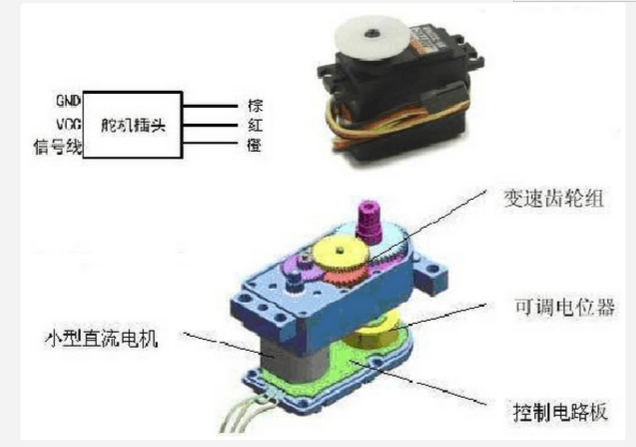

[Micropython]TPYBoard v10x 驱动舵机教程
==============================

引言
----------------------

大家应该都看到过机器人的手臂啊腿脚啊什么的一抽一抽的在动弹吧...是不是和机械舞一样的有节奏，现在很多机器人模型里面的动力器件都是舵机。

但是大家一般见到的动力器件都是像步进电机，直流电机这一类的动力器件，应该对舵机比较陌生。

舵机主要有以下3个优点:

一是体积紧凑，便于安装；
二是输出力矩大，稳定性好；
三是控制简单，便于和数字系统接口。

本次教程中使用的是SG90的舵机，个人感觉性能一般，但是比较稳定和耐用，做DIY实验器材用还是比较不错的。

舵机的基本介绍
-----------------------

- 舵机的组成与参数

舵机，又称伺服马达，是一种具有闭环控制系统的机电结构。舵机主要是由外壳、电路板、无核心马达、齿轮与位置检测器所构成。
其工作原理是由控制器发出PWM（脉冲宽度调制）信号给舵机，经电路板上的IC处理后计算出转动方向，再驱动无核心马达转动，
透过减速齿轮将动力传至摆臂，同时由位置检测器（电位器）返回位置信号，判断是否已经到达设定位置，一般舵机只能旋转180度。

- 舵机的接线

舵机有3根线，棕色为地，红色为电源正，橙色为信号线，但不同牌子的舵机，线的颜色可能不同。

- 舵机的控制原理

舵机的转动的角度是通过调节PWM（脉冲宽度调制）信号的占空比来实现的。

占空比:

1.指高电平在一个周期之内所占的时间比率。

2.正脉冲的持续时间与脉冲总周期的比值。例如:正脉冲宽度1μs,信号周期10μs的脉冲序列占空比为0.1。即：脉冲的宽度除以脉冲的周期称为占空比。标准PWM（脉冲宽度调制）信号的周期固定为20ms（50Hz），理论上脉宽分布应在1ms到2ms之间，但是，事实上脉宽可由0.5ms到2.5ms之间，脉宽和舵机的转角0°～180°相对应。

TPYBoard v10x驱动舵机
-----------------------

- 实验目的

通过加速度传感器的X方向控制舵机的转动，让舵机随TPYBoard 的转动而转动

- 实验材料

1. TPYBoard v10x 开发板 1块
2. SG90舵机 1个
3. 杜邦线 若干

- 连接图:

在micropython中已经有封装好的Servo模块用于伺服控制。设定了4个引脚X1、X2、X3和X4。我这里接的是X1引脚。

+--------------+--------+
| TPYBoardv10x | 舵机   |
+==============+========+
| X1           | 橙色   |
+--------------+--------+
| VIN          | 红色   |
+--------------+--------+
| GND          | 棕色   |
+--------------+--------+

.. image:: http://www.tpyboard.com/ueditor/php/upload/image/20160722/1469172305445497.jpg

当然，大家也可以使用其他的GPIO引脚，但是需要自己编写驱动程序，看参考此教程：http://old.tpyboard.com/support/studyexample14/214.html

- 实验代码

我们将三轴加速度传感器和舵机进行结合，实现当开发板转动时，舵机也随之转动。

main.py 内容如下:

.. code-block:: python

    from pyb import *
    
    accel = Accel()
    servo = Servo(1)
    while True:
        x = accel.x()
        servo.angle(-x*3,300)
        delay(200)

效果演示
-----------------------

  `观看视频 <http://v.youku.com/v_show/id_XMTY1MzE5ODIyOA==.html>`_

  虽然舵机只是能实现转动指定的角度，看起来功能很单一，但是单一的功能结合起来，就能完成很复杂的任务。

- `下载源码 <https://github.com/TPYBoard/developmentBoard/tree/master/TPYBoard-v10x-master>`_
