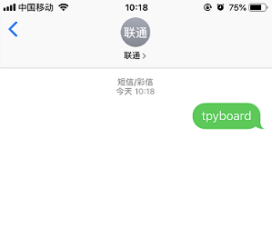

[Micropython]TPYBoard v102 温湿度短信通知器(SIM900A模块)
==============================================================

实验器件
-----------------------

 - TPYBoard v102 1块
 - SIM900A模块 1个
 - DHT11温湿度模块 1个  
 - micro USB 数据线 1根
 - USB转TTL模块或RS232(用于调试) 1块
 - 杜邦线 若干

SIM900A模块使用说明
-----------------------------

1.SIM900A模块需要单独外部供电，供电电压5V，电流1A。提供的用户手册中说调试初期短时间内电脑USB供电也可以。一开始用TTL模块（CH340）调试，发送AT指令模块无返回，TTL模块是可用的，不知道啥原因，
最好用CP2012芯片的。调试时最好用RS232接口。我这里用板子写了一个串口中间转发的程序才解决掉调试问题的。

2.给SIM900A模块上电前，请将SIM卡正确放入卡槽，接上GSM天线。通电后，可以通过观察D5和D6的工作状态来大致判断模块的工作状态。具体内容详见资料下载中的【12,调试教程 必看资料/全球鹰sim900 V3.8.1用户手册.pdf】。

3.SIM900A模块支持移动、联通2G网络，不支持电信。

4.模块上的5VR和5VT串口兼容3.3V和5V的TTL电平，如果你的单片机的TTL电平电压为3.3V时，可将单片机的TXD连接到模块上的5VR，RXD连接5VT，单片机的GND连接到模块的GND，模块上的VCC_MCU接到直流3.3V上。
同理若是5V电平，则VCC_MCU接到5V上。

以上说明在用户手册中都能找到，大家在使用时仔细阅读手册基本上遇到的问题都能解决。

接线说明
-------------------------------

+----------------+---------------+
| TPYBoard v102  |SIM900A模块    |
+================+===============+
| 3V3            | VCC_MCU       |
+----------------+---------------+
| GND            | GND           |
+----------------+---------------+
| Y1(UART6-TX)   | 5VR           |
+----------------+---------------+
| Y2(UART6-RX)   | 5VT           |
+----------------+---------------+

当然还需要我们的DHT11温湿度模块，用它来采集当前环境下的温湿度信息。关于DHT11模块的内容这里就不具体介绍了，没有了解过的小伙伴可以看一下本篇之前的教程中，有专门介绍DHT11模块。

+----------------+---------------+
| TPYBoard v102  |DHT11温湿度模块|
+================+===============+
| VIN            | VCC(+)        |
+----------------+---------------+
| Y12            | DATA(out)     |
+----------------+---------------+
| GND            | GND(-)        |
+----------------+---------------+

源代码
--------------------------

在写开发板的程序之前，建议先用PC与SIM900A模块进行调试，调试成功后，再将AT指令的收发功能移植到开发板的程序上。

main.py文件内容如下，可供参考。

.. code-block:: python

    import pyb
    from pyb import UART
    from dht11 import DHT11

    SIM = UART(6,9600,timeout=50)  #与SIM900A模块通信串口的初始化
    dht = DHT11('Y12')             #Y12是开发板上为DHT11数字输出引脚连接的引脚

    CMD = [
    'AT',
    'AT+CPIN?',     #查询SIM卡的状态
    'AT+CSQ',       #查询信号强度
    'AT+COPS?',     #查询当前运营商
    'AT+CMGF=1',    #设置为文本模式
    'AT+CSCS="GSM"',#设置字符集
    'AT+CNMI=2,1',  #设置新消息提示
    'AT+CMGR=',     #读取指定短信
    'AT+CMGS="18088889999"' #接收短信的手机号码
    ] 

    def sendToSIM(m,f=True):
        print('CMD:',m)
        if f:
            SIM.write(m + '\r\n')#每条AT指令后必须带\r\n
        else:
            SIM.write(m)         #编辑短信内容时不需要加\r\n
        
    if __name__ == '__main__':
        NUM = 0                  #计数,用来指定接下来要发送的AT指令
        Wait = False             #True 不发送AT指令 等待新短息指令
        msg = 'Temp:{}-Hum:{}'   #发送短信的内容
        sendToSIM(CMD[NUM])      #发送AT测试与模块通信是否正常
        while True:
            if SIM.any() > 0:    #any返回的是缓存区的字节数,判断大于0即表示有数据
                revData = SIM.read().replace(b'\r\n',b'')#读取缓存区的全部数据,返回的是bytes类型,replace去除\r\n
                print('rev:',revData)
                if revData.find(b'OK') > -1:
                    if len(revData) == 2:#模块返回OK,说明通信正常
                        if NUM == 0:
                            NUM = 1
                        elif 4 <= NUM <6:
                            NUM += 1
                            if NUM == 6:
                                Wait = True
                                print('等待新短息的到来......')
                                pyb.LED(2).on()
                    elif revData.find(b'+CPIN: READY') > -1: #表明SIM卡状态正常
                        NUM = 2 
                        print('SIM卡状态正常')
                    elif revData.find(b'+CSQ') > -1:             #返回信号强度值
                        if int(revData.split(b',')[0][-2:]) > 10:#信号强度值大于10才能正常收发短信
                            NUM = 3
                            print('信号质量正常')
                        else:
                            print('信号质量异常,请检查模块!')
                            break
                    elif revData.find(b'+COPS: 0,0,"CHN-UNICOM"') >-1:
                        #这里测试用的是联通卡返回为CHN-UNICOM，移动返回+COPS:0,0,"CHINAMOBILE"
                        NUM = 4
                        print('查询当前运营商成功')
                    elif revData.find(b'+CMGR:') > -1:    #短信的内容
                        if revData.find(b'tpyboard') > -1:#判断短信内容是否有tpyboard,有则短信回复温湿度信息
                            NUM = 8
                            print('指定短信接收成功')
                    elif revData.find(b'+CMGS:') > -1:
                        print('短信发送成功')
                        pyb.LED(4).on()
                elif revData.find(b'+CMTI') > -1:#有新短息来了
                        Wait = False
                        ID = revData.split(b',')[-1]  #获取新短息在SIM卡的位置编号
                        NUM = 7
                        CMD[NUM] = 'AT+CMGR=' + ID.decode()
                        print('来了条新短息')
                        pyb.LED(3).on()
                elif revData.find(b'>') > -1:
                        print('编辑短信并发送')
                        dhtData = dht.read_data() #采集温湿度信息
                        while 0 in dhtData:
                            dhtData = dht.read_data()
                        D = msg.format(*dhtData)
                        print(D)
                        sendToSIM(D,False)
                        pyb.delay(10)
                        #发送16进制0x1A 执行短信发送
                        sendToSIM(b'\x1A',False)
                        Wait = True
                if Wait == False:
                    sendToSIM(CMD[NUM])

程序调试
------------------

1、程序一开始运行会进行一些初始化配置，比如获取信号质量、运营商等;

2、当PuTTY输出等待新短息到来，板载LED2亮起，说明初始化完毕;

3、手机发送短息给模块上安装的SIM卡号码，内容为tpyboard;

4、接收到新短信后LED3亮起，读取内容判断是否存在tpyboard;

5、存的话，开始采集DHT11模块的温湿度信息，编辑短息发送出去;

6、这时LED4亮起，手机就会收到带有温湿度信息的短息了。

- `下载源码 <https://github.com/TPYBoard/TPYBoard-v102>`_

- `下载SIM900A资料 <http://old.tpyboard.com/download/data/202.html>`_