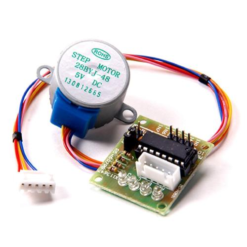
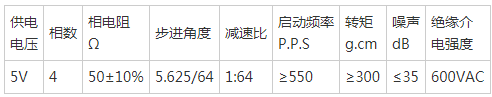
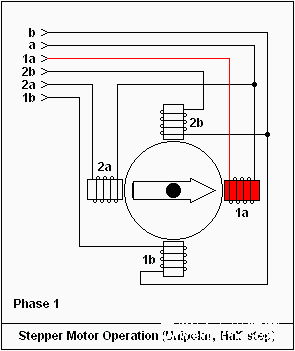

.. _quickref:

[Micropython]TPYBoard v10X 驱动28BYJ-48步进电机
========================================================

版权声明：翻译整理属于TPYBoard，转载时请以超链接形式标明文章原始出处和作者信息及本声明

实验目的
---------------------

    - 了解步进电机的工作原理。
    - 学习步进电机的驱动方法。

所需元器件
---------------------

    - TPYBoard v102板子 1块
    - micro USB数据线 1条
    - 杜邦线 若干
    - 微型步进电机（28BYJ-48） 1个
    - 步进电机驱动板（ULN2003APG） 1块

28BYJ-48步进电机
---------------------

本次实验采用的是28BYJ-48 四相八拍电机，电压DC5V~12V。
24BYJ48名称的含义：
24：电机外径24mm 
B：步进电机中步字的拼音首字母
Y：永磁中永字的拼音首字母
J：减速的减字拼音首字母
48：四相8步

实物图
~~~~~~~~~~~~~~

工作原理
~~~~~~~~~~~~~

步进电机是将电脉冲信号转变为角位移或线位移的开环控制电机，是现代数字程序控制系统中的主要执行元件，应用极为广泛。
在非超载的情况下，电机的转速、停止的位置只取决于脉冲信号的频率和脉冲数，而不受负载变化的影响，当步进驱动器接收到一个脉冲信号，
它就驱动步进电机按设定的方向转动一个固定的角度，称为“步距角”，它的旋转是以固定的角度一步一步运行的。可以通过控制脉冲个数来控制角位移量，
从而达到准确定位的目的；同时可以通过控制脉冲频率来控制电机转动的速度和加速度，从而达到调速的目的。

28BYJ-48 步进电机参数表
~~~~~~~~~~~~~~~~~~~~~~~~~~~~

上表中启动频率≥550 P.P.S（每秒脉冲数），意思是要想正常启动，需要单片机每秒至少给出550个步进脉冲。那么每一节拍需要持续的时间就是1S/550≈1.8ms，所以控制节拍刷新的速率应大约1.8ms。

驱动原理
~~~~~~~~~~~~

当连续不断的给电机发送控制脉冲时，电机就会不断的转动。每一个脉冲信号对应步进电机的某一相或两相绕组的通电状态改变一次，对应转子就会转过一定的角度（步距角）。当通电状态的改变完成一个循环时，转子转过一个齿距。
四相步进电机可以在不同的通电方式下运行，常见的通电方式：

    - 四拍（单相绕组通电）：A-B-C-D-A…
    - 双四拍（双相绕组通电）：AB-BC-CD-DA-AB-...
    - 八拍： A-AB-B-BC-C-CD-D-DA-A…

模拟效果图:

硬件连接
---------------------

将步进电机白色接头插到驱动板对应的座子上即可。

TPYBoard v102驱动板与驱动板的接线图，如下：

+----------------+-------------------+
| TPYBoard v102  | ULN2003APG驱动板  |
+================+===================+
| X1             | IN1               |
+----------------+-------------------+
| X2             | IN2               |
+----------------+-------------------+
| X3             | IN3               |
+----------------+-------------------+
| X4             | IN4               |
+----------------+-------------------+
| VIN            | +5V               |
+----------------+-------------------+
| GND            | 负极              |
+----------------+-------------------+

源代码
---------------------

.. code-block:: python

    # main.py -- put your code here!
    import pyb
    from pyb import Pin

    Pin_All=[Pin(p,Pin.OUT_PP) for p in ['X1','X2','X3','X4']]

    #转速(ms) 数值越大转速越慢 最小值1.8ms
    speed=2

    STEPER_ROUND=512 #转动一圈(360度)的周期
    ANGLE_PER_ROUND=STEPER_ROUND/360 #转动1度的周期
    print('ANGLE_PER_ROUND:',ANGLE_PER_ROUND)

    def SteperWriteData(data):
        count=0
        for i in data:
            Pin_All[count].value(i)
            count+=1
    def SteperFrontTurn():
        global speed
        
        SteperWriteData([1,1,0,0])
        pyb.delay(speed)

        SteperWriteData([0,1,1,0])
        pyb.delay(speed)

        SteperWriteData([0,0,1,1])
        pyb.delay(speed)
        
        SteperWriteData([1,0,0,1])   
        pyb.delay(speed)
        
    def SteperBackTurn():
        global speed
        
        SteperWriteData([1,1,0,0])
        pyb.delay(speed)
        
        SteperWriteData([1,0,0,1])   
        pyb.delay(speed)
        
        SteperWriteData([0,0,1,1])
        pyb.delay(speed)

        SteperWriteData([0,1,1,0])
        pyb.delay(speed)

    def SteperStop():
        SteperWriteData([0,0,0,0])
        
    def SteperRun(angle):
        global ANGLE_PER_ROUND
        
        val=ANGLE_PER_ROUND*abs(angle)
        if(angle>0):
            for i in range(0,val):
                SteperFrontTurn()
        else:
            for i in range(0,val):
                SteperBackTurn()
        angle = 0
        SteperStop()

    if __name__=='__main__':
        SteperRun(180)
        SteperRun(-180)
        
- `下载源码 <https://github.com/TPYBoard/developmentBoard/tree/master/TPYBoard-v10x-master>`_