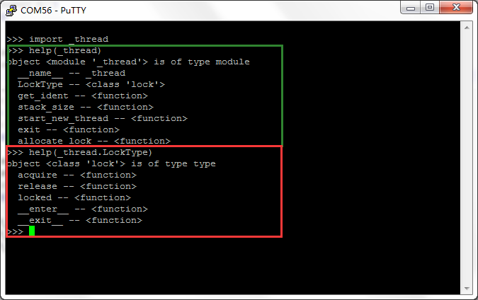
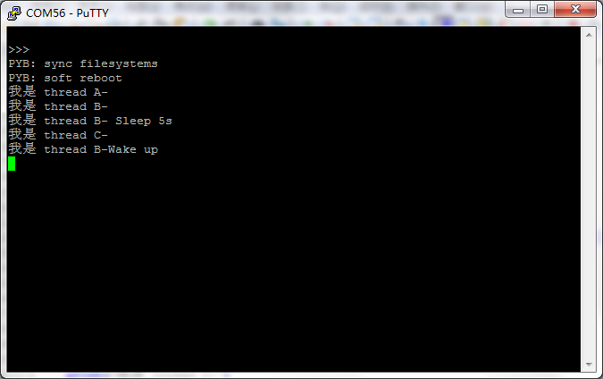
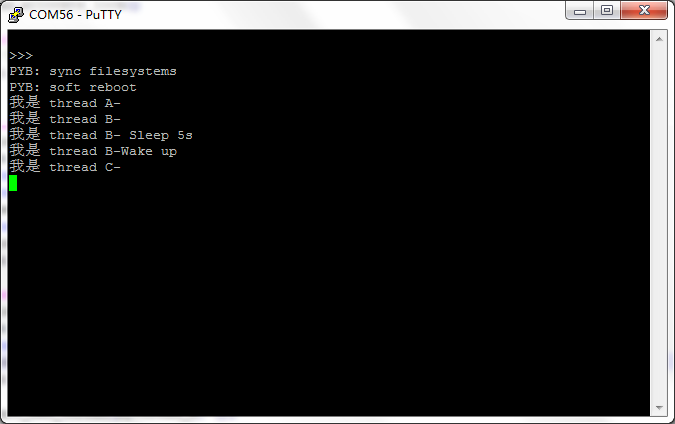

.. _quickref:

[Micropython]TPYBoard v10x 线程与锁
========================================================

版权声明：翻译整理属于TPYBoard，转载时请以超链接形式标明文章原始出处和作者信息及本声明

线程的介绍
---------------------
   
线程是程序中一个单一的顺序控制流程。进程内一个相对独立的、可调度的执行单元，是系统独立调度和分派CPU的基本单位指运行中的程序的调度单位。在单个程序中同时运行多个线程完成不同的工作，称为多线程。

在micropython官方网站的 `DOWNLOAD <http://micropython.org/download>`_ 下载页中,pyboard的固件中有一个"threading"版本的固件，里面包含了_thread模块允许多线程操作。

线程的使用
---------------------

接下来为大家演示一下，在micropython的平台上如何实现多线程的操作。
    
- 烧写threading版本的固件
    
    本次我用的是TPYBoard v102(绿色版)，所以烧写的是PYBv1.0版本的，简约版的也是这个版本。如果是TPYBoard v102(黑色版)，就要烧写PYBv1.1版本的了。

- <_thread>模块的了解
    
    我用Putty连接TPYBoard v102，先大体了解一下_thread模块。
    
.. code-block:: python    
    
    import _thread
    help(_thread)
    help(_thread.LockType)

    
- 源代码

.. code-block:: python

    # main.py -- put your code here!
    import _thread
    import time
     
    lock=_thread.allocate_lock()
     
    def myThread_A():
        print('我是 thread A-')
        _thread.exit()
     
     
    def myThread_B(time_):
        time.sleep(time_)
        print('我是 thread B-')
        print('我是 thread B- Sleep 5s')
        time.sleep(5)
        print('我是 thread B-Wake up')
        _thread.exit()
     
    def myThread_C(time_):
        time.sleep(time_)
        print('我是 thread C-')
        _thread.exit()
     
    _thread.start_new_thread(myThread_A, ())
    _thread.start_new_thread(myThread_B, (2,))
    _thread.start_new_thread(myThread_C, (3,))
     
    while True:
        pass

- 效果图
    

    

    
多线程中锁的使用
---------------------

多线程同时运行时，是共享内存、共享数据和资源的，当你需要独占某一个资源时，你就可以使用锁来把这个资源锁住，只有等你释放打开这个锁后，其它线程才能使用。
    
    

- 源代码
    
.. code-block:: python

    # main.py -- put your code here!
    import _thread
    import time
     
    lock=_thread.allocate_lock()
     
    def myThread_A():
        print('我是 thread A-')
        _thread.exit()
     
     
    def myThread_B(time_):
        time.sleep(time_)
        if lock.acquire():#锁住资源
            print('我是 thread B-')
            print('我是 thread B- Sleep 5s')
            time.sleep(5)
            print('我是 thread B-Wake up')
            lock.release()#打开锁 释放资源
        _thread.exit()
     
    def myThread_C(time_):
        time.sleep(time_)
        if lock.acquire():#B先抢到了资源 需等待B释放后才能占有
            print('我是 thread C-')
            lock.release()
        _thread.exit()
     
    _thread.start_new_thread(myThread_A, ())
    _thread.start_new_thread(myThread_B, (2,))
    _thread.start_new_thread(myThread_C, (3,))
     
    while True:
        pass
    
    
    
- 效果图
    

- `下载源码 <https://github.com/TPYBoard/developmentBoard/tree/master/TPYBoard-v10x-master>`_
