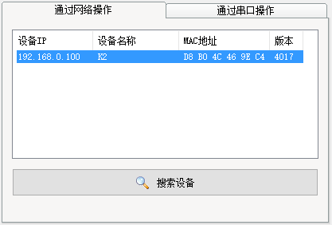
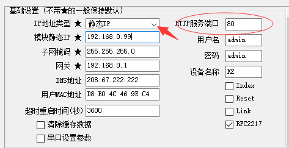
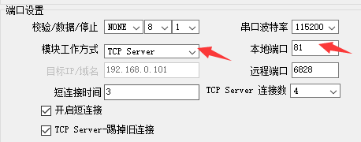
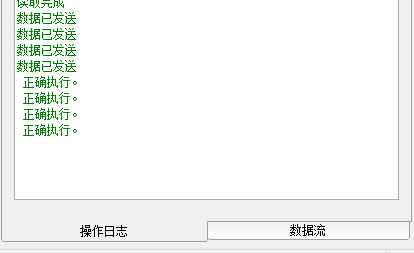
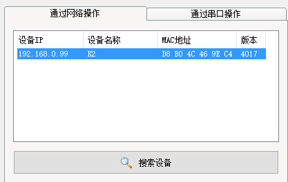
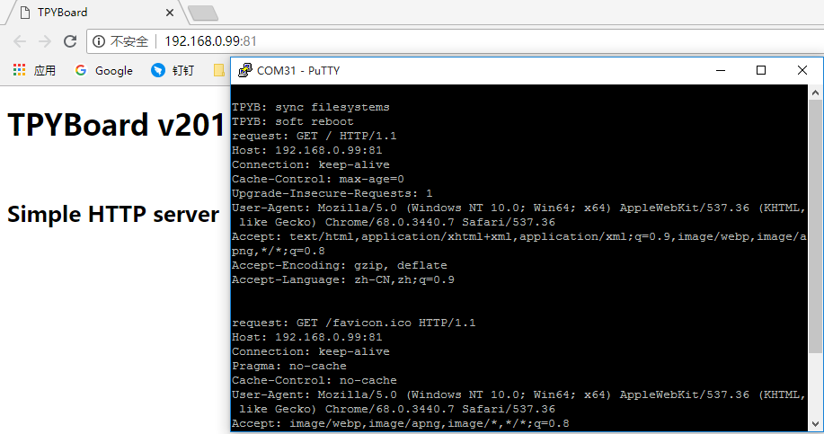

[Micropython]TPYBoard v201 简易的WEB服务器
===============================================

版权声明：翻译整理属于TPYBoard，转载时请以超链接形式标明文章原始出处和作者信息及本声明

前言
-----------

TPYBoard v201开发板上搭载了以太网转TTL串口模块(USR-K2)，从而实现了TCP通信的功能。既然可以TCP通信，自然也可以实现HTTP协议通信。于是，就萌发了本教程。本教程很简单，仅是实现了一个简单的静态页面，希望可以给大家带来不一样的启发。

准备工作
----------

**硬件&工具**

- TPYBoard v201 开发板 1块
- TPYBoard v201 网络参数配置的工具
- 路由器、电脑、网线等

**知识储备**

- 了解基本的TCP、HTTP通信协议等相关的知识。不知道的可自行去百度，相关教程很多。

TPYBoard v201网络参数配置
-----------------------------

`USR-K2资料和工具下载 <https://github.com/TPYBoard/Documentation/blob/master/tpyboard_docs/tpyboard/tutorial/doc/USR-K2%E8%B5%84%E6%96%99.rar>`_ 
下载地址是在GitHub上，如果下载速度很慢的话，你也可以加TPYBoard技术交流/*裙*/;157816561 文件里下载。

首先，将TPYBoard v201开发板通过网线与你使用的电脑接入同一个局域网内。双击运行<USR-M0_V2.2.1.272.exe>，点击搜索设备，成功的情况下会在上面的列表中显示搜索到的设备。

点击搜素到的设备，可以读取到该设备的相关参数。同时也可以进行修改并保存。接下来，我们要进行IP地址、端口等设置。IP地址我这里设置了静态IP<192.168.0.99>，防止每次重新启动时会改变IP。

接下来端口设置，模块工作方式选择TCP Server。大家可以注意到基础设置中有一个HTTP服务端口的设置，是因为USR-K2中本身就有一个内嵌的网页用于参数的设置，默认是启用了80端口，那我们下面开启的TCP Server的服务端口就使用81端口吧。

设置完毕后，点击软件最下方的保存设置。左侧的操作日志显示框会显示保存的进度和状态。

这时再重新搜索设备，验证下模块的IP地址是否和我们设置的一致。

程序实现
---------------

TPYBoard v201通过板子上的串口6与USR-K2模块之间通信。我们不用去管TCP链接等问题，只需要将想要发送的数据通过串口6发送给K2模块即可。其实我们的程序主要就是读取和写入串口的工作，
当我们从串口读取到HTTP请求报文时，组成一个简单的响应报文写入到串口发送回去就可以了。

main.py 源码：

.. code-block:: python

    import pyb
    from pyb import UART

    #串口6初始化
    uart = UART(6,115200,timeout = 100)
    #响应报文
    header = """
    HTTP/1.1 200 OK
    Content-Type:text/html
    Content-Length:{0}

    {1}
    """
    #HTML页面
    html = """<!DOCTYPE html>
    <html>
        <meta http-equiv="Content-Type" content="text/html; charset=utf-8" />
        <head> <title>TPYBoard</title> </head>
        <body>
          <h1>TPYBoard v201</h1> 
          <h2>Simple HTTP server</h2>
        </body>
    </html>
    """

    while True:
        if uart.any() > 0:
            request = uart.read().decode()
            print('request:',request)
            #当接收到GET请求头时，进行响应
            if request.find('GET') > -1:
                data = header.format(len(html),html)
                uart.write(data)

保存代码。打开浏览器，输入URL进行访问。URL=ip:81，例如我的URL就是192.168.0.99:81。

PuTTY中打印了接收到的请求头的数据，如下：

.. code-block:: c

    request: GET / HTTP/1.1
    Host: 192.168.0.99:81
    Connection: keep-alive
    Cache-Control: max-age=0
    Upgrade-Insecure-Requests: 1
    User-Agent: Mozilla/5.0 (Windows NT 10.0; Win64; x64) AppleWebKit/537.36 (KHTML, like Gecko) Chrome/68.0.3440.7 Safari/537.36
    Accept: text/html,application/xhtml+xml,application/xml;q=0.9,image/webp,image/apng,*/*;q=0.8
    Accept-Encoding: gzip, deflate
    Accept-Language: zh-CN,zh;q=0.9

我用的是谷歌浏览器，不同浏览器可能会有些不同，但是大同小异，只要符合HTTP请求报文格式即可，有兴趣的朋友可以多去了解些。细心的朋友会注意到，每次访问时浏览器会发送两次请求，其中有一个 GET /favicon.ico HTTP/1.1，这是因为浏览器想找favicon.ico文件作为访问网页的图标，这个可以忽略掉，不影响功能。也可以在程序中进行过滤。

- `下载源码 <https://github.com/TPYBoard/TPYBoard-v201>`_
