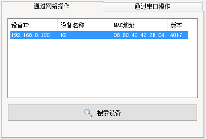
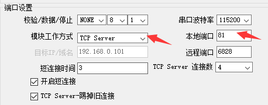
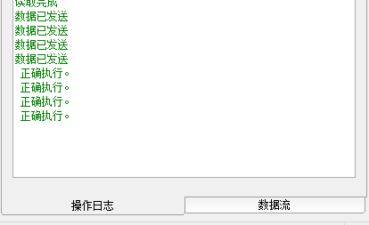

[Micropython]TPYBoard v201 简易家庭气象站的实现过程
======================================================

版权声明：翻译整理属于TPYBoard，转载时请以超链接形式标明文章原始出处和作者信息及本声明

前言
-----------

上一篇教程中我们实现了一个简单网页的显示。本篇呢，增加上温湿、时间等信息的展示，实现一个简单的家庭气象站。

**TPYBoard v201开发板实物图**

.. image:: images/v201.jpg

准备工作
----------

**硬件&工具**

- TPYBoard v201 开发板 1块
- TPYBoard v201 网络参数配置的工具
- 路由器、电脑、网线等
- DHT11温湿度模块 1个
- DS3231时钟模块 1个

**知识储备**

- 了解基本的TCP、HTTP通信协议等相关的知识。不知道的可自行去百度，相关教程很多。
- 掌握DHT11温湿度模块的使用方法。
- 掌握DS3231时钟模块的使用方法。

TPYBoard v201网络参数配置
-----------------------------

`USR-K2资料和工具下载 <https://github.com/TPYBoard/Documentation/blob/master/tpyboard_docs/tpyboard/tutorial/doc/USR-K2%E8%B5%84%E6%96%99.rar>`_ 
下载地址是在GitHub上，如果下载速度很慢的话，你也可以加TPYBoard技术交流群：157816561 群文件里下载。

首先，将TPYBoard v201开发板通过网线与你使用的电脑接入同一个局域网内。双击运行<USR-M0_V2.2.1.272.exe>，点击搜索设备，成功的情况下会在上面的列表中显示搜索到的设备。

点击搜素到的设备，可以读取到该设备的相关参数。同时也可以进行修改并保存。接下来，我们要进行IP地址、端口等设置。IP地址我这里设置了静态IP<192.168.0.99>，防止每次重新启动时会改变IP。

.. image:: images/1.png

接下来端口设置，模块工作方式选择TCP Server。大家可以注意到基础设置中有一个HTTP服务端口的设置，是因为USR-K2中本身就有一个内嵌的网页用于参数的设置，默认是启用了80端口，那我们下面开启的TCP Server的服务端口就使用81端口吧。

设置完毕后，点击软件最下方的保存设置。左侧的操作日志显示框会显示保存的进度和状态。

这时再重新搜索设备，验证下模块的IP地址是否和我们设置的一致。

.. image:: images/4.png

程序实现
---------------

TPYBoard  v201通过板子上的串口6与USR-K2模块之间通信。我们不用去管TCP链接等问题，只需要将想要发送的数据通过串口6发送给K2模块即可。
其实我们的程序主要就是读取和写入串口的工作，当我们从串口读取到HTTP请求报文时，开始采集DHT11和DS3231的数据，采集完成后组成一个完整的响应报文写入到串口发送回去就可以了。

这里只展示main.py文件，其中里面还需要DHT11和DS3231的驱动文件，文章末有下载链接大家可自行下载参考。

main.py 源码：

.. code-block:: python

    import pyb
    from pyb import Timer,UART
    from ds3231 import DS3231
    from dht11 import DHT11

    #串口6初始化
    uart = UART(6,115200,timeout = 100)
    #响应报文
    header = """
    HTTP/1.1 200 OK
    Content-Type:text/html
    Content-Length:{0}

    {1}
    """
    #HTML页面
    html = """
    <html>
        <meta http-equiv="Content-Type" content="text/html; charset=utf-8" />
        <head> <title>TPYBoard v201</title> </head>
        <body>
            <h1>TPYBaord 家庭气象站</h1> 
            
时间:{}

            
温度:{}

            
湿度:{}

        </body>
    </html>
    """

    #------------------------DS3231----------------------------------#
    ds=DS3231(2) #设置DS3231为I2C2接口,对应SCL-Y9,SDA-Y10
    #初始日期和时间，设置一次即可
    #ds.DATE([19,7,27])   #设置初始日期年、月、日
    #ds.TIME([14,50,0])   #设置初始时间时、分、秒
    #------------------------DHT11----------------------------------#
    d = DHT11('X12')

    def updateDisplay():

        DATE = [str(i) for i in ds.DATE()] #将返回的时间数据int转str
        TIME = [str(i) for i in ds.TIME()]
        time = '-'.join(DATE) + ' ' + ':'.join(TIME) #读取日期和时间，拼接成正常的时间格式
        data = d.read_data()             #读取温湿度的值
        return time,data

    while True:
        if uart.any() > 0:
            request = uart.read().decode()
            print('request:',request)
            #当接收到GET请求头时，进行响应.同时把favicon.ico请求过滤掉
            if request.find('GET') > -1 and request.find('favicon.ico') < 0:
                time,data = updateDisplay()
                print(data)
                HTML = html.format(time,data[0],data[1])
                #print(HTML)
                uart.write(header.format(len(HTML),HTML))

保存代码。打开浏览器，输入URL进行访问。URL=ip:81，例如我的URL就是192.168.0.99:81。

.. image:: images/5.png

如果访问时页面出现了乱码，主要有两个地方需要注意下：

- 1.main.py文件的编码格式修改为UTF-8 无BOM格式；
- 2.代码中的HTML字符串中需要添加<meta http-equiv="Content-Type" content="text/html; charset=utf-8" />
- 3.通过浏览器开发者工具查看，接收到的Response体是否完整。

大家可以依照本实验的基础加上自己喜欢的显示屏，然后用纸盒等包装起来，DIY一个超棒的家庭气象站。同时也可以做一个路由器映射，这样就可以
随时随地查看家里的环境信息了。

- `下载源码 <https://github.com/TPYBoard/TPYBoard-v201>`_
