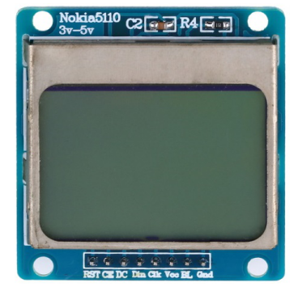
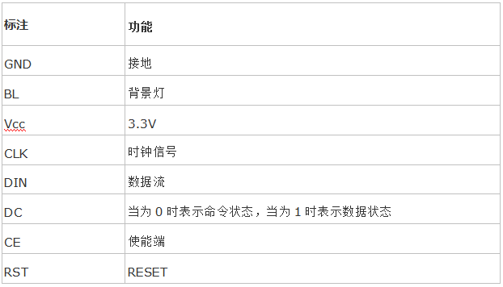
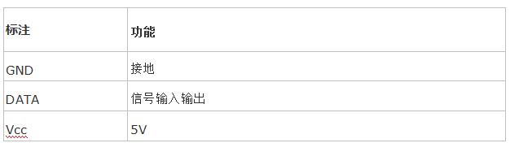
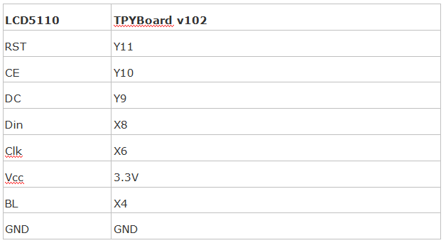
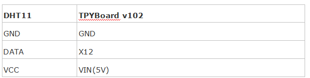
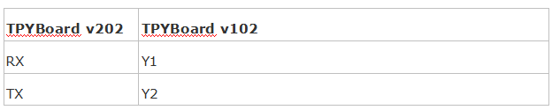
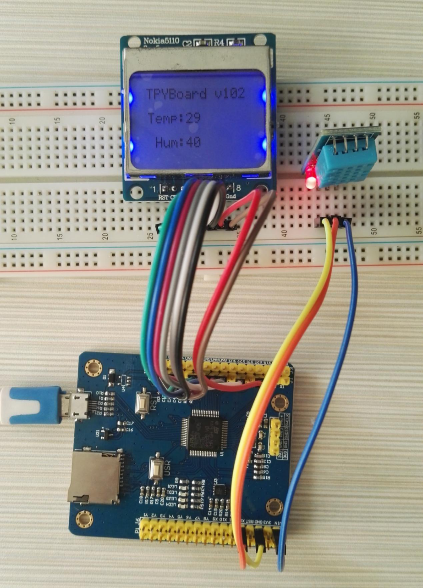
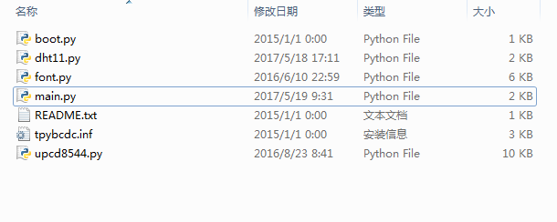
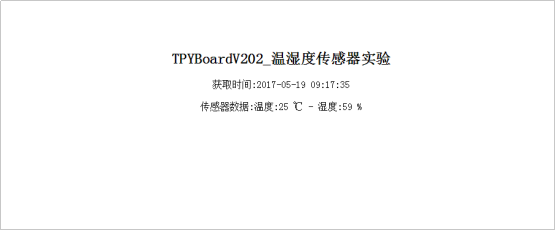

[Micropython]TPYBoard v202 家庭气象站
==============================================================

一、实验器件
-----------------------

 - TPYBoard v102 1块
 - TPYBoard v202 1块
 - Nokia 5110LCD显示屏 1块
 - DHT11温湿度传感器 1个 
 - micro USB 数据线 2根
 - 面包板 1块
 - 杜邦线 若干

二、实验步骤
---------------------------

 - TPYBoard v102连接DHT11，采集温湿度信息；
 - TPYBoard v102将采集到的温湿度信息显示在LCD5110上；
 - TPYBoard v102通过串口将温湿度信息发送给TPYBoard v202；
 - TPYBoard v202 将串口的数据读取出来，同时传递到服务器上。

三、实验方法
-----------------------------

1、Nokia 5110 LCD显示屏说明
>>>>>>>>>>>>>>>>>>>>>>>>>>>>>>>>>>>>>>

LCD5110是一款84x48 的点阵LCD，可以显示4 行汉字。采用串行接口与主处理器进行通信，支持多种串行通信协议（如AVR 单片机的ＳＰI、MCS51 的串口模式０等），传输速率高达4Mbps，可全速写入显示数据。

Nokia 5110 LCD共有8个引脚，不同的板子可能标注的英文略有不同，具体参照如下：

2、DHT11温湿度说明
>>>>>>>>>>>>>>>>>>>>>>>>>>>>>>>>>>>>>>

DHT11是一款有已校准数字信号输出的温湿度传感器。 精度湿度+-5%RH， 温度+-2℃，量程湿度20-90%RH， 温度0~50℃。

.. image:: images/DHT11.png

DHT11温湿度共有3个引脚，具体参照如下：

四、接线方式
-------------------------------

1、针脚对应图
>>>>>>>>>>>>>>>>>>>>>>>>>>>

DHT11和LCD5110的使用方法上面都介绍过了，接下来，就要动手和我们的TPYBoard v102	接起来了。

TPYBoard v102连接LCD5110

TPYBoard v102连接DHT11

TPYBoard v102连接TPYBoard v202

**注意:** TPYBoard v202只有一个串口，在使用时比较麻烦。因为REPL也是通过串口输出的，有些字符会导致v202的程序停止，或者支持REPL（puuty）等工具会无法使用。使用时，应多注意冲突。

2、实物连接图
-----------------------

五、源代码
--------------------------

TPYBoard v102 源代码

TPYBoard v102 main.py文件内容如下：

::

    #main.py
    import pyb
    import upcd8544
    from machine import SPI,Pin
    from dht11 import DHT11
    def main(lcd_5110,dht,uart6):
        data_=dht.read_data()
        lcd_5110.lcd_write_string(' ',0,1)#添加一个分隔行
        lcd_5110.lcd_write_string('Temp:'+str(data_[0]),2,2)
        lcd_5110.lcd_write_string(' ',0,3)
        lcd_5110.lcd_write_string(' Hum:'+str(data_[1]),2,4)
        uart6.write(str(data_[0])+','+str(data_[1]))#通过串口将数据发送给v202
    if __name__ == '__main__':
        #init UART
        u6=pyb.UART(6,115200)
        #init DHT11 
        dht=DHT11('X12')
        #init LCD5110
        SPI    = pyb.SPI(1) 
        RST    = pyb.Pin('Y11')
        CE     = pyb.Pin('Y10')
        DC     = pyb.Pin('Y9')
        LIGHT  = pyb.Pin('X4')
        #DIN=>X8-MOSI/CLK=>X6-SCK
        #DIN =>SPI(1).MOSI 'X8' data flow (Master out, Slave in)
        #CLK =>SPI(1).SCK  'X6' SPI clock
        lcd_5110 = upcd8544.PCD8544(SPI, RST, CE, DC, LIGHT)
        lcd_5110.lcd_write_string('TPYBoard v102',1,0)
        while True:
            main(lcd_5110,dht,u6)
            pyb.delay(2000)

TPYBoard v202 main.py文件内容，如下：

::

    import machine
    import network
    import socket
    from machine import Pin
    from machine import UART
    import time
    u2=UART(0,115200)#串口初始化
    led = Pin(2, Pin.OUT).value(1)#板载小蓝灯 默认关闭
    def http_get(temp,hum):
        url='http://old.tpyboard.com/esp8266/SensorTest.php?t='+temp+'&h='+hum+''
        _, _, host, path = url.split('/', 3)
        addr = socket.getaddrinfo(host, 80)[0][-1]
        s = socket.socket()
        s.connect(addr)
        s.send(bytes('GET /%s HTTP/1.0\r\nHost: %s\r\n\r\n' % (path, host), 'utf8'))
        while True:
            data = s.recv(50)
            if data:
                recive=str(data, 'utf8').upper()
                #print(str(data, 'utf8'), end='')
                if(recive.find('YES')>-1):
                   print('Send Data OK')
            else:
                break
        s.close()
    def do_connect():
        wlan = network.WLAN(network.STA_IF)
        wlan.active(True)
        if not wlan.isconnected():
            print('connecting to network...')
            wlan.connect( 'ssid', 'pwd')
            while not wlan.isconnected():
                pass
        print('network config:', wlan.ifconfig())
    do_connect()
    led = Pin(2, Pin.OUT).value(0)#连接wifi成功 点亮LED
    while 1:
        data_=u2.readall()
        if data_!=None:
            data_=data_.decode('utf8')#数组转成字符串
            data_a=data_.split(',')#分割
            temp_=str(data_a[0])#温度
            hum_=str(data_a[1])#湿度
            http_get(temp_,hum_)#发送给服务器
			time.sleep(2)

**服务器源码**

SensorTest.php 用于接收TPYBoard v202提交的数据。

SensorData.php 用于显示TPYBoard v202上传的数据。

页面下方点击下载源码，获取SensorData.php和SensorTest.php文件。

六、效果图
----------------------------

1、实物效果图
>>>>>>>>>>>>>>>>>>>>>>>

.. image:: images/SW1.png

2、网页效果图
>>>>>>>>>>>>>>>>>>>>>

访问网址：http://old.tpyboard.com/esp8266/SensorData.php

- `下载源码 <https://github.com/TPYBoard/TPYBoard-v202>`_