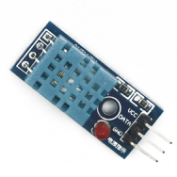
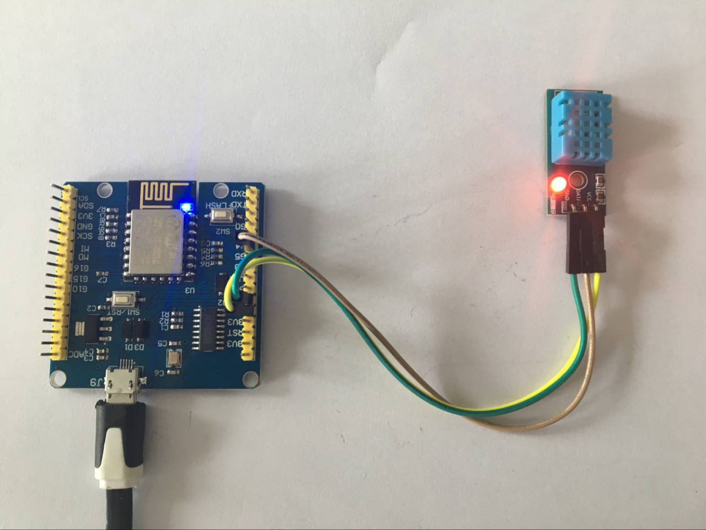
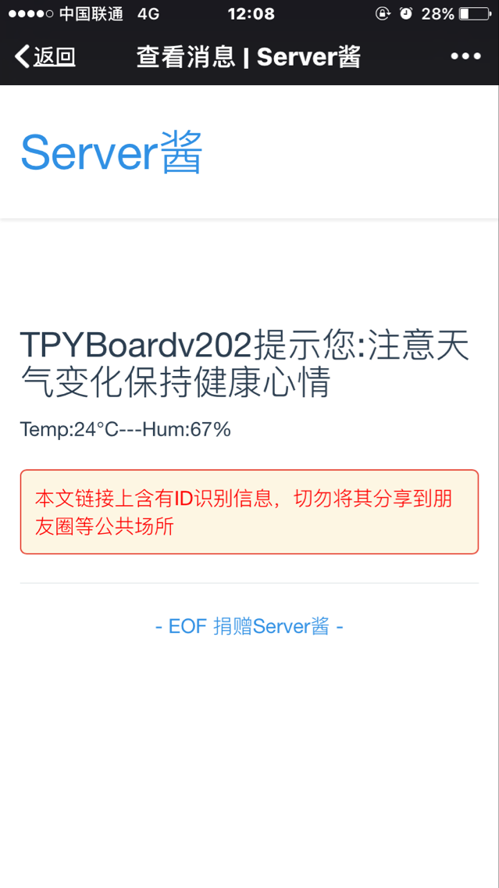

[Micropython]TPYBoard v202 自制微信远程智能温湿度计
====================================================

智能时代一夜间什么都能远程了。创业者想着如何做智能产品，如何做远程控制。DIY爱好者也想着如何自制各种奇妙的工具。这里和大家一起学习制作一款廉价的智能温湿度计。说它廉价是因为共计花费不过40元，说它智能是因为你可以通过手机微信时时知道该设备所在位置的温湿度。

一、申请微信推送服务
-----------------------------

		能否实现微信推送服务的平台有很多，这里我就不一一解释了。我选用了「Server酱」，英文名「ServerChan」。你完全可以选用你认为比较好用的平台。「Server酱」的申请方法：
	
	打开该网址http://sc.ftqq.com/3.version，开通并使用：

	- 1.登入：用GitHub账号登入网站，点击进入“发送消息”页面，就能获得一个SCKEY。具体见：http://sc.ftqq.com/?c=code
	- 2.绑定：点击“微信推送”页面，扫码关注同时即可完成绑定
	- 3.发消息：往 https://sc.ftqq.com/SCKEY.send 发GET请求，就可以在微信里收到消息啦。

二、让我们开始DIY温湿度计
-------------------------------------

1、选择合适的主控板
>>>>>>>>>>>>>>>>>>>>>>>>>>>>>

	更喜欢python编程的我，这里选用支持micropython的TPYBoard v202（esp8266）开发板。该开发板能够直接用python进行编程，功能还是比较强大的，甚至可用来作web服务器。这里我们主要是用其进行温湿度传感器的控制及网络请求。
	
.. image:: images/2021.png

2、DHT11温湿度传感器
>>>>>>>>>>>>>>>>>>>>>>>>>>>>>>>>>>>

	DHT11是常用的温湿度传感器，网上可以很轻易就买到。简单的讲，就是可以用这个传感器获取的当前环境的温度和湿度。

	该传感器使用非常简单，有的有3个引脚，有的有4个引脚。我们在使用时，只用三个，分别为VCC（电源脚，接5V）、DATA（数据引脚）、GND（接地）。

3、正确的连线方法
>>>>>>>>>>>>>>>>>>>>>>>>>>>>>>>>>>>>>>>>

	TPYBoard v202与DHT11的具体接线对应及实物图

三、少不了的编程
-----------------------------

	TPYBoard v202主要有两个文件来控制，一个是boot,py，一个是main.py。我们只需要修改这两个文件就可以完成程序的编写。如果你对如何使用TPYBoard v202还不清楚，可以参照

http://docs.tpyboard.com/zh/latest/tpyboard/tutorial/v202/。

1、编写boot脚本
>>>>>>>>>>>>>>>>>>>>>>>>>>>>>>>>>>

	boot()::

		import network
		import utime
		 
		pdcn = network.WLAN(network.STA_IF)
		pdcn.active(True)
		pdcn.connect('wifi账号', 'wifi密码')
		utime.sleep(5)
		if pdcn.isconnected():
		    print("WiFi is connected %s."%pdcn.ifconfig()[0])    
		else:
		    pdcn.active(False)
		    utime.sleep(5)
		    print("WiFi cannot connect.")

2、编写main.py脚本
>>>>>>>>>>>>>>>>>>>>>>>>>>>

	main()::

		# coding=utf-8
		import urequests
		import dht
		import machine
		from machine import Pin
		import time  
		 
		class AlarmSystem:
			def __init__(self):
				self.d = dht.DHT11(machine.Pin(5))
		 
			def dht11(self):
				try:
					self.d.measure()
					return 'Temp:'+str(self.d.temperature())+'°C---Hum:'+str(self.d.humidity())+'%'
			
				except:
					return '0'
		 
			def push(self, result):
				title = "TPYBoardv202提示您:注意天气变化保持健康心情"
				content = 'text='+title+'&'+'desp='+result
				url="https://sc.ftqq.com/你的密钥.send?%s" % content
				r = urequests.get(url)
				r.close()

		p2=Pin(2,Pin.OUT)
		a = AlarmSystem()

		def SendData():
			p2.value(not p2.value())
			data_= a.dht11()
			if(data_!='0'):
				print(data_)
				a.push(data_)
			else:
				print('GET Data Fail')

		if __name__ == '__main__':
			
			while True:
				SendData()
				time.sleep(300)

四、成果分享
-------------------------

	到这里，工作完成，方糖就会给你，你就会看到显示的温湿度了。

