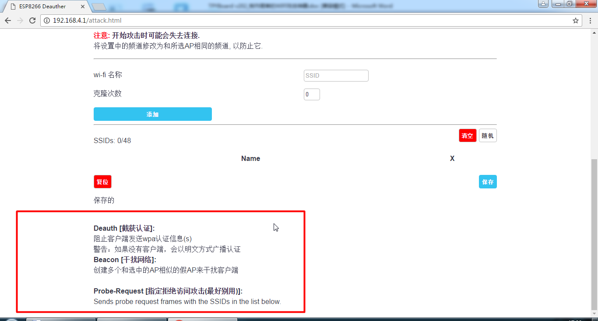
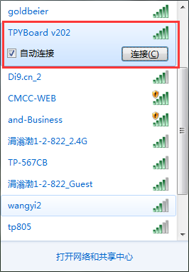
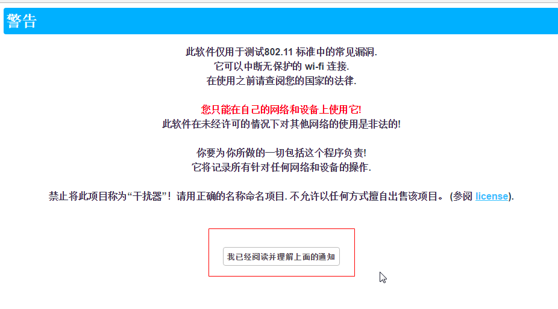
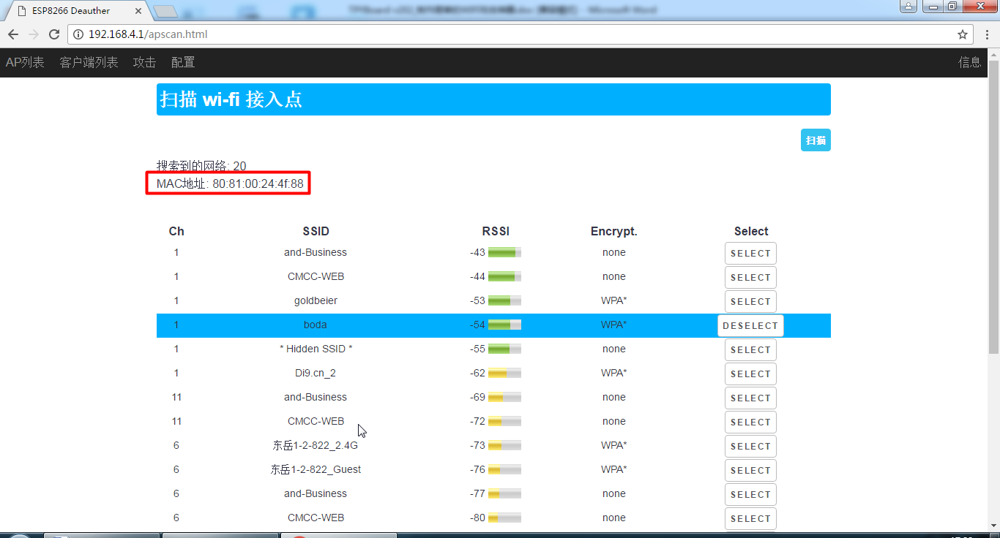

邪恶改装2：用单片机实现一次完整的wifi攻击
=======================================================

0x00 前言
----------------------

	前段时间用TPYBoard v202 做了一个简单的WIFI干扰攻击器（ps：没有看过的小伙伴，可以看一下：http://www.freebuf.com/column/136985.html），最近几天，一直在想，如何用单片机实现一次完整的wifi攻击。于是想在干扰后，是否能成功拿到wifi的登陆密码。

0x01 攻击构思
-------------------------

	利用tpyboard v202将wifi干扰的同时，将v202的ssid和信道改为与受干扰wifi相同的SSID及信道。此时，受干扰用户极有可能去连接虚假的WIFI，当用户连接后，无论用户访问哪个网络都会跳出伪装的输入密码的页面，从而诱导其写入密码。当密码写入后，v202后尝试验证密码的正确性，如果正确将停止干扰，并将密码存入TF卡，否则再次进行干扰。

0x02 搭建开发环境
---------------------------------

	- 1、首先你的需要TPYBoard v202和TPYBoard V102开发板各一块。

	- 2、网上下载了一个使用esp8266制作Deauth无线攻击的开源固件，是arduino开发的。
	
	github下载地址：https://github.com/PakchoiFood/TPYBoard-v202-v102-EvilPlans
	
	里面包含了arduino IDE（arduino-1.8.2-windows.exe）、固件源码（esp8266_wifi.rar）、TPYBoard v102的源码(TPYBoard v102.rar)和串口调试工具(XCOM V2.0.rar)。另外，还需要esp8266开发包（Arduino15-2.rar）可以从下面链接：http://pan.baidu.com/s/1pLnwz7l 下载。

	- 2、下载完毕后，解压如下：

	.. image:: images1/1.png

	esp8266_wifi.rar的固件是在上一篇【邪恶改装：TPYBoard制作廉价WIFI干扰器】的实验基础上增加了骗取WIFI密码的功能。同时使用串口和TPYBoard v102进行连接，将获取到的WIFI密码传递给v102，v102接收到正确的密码后，进行TF卡的存储，同时也记录下攻击日志。

	- 3、双击arduino-1.8.2-windows.exe 安装arduino IDE。（如果你已经安装过arduino IDE，这步可以省略）。

	- 4、安装完毕后，打开arduino,菜单找到 文件—》首选项，点击红色区域进入SDK目录。我的路径是：C:\Users\Sen\AppData\Local\Arduino15。

	.. image:: images1/2.png

	- 5、解压Arduino15-2.rar,将里面的全部内容直接覆盖C:\Users\Sen\AppData\Local\Arduino15下的文件。

	.. image:: images1/3.png

	0x03编译烧写固件
----------------------------------

	- 1、如果你对V102及V202的使用方法不熟悉，可以参考TPYBoard 官方docs网站。
	
	http://docs.tpyboard.com/zh/latest/tpyboard/tutorial/

	TPYBoard v102 源代码(main.py)::

		import pyb
		from pyb import UART

		u4=UART(4,115200)
		mkdir_='/sd/log.txt' #需先插入TF卡 新建log.txt 
		pyb.LED(2).on()
		while True:
			if(u4.any()>0):# 判断串口是否有数据
				_mag=''
				pyb.LED(3).toggle()
				f=open(mkdir_,'a')
				_data=u4.readline()#读取一行数据
				_dataMsg=_data.decode('utf-8')#将字节数据转码成utf-8 编码的字符串
				print('_dataMsg:',_dataMsg)
				#解析数据
				_index_h=_dataMsg.find('tpyboardpwd')
				_index_e=_dataMsg.find('*')
				if _index_h>-1 and _index_e>-1 and (_index_e-_index_h)>11:
					_dataMsg=_dataMsg.replace('tpyboardpwd','').replace('*','')
					print('GetPwd:',_dataMsg)
					_mag=_mag+'---------------attack log------------\r\n'
					_mag=_mag+'SSID:'+_dataMsg.split('+')[0]+'--'+'PWD:'+_dataMsg.split('+')[1]
					print('-------------------------\r\n')
					pyb.LED(4).toggle()
				if _mag!='':
					f.write(_mag)#将获取到的SSID和PWD 保存在日志文件中
				f.close()

	2、本文重点讲解TPYBoard v202的使用方法

	- （1）解压esp8266_wifi.rar，arduino IDE菜单栏 文件-》打开esp8266_wifi源码包下的esp8266_deauther\esp8266_deauther.ino
	- （2）TPYBoard v202 使用micro USB数据线接入电脑。查看安装的usb转串的端口。打开电脑的设备管理器（这里是COM44）

	.. image:: images1/4.png

	- （3）工具-》端口，选择COM44（根据自己的实际端口号选择）

	.. image:: images1/5.png

	- （4）菜单栏下面的绿色图标菜单区，选择上传，开始编译，烧写固件

	.. image:: images1/6.png

	- （5）查看最下方的日志区域

	.. image:: images1/7.png

	.. image:: images1/8.png

	等待编译完成，出现上图信息（状态：变为“上传”）时，按住FLASH的同时，按一下RST按键松开，让TPYBoard v202复位一下，继续按着FLASH,出现下面的信息时就可以松开FLASH按键了。

	.. image:: images1/9.png

0x04硬件的连接
----------------------------

	代码和程序都完成了，接下来需要将TPYBoard v102和TPYBoard v202 的串口连接起来。

	连接示意图：

	连接实物图：

	.. image:: images1/10.png

	.. image:: images1/11.png

0x05 测试效果
-------------------------

	- 1、首先用我自己家的WIFI做测试，我先用手机接入WIFI（Tend_01CB30）。
	- 2、解压XCOM V2.0.rar，解压双击运行XCOM V2.0.exe 串口助手。打开串口根据自己的选择，我的是COM44 波特率115200 其余默认，打开串口，就可以看到v202打印的信息了。
	ps：刚才v202烧写完固件后会马上自启动，所以这里先复位一下v202，按一下RST，这样我们就可以看到从开始到最后的整个过程了。

	- 3、大家可以看到，v202启动会搜索到了很多附近的WIFI，然后它就判断出那一个信号最强，我这里肯定是我家的最强了，于是v202开始攻击[Tend_01CB30] 这个WIFI，同时也会建立一个开放的[Tend_01CB30]热点。攻击时，v202上的小蓝灯会常亮。

	- 4、此时我的手机已经连接不到我原有路由器的[Tend_01CB30]的WIFI。这时，如果换成完全不知情的别人，极有可能会去手机设置里面看，怎么连接不上网络了？

	- 5、这时他就会手动去点击连接[Tend_01CB30]，当然他会发现有两个一样名字的WIFI，因为我们是Open的，所以他再连接他原有WIFI失败后，会连入到伪装的WIFI上来。

	- 6、当我们成功骗取他连接我们的WIFI后，只要打开浏览器，输入任何网址，都会自动跳转到虚假网络密码确认页面。

.. image:: images1/14.png

	- 7、测试输入12345678点击确认，串口调试助手中可以看到获取到的WIFI密码，然后停止攻击，小蓝灯会熄灭。

	- 8、同时，v202会自己先去尝试连接，来验证密码的准确性，如果连接成功的话，会自动将密码传送给v102 进行保存；如果连接失败，v202会继续进行干扰攻击。

	- 9、查看一下TF卡中的log.txt文件，是否记录了刚才破解的密码。

	（TPYBoard v102使用TF卡时，数据不会实时更新，你需要重新复位才能看到刚才更新的log.txt 的内容）

.. image:: images1/16.png

	本实验仅供学习参考。