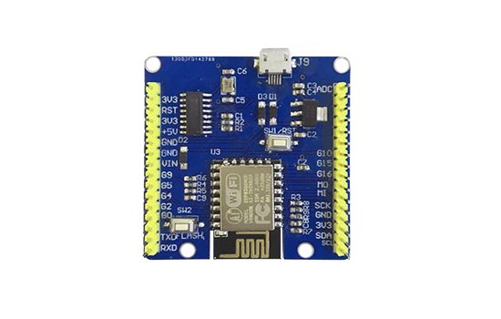
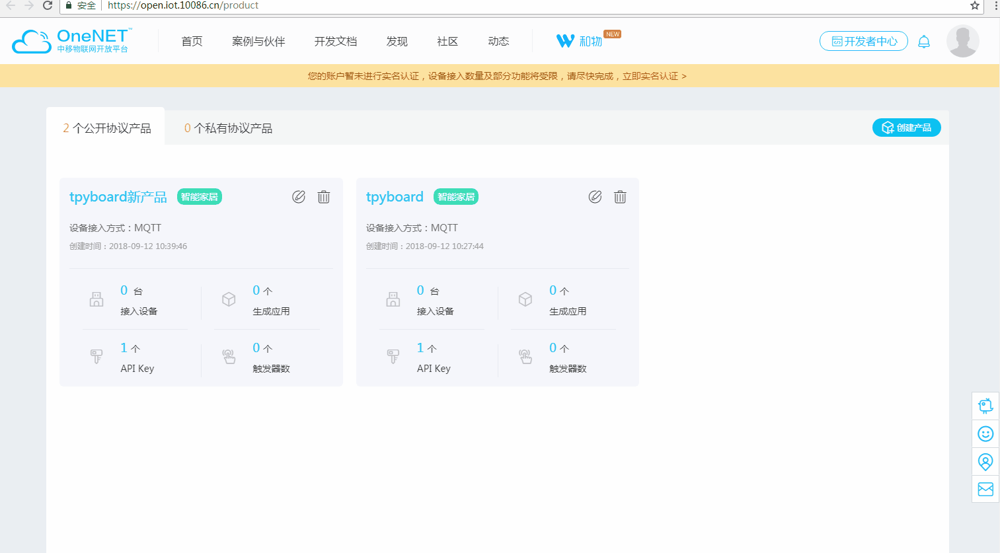
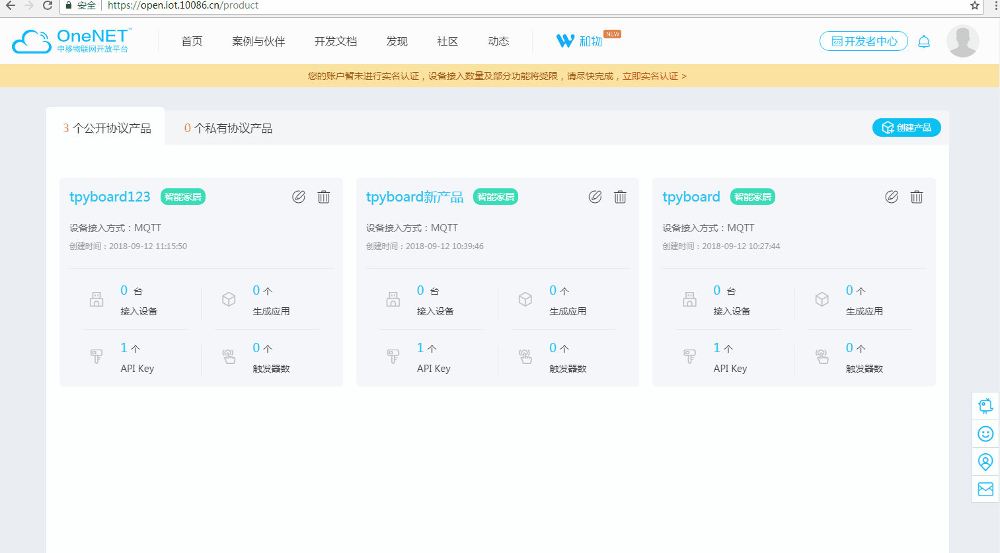
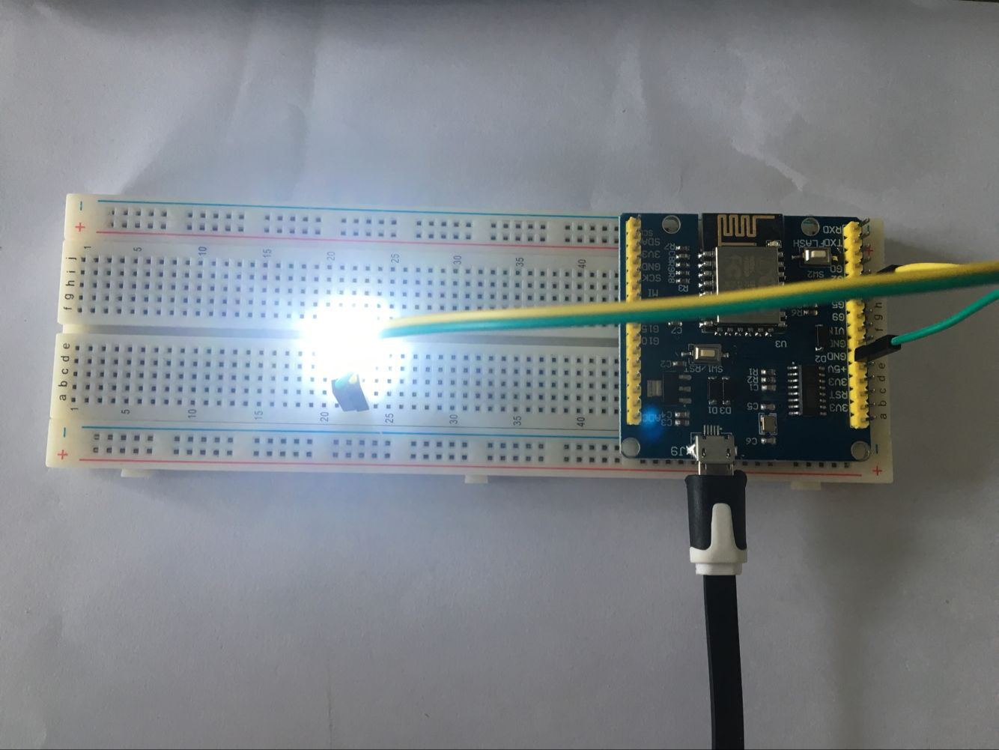
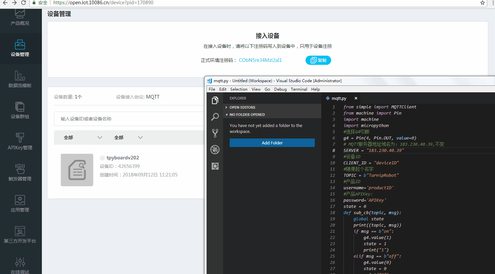
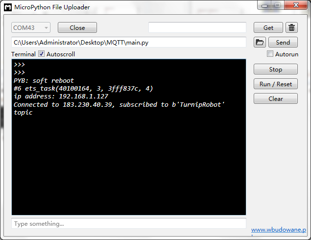
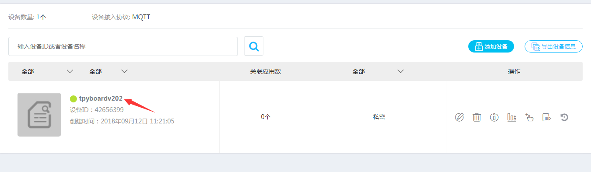
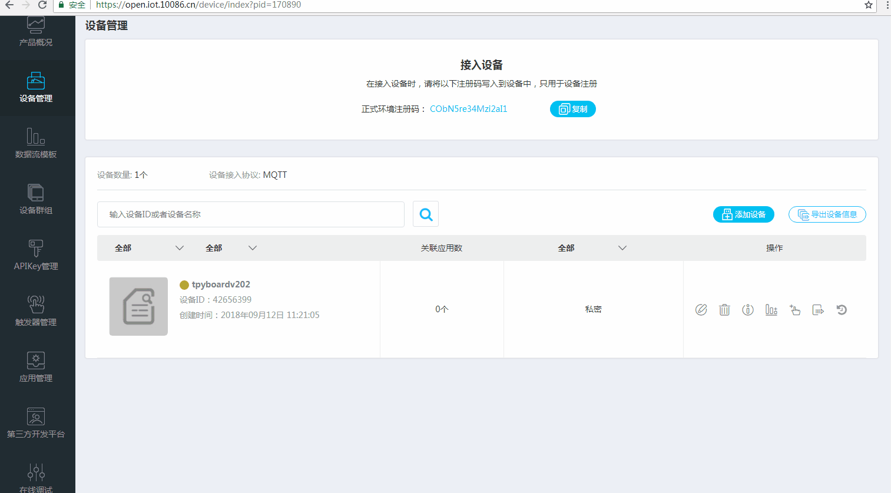

[Micropython]TPYBoard v202 MQTT协议1:接入OneNET云平台
==========================================================

版权声明：翻译整理属于TPYBoard，转载时请以超链接形式标明文章原始出处和作者信息及本声明

随着移动互联网的发展，MQTT由于开放源代码，耗电量小等特点，将会在移动消息推送领域会有更多的贡献，在物联网领域，传感器与服务器的通信，信息的收集，MQTT都可以作为考虑的方案之一。在未来MQTT会进入到我们生活的各各方面，本篇文章教大家利用TPYBoard v202使用MQTT协议接入OneNET平台，并且远程控制LED灯。

什么是MQTT协议
-----------------------------

早在1999年，IBM的Andy Stanford-Clark博士以及Arcom公司ArlenNipper博士发明了MQTT（Message Queuing Telemetry Transport，消息队列遥测传输）技术 。MQTT（Message Queuing Telemetry Transport，消息队列遥测传输）是IBM开发的一个即时通讯协议，有可能成为物联网的重要组成部分。该协议支持所有平台，几乎可以把所有联网物品和外部连接起来，被用来当做传感器和致动器（比如通过Twitter让房屋联网）的通信协议。

实验准备
-------------------------

硬件材料
>>>>>>>>>>>>>>>>>>>>>>>

- TPYBoard v202
- 面包板
- 数据线
- LED发光二极管

软件准备
>>>>>>>>>>>>>>>>>>>>

- MicroPython File Uploader  用于与开发板的文件传输

下载地址：http://www.tpyboard.com/download/tool/170.html

- 第三方库文件：micropython-lib\umqtt.simple\umqtt\simple.py

下载地址：http://www.tpyboard.com/download/data/184.html

OneNET平台创建MQTT协议的产品并添加设备。
OneNET平台官网地址：https://open.iot.10086.cn/，登录成功进入开发者中心，添加一个新产品。

在新建的产品下新建一个设备tpyboardv202。

实物接线图

我用的TPYBoard v202的G4引脚，这个引脚可以随便定义，主要看程序里你想用哪个。

编写程序
>>>>>>>>>>>>>>>>>>>>

`点击下载程序源码 <https://github.com/TPYBoard/developmentBoard/tree/master/TPYBoard-v20x-master>`_

首先，需要修改一下boot.py文件，连接上无线网络。

boot.py源码::

    #连接本地网络
    def do_connect():
        import network
        sta_if = network.WLAN(network.STA_IF)
        ap_if = network.WLAN(network.AP_IF)
        if ap_if.active():
            ap_if.active(False)
        if not sta_if.isconnected():
            print('connecting to network...')
        sta_if.active(True)
        sta_if.connect('WIFI名称','密码') #wifi的SSID和密码
        while not sta_if.isconnected():
            pass
        print('network config:', sta_if.ifconfig())
    do_connect()

修改mqtt.py中设备ID、产品ID和APIKEY参数的信息。

mqtt.py源码::

    from simple import MQTTClient
    from machine import Pin
    import machine
    import micropython
    #选择G4引脚
    g4 = Pin(4, Pin.OUT, value=0)
    # MQTT服务器地址域名为：183.230.40.39,不变
    SERVER = "183.230.40.39"
    #设备ID
    CLIENT_ID = "deviceID"
    #随便起个名字
    TOPIC = b"TurnipRobot"
    #产品ID
    username='productID'
    #产品APIKey:
    password='APIKey'
    state = 0
    def sub_cb(topic, msg):
        global state
        print((topic, msg))
        if msg == b"on":
            g4.value(1)
            state = 1
            print("1")
        elif msg == b"off":
            g4.value(0)
            state = 0
            print("0")
        elif msg == b"toggle":
            state = 1 - state
            g4.value(state)
               
    def main(server=SERVER):
        #端口号为：6002
        c = MQTTClient(CLIENT_ID, server,6002,username,password)
        c.set_callback(sub_cb)
        c.connect()
        c.subscribe(TOPIC)
        print("Connected to %s, subscribed to %s topic" % (server, TOPIC))
        try:
            while 1:
                c.wait_msg()
        finally:
            c.disconnect()

main.py源码::

    import mqtt
    mqtt.main()

simple.py文件不用更改。依次将这4个文件下载到TPYBoard v202开发板中。

效果展示
>>>>>>>>>>>>>>>>>>>>

当我们给TPYBoard v202通电或执行开始运行程序。

这个时候我们OneNET云平台上设备就会显示在线了

当我们通过页面发送指令的时候，就会看到控制台的输入。面包板上的LED状态也会相应的改变。

在这只是给大家演示了TPYBoard v202怎么用MQTT协议接入OneNET云平台，并教大家如何控制一个外围电路点亮一个LED，大家可以利用TPYBoard v202接入更复杂，更好玩的东西。

