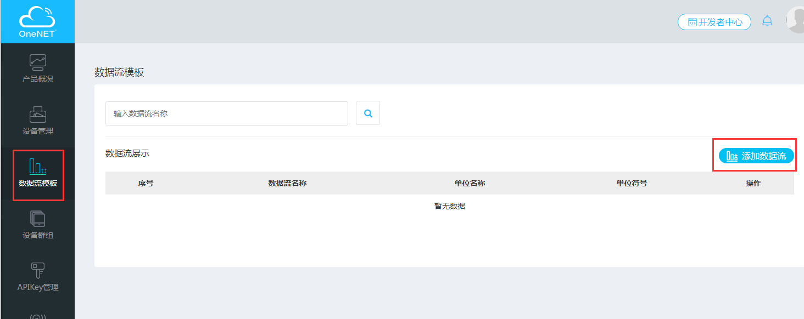
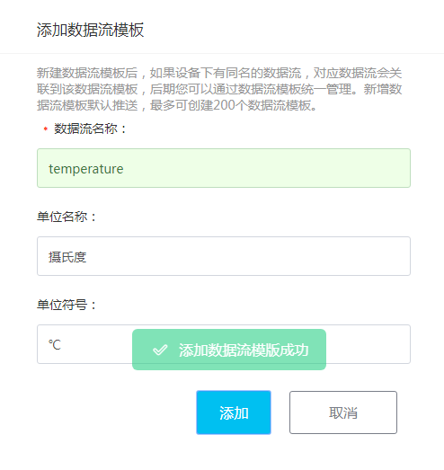
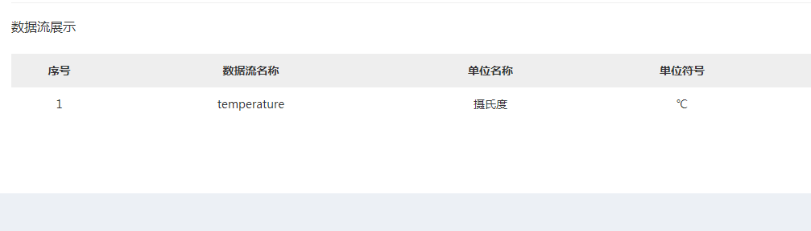
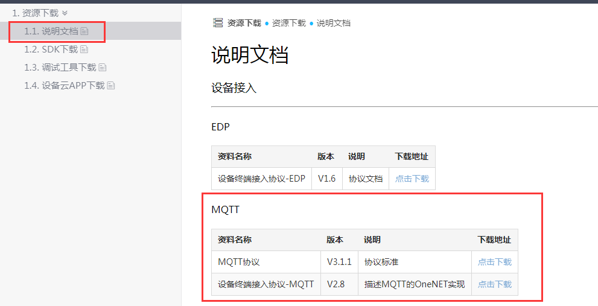
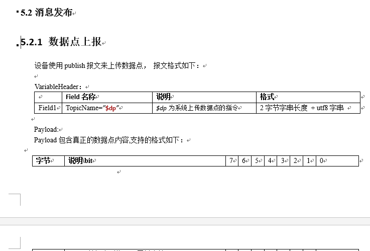
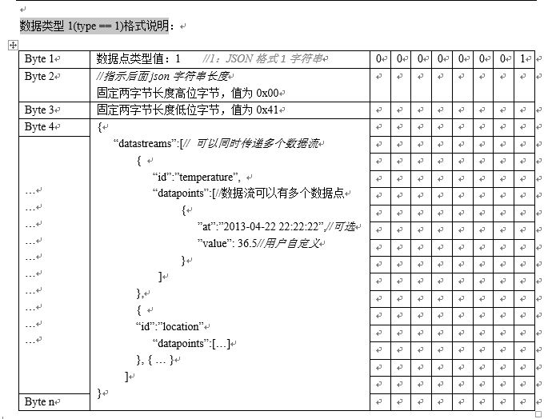
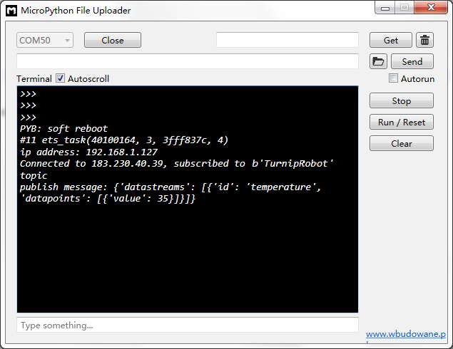
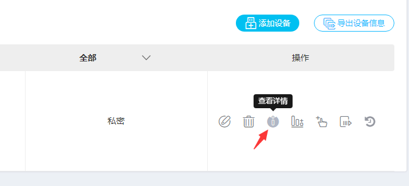
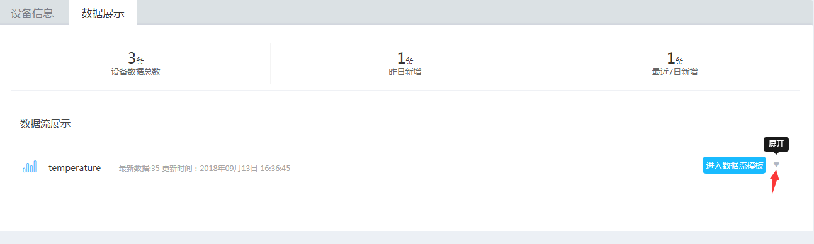
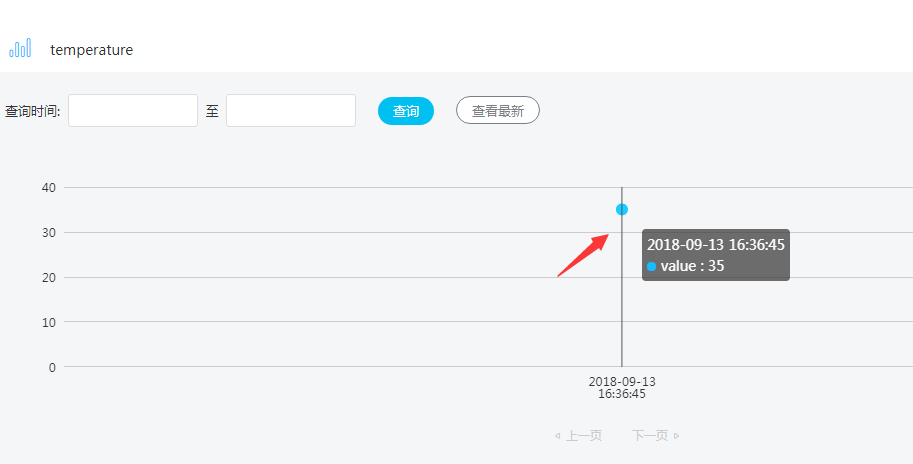

[Micropython]TPYBoard v202 MQTT协议2:上传数据点到OneNET平台
=============================================================

版权声明：翻译整理属于TPYBoard，转载时请以超链接形式标明文章原始出处和作者信息及本声明

前言
-----------------------------

在之前的教程中，学习过如何使用MQTT协议接入OneNET平台，同时获取该平台下发的命令实现远程控制的功能。若之前没有接触过MQTT协议和OneNET平台的朋友，建议先学习之前的教程，点击链接进入：http://docs.tpyboard.com/zh/latest/tpyboard/tutorial/v202/V2024/。

本次教程，将要学习如何在OneNET平台上新建数据流，同时使用MQTT协议中publish报文格式上传数据点。

准备工作
-------------------------

- TPYBoard v202开发板
- USB数据线
- NotePad ++ 软件（其他编辑工具也可以）
- MicroPython File Uploader（MFU）软件

OneNET平台新建数据流
-------------------------

OneNET平台官网地址：https://open.iot.10086.cn/。
若没有使用过的该平台的，可以参考上面前言中的教程，先进行产品和设备的添加。

在数据点上报之前，我们需要在OneNET云平台上添加一个数据流模板。步骤如下：

1、进入[开发者中心]的[设备管理]页面，在左侧菜单栏中选择[数据流模板]，点击[添加数据流]。

2、会弹出一个添加数据流的对话框，必填项名称，其他可以选填，填完之后点击[添加]。

 
3、添加成功后，对话框会自动关闭。数据流展示列表会自动增加刚才新添加的数据流信息。

到此，数据流模块就建立完成了。

向OneNET平台上传数据点
-------------------------

接下来就要进行数据点的上传了。上传数据点时需要参考协议规则说明，大家可以去OnetNET平台文档中心上下载，OnetNET平台文档中心地址：https://open.iot.10086.cn/doc/art431.html#118。
找到[1.1 说明文档]找到关于MQTT项目中的设备终端接入协议-MQTT进行下载。

 
下载的是一个word文档，打开之后找到[5.2消息发布]-[5.2.1 数据点上报]。

 
数据类型采用JSON格式，主要看[数据类型1(type == 1)格式说明]。

 
了解完publish报文格式后，找到之前[接入OneNET平台]教程的程序，添加上上传数据点的功能即可。`点击下载源程序 <https://github.com/TPYBoard/developmentBoard/tree/master/TPYBoard-v20x-master/TPYBoard%20v202%20%E5%85%B8%E5%9E%8B%E5%AE%9E%E4%BE%8B>`_

修改mqtt.py文件，如下：

.. code-block:: python

    from simple import MQTTClient
    from machine import Pin
    import machine
    import micropython
    import json

    #选择G4引脚
    g4 = Pin(4, Pin.OUT, value=0)
    # MQTT服务器地址域名为：183.230.40.39,不变
    SERVER = "183.230.40.39"
    #设备ID
    CLIENT_ID = "deviceID"
    #随便起个名字
    TOPIC = b"TurnipRobot"
    #产品ID
    username='productID'
    #产品APIKey:
    password='APIKey'
    state = 0
    #要上报的数据点
    message = {'datastreams':[{
    'id':'temperature',
    'datapoints':[{'value':35}]}
    ]}

    def pubdata(data):
        j_d = json.dumps(data)
        j_l = len(j_d)
        arr = bytearray(j_l + 3)
        arr[0] = 1 #publish数据类型为json
        arr[1] = int(j_l / 256) # json数据长度 高位字节
        arr[2] = j_l % 256      # json数据长度 低位字节
        arr[3:] = j_d.encode('ascii') # json数据
        return arr
        
    def sub_cb(topic, msg):
        global state
        print((topic, msg))
        if msg == b"on":
            g4.value(1)
            state = 1
            print("1")
        elif msg == b"off":
            g4.value(0)
            state = 0
            print("0")
        elif msg == b"toggle":
            state = 1 - state
            g4.value(state)
               
    def main(server=SERVER):
        #端口号为：6002
        c = MQTTClient(CLIENT_ID, server,6002,username,password)
        c.set_callback(sub_cb)
        c.connect()
        c.subscribe(TOPIC)
        print("Connected to %s, subscribed to %s topic" % (server, TOPIC))
        #publish报文上传数据点
        c.publish('$dp',pubdata(message))
        print('publish message:',message)

        try:
            while 1:
                c.wait_msg()
        finally:
            c.disconnect()

**程序解析**

.. code-block:: python

    def pubdata(data):
        j_d = json.dumps(data)
        j_l = len(j_d)
        arr = bytearray(j_l + 3)
        arr[0] = 1 #publish数据类型为json
        arr[1] = int(j_l / 256) # json数据长度 高位字节
        arr[2] = j_l % 256      # json数据长度 低位字节
        arr[3:] = j_d.encode('ascii') # json数据
        return arr

我们自定义一个pubdata方法，该方法的功能是组合成协议要求的报文格式。
::

    c.publish('$dp',pubdata(message))
    
设备使用publish报文来上传数据点。$dp为系统上传数据点的指令（2个字节的字符串）。

效果展示
-------------------

点击运行TPYBoard v202的程序

找到设备管理页面，在tpyboardv202设备信息的操作列中，点击[查看详情]。
 

选择[数据展示]，

.. image:: img/09.png
 
选择数据流[temperature]信息行的最右侧展开小三角，查看详细数据点。

大家可根据上面学习到的内容进行扩展，比如接DHT11温湿度模块等各类传感器，上传温湿度、气压、光照等信息。
OneNET云平台除了支持MQTT协议外，还支持HTTP、TCP透传等多种协议，大家可以尝试添加其他协议的产品进行智能物联的开发。

