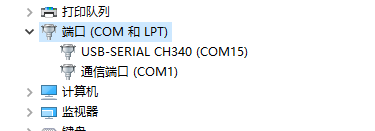
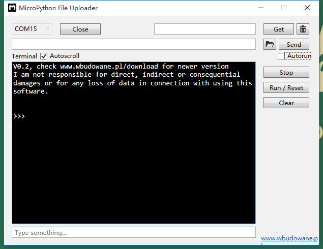
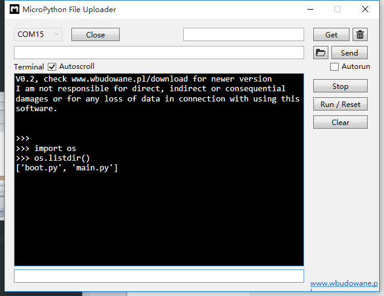

[Micropython]TPYBoard v202 文件查看与修改
========================================================

版权声明：翻译整理属于TPYBoard，转载时请以超链接形式标明文章原始出处和作者信息及本声明

前言
--------------

TPYBoard(Micropython)开发板上有搭建的文件系统，但是TPYBoard v202与TPYBoard v102有所不同，v202没有USB驱动器，所以只能通过串口或者Wifi方式访问。

简单命令的介绍
------------------------

显示文件列表
通过串口访问文件的方法，通过os列出当前目录下的文件和目录：

>>> import os
>>> os.listdir()
['boot.py', 'demos', 'drive', 'main.py']

查看当前目录

>>> os.getcwd()

改变当前目录

>>> os.chdir()

创建目录

>>> os.mkdir("demos")
os.mkdir("demos")

命令就是创建一个demos的目录，档执行os.listdir()时会显示['boot.py', 'main.py', 'demos']说明已经在开发板中建立了一个demos的目录。

删除指定文件

>>> os.remove()

删除指定目录

>>> os.rmdir()

查看和修改文件
-----------------------------------------

打开设备管理器，查看TPYBoard v202对应的端口号，这里的为COM15。

首先打开MicroPython File Uploader（简称MFU）工具，选择对应的端口号，点击Open。

.. image:: image4/1.png

这时，点击Stop按钮停止现有程序的运行，当出现>>>提示符时，就说明未运行程序，可手动输入代码执行。
（若点击一次未出现，再点击一次即可）

工具底部输入框中输入查看文件的代码，回车执行。每次输入一行后执行即可。

想要修改文件的话，就直接Send相同文件名的即可，它会覆盖掉之前的文件。