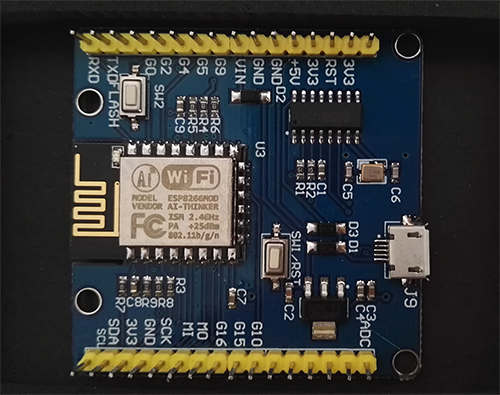

[Micropython]TPYBoard v202 GPIO的使用
====================================================

版权声明：翻译整理属于TPYBoard，转载时请以超链接形式标明文章原始出处和作者信息及本声明

实验目的
--------------

- 学习在PC机系统中GPIO（General Purpose I/O Ports，即通用输入/输出端口）的使用方法
- 学会用TPYBoard v202开发板读取GPIO的电平值，控制板载的LED点亮/熄灭

准备工作
----------------

- TPYBoard v202开发板 1块
- micro USB数据线 1条
- 电脑 1台（本次实验以win7为例）
- 所需软件 MicroPython File Uploader

GPIO的介绍
----------------------

GPIO（General Purpose I/O Ports）意思为通用输入/输出端口，通俗地说，就是一些引脚，可以通过它们输出高低电平或者通过它们读入引脚的状态-是高电平或是低电平。

通过上图大家可以看到开发板上的ESP8266模块上有一个蓝色的LED灯，它与板子的G2引脚相连。当控制G2输出低电平时，LED点亮，反之熄灭。开发板上有两个按键，RST按键和FLASH按键。

- *RST按键* ：复位按键，用于开发板的硬复位

- *FLASH按键* ：FLASH按键，主要与RST按键搭配使用，使开发板进入烧录模式，与G0引脚相连。

TPYBoard v202开发板支持MicroPython开发，同时也只支持Lua语言开发。为了方便大家使用，下表列举了TPYBoard v202开发板上的引脚编号与NodeMCU、MicroPython之间的对应关系。

+----------------+-------------+-------------------+---------------+
| TPYBoard v202  | MicroPython | ESP8266模块 GPIO  | NodeMCU GPIO  |
+================+=============+===================+===============+
| G0             | 0           | GPIO 0            | 3             |
+----------------+-------------+-------------------+---------------+
| G2/SDA/LED     | 2           | GPIO 2            | 4             |
+----------------+-------------+-------------------+---------------+
| G4             | 4           | GPIO 4            | 2             |
+----------------+-------------+-------------------+---------------+
| G5             | 5           | GPIO 5            | 1             |
+----------------+-------------+-------------------+---------------+
| G9             | 9           | GPIO 9            | 11            |
+----------------+-------------+-------------------+---------------+
| G10            | 10          | GPIO 10           | 12            |
+----------------+-------------+-------------------+---------------+
| G15            | 15          | GPIO 15           | 8             |
+----------------+-------------+-------------------+---------------+
| G16            | 16          | GPIO 16           | 0             |
+----------------+-------------+-------------------+---------------+
| MO             | 13          | GPIO 13           | 7             |
+----------------+-------------+-------------------+---------------+
| MI             | 12          | GPIO 12           | 6             |
+----------------+-------------+-------------------+---------------+
| SCK/SCL        | 14          | GPIO 14           | 5             |
+----------------+-------------+-------------------+---------------+
| TXD(REPL UART0)| UART0 TXD   | TXD               | 10/TX         |
+----------------+-------------+-------------------+---------------+
| RXD(REPL UART0)| UART0 RXD   | RXD               | 9/RX          |
+----------------+-------------+-------------------+---------------+

可用于GPIO操作的引脚有：G0,G2,G4,G5,G12,G13,G14,G15,G16，其中G16是一个特殊的引脚，用于从深度睡眠模式唤醒模块。还需要注意一点，开发板上只要一个串口，引出USB虚拟串口用于REPL操作，当你需要使用串口时，应注意避免冲突。

实验方法
-----------------

第一步：下载安装所需的软件--MicroPython File Uploader 工具（以下简称MFU）

`MFU下载 <http://tpyboard.com/download/tool/170.html>`_

第二步：连接TPYBoard v202开发板

通过USB数据线将电脑和TPYBoard v202开发板连接起来，查看设备管理器，是否正确创建端口号。打开MFU工具，选择对应的端口号，点击Open。

第三步：下载程序

在本地新建一个main.py文件，在main.py文件中输入以下源代码的内容，使用MFU工具将程序下载到TPYBoard v202开发板中。
``下载前，请先停止运行程序。``

源代码
----------------

.. code-block:: python

	from machine import Pin
	import time

	p2 = Pin(2, Pin.OUT)    # 创建一个引脚对象p2，使用GPIO2（G2）引脚，输出模式
	p2.value(1)             # 设置引脚输出高电平，即板载蓝色LED熄灭

	while True:
	  p2.value(0)           # 设置引脚输出低电平，即板载蓝色LED点亮
	  print(p2.value())     # 读取引脚的电平值，并打印
	  time.sleep(3)         # 延时3秒
	  p2.value(1)
	  print(p2.value())
	  time.sleep(3)

第四步：运行程序查看效果

点击MFU工具的Run/Reset，重新运行程序，或者按下板载的RST按键都可以。运行新程序后，你会看到板载的蓝色LED灯会每隔3秒亮灭一次，并一直循环下去。

- `下载源码 <https://github.com/TPYBoard/TPYBoard-v202>`_
