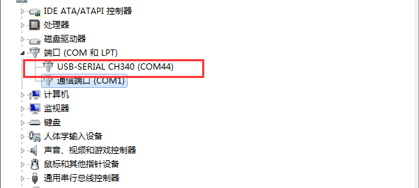
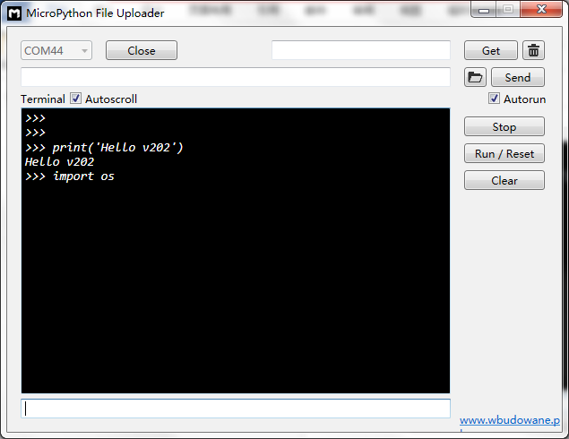
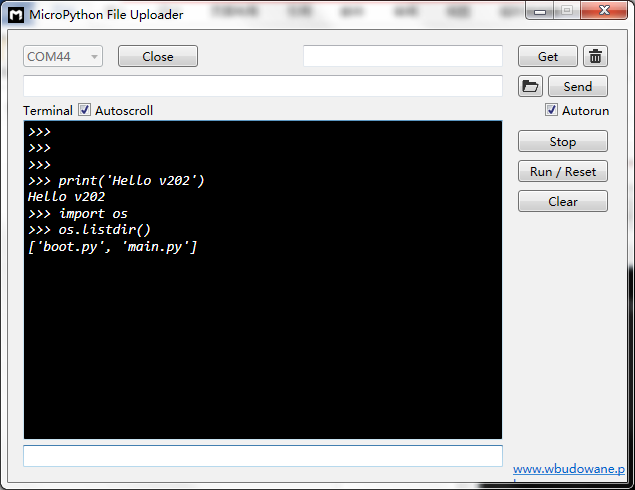
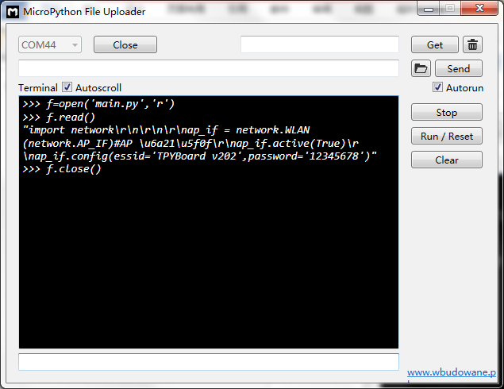
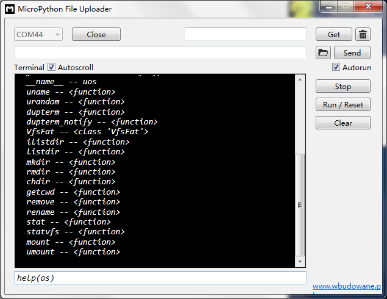

[Micropython]TPYBoard v202 快速入手教程
=============================================================================

版权声明：翻译整理属于TPYBoard，转载时请以超链接形式标明文章原始出处和作者信息及本声明

前言
----------------------

当你第一次接触TPYBoard v202时，或许有些疑惑，不知道该如何使用它。不用担心，当你认真阅读完本篇文章后，保证你用起来游刃有余。

初次见面
----------------------

    - 正面指示图

    .. image:: images/001.png

    
    - 反面实物图
    
    .. image:: images/002.png
 

初次见到TPYBoard v202（以下简称v202）时，我们首先通过micro接口的USB数据线（android手机数据线）将v202接入电脑。

一般情况下，电脑会自动安装v202所需的驱动（以windows系统为例），安装完毕后，我们可以在设备管理器中，看到如下：
 

也有可能有的小伙伴的电脑，不能自动安装时，请点击连接自行安装。

`CH34x驱动下载 <http://tpyboard.com/download/drive/163.html>`_

 

深入了解
----------------------

TPYBoard v202与TPYBoard v102有所不同，v202没有USB驱动器，所以在电脑上我们看不到像v102似得加载的可移动磁盘。

我们需要一些工具，将程序下载到v202 的Flash中并运行。本次主要介绍MicroPython File Uploader 工具（以下简称MFU）`MFU下载 <http://tpyboard.com/download/tool/170.html>`_。

 - 双击运行MicroPython File Uploader.exe
 
 .. image:: images/2.png
 
此软件需要.NET Framework 4.2 及以上版本，若打开失败，请安装.NET Framework后再使用。

`.NET Framework 4.5下载 <http://www.tpyboard.com/download/drive/174.html>`_

 - 通过设备管理器可以看到COM编号，我的是COM44，所以选择COM44，点击【Open】打开串口。

 .. image:: images/3.png 

 - 按一下v202上的RST键进行复位。
 
 .. image:: images/4.png 

 我们看到了一些打印的信息，不过都是乱码，这是v202内部的编码格式与工具有些不兼容，不过不用担心，一点都不影响我们的开发调试。

 - 我们v202出厂时，会自带一个呼吸灯的程序，大家此时可以仔细观察一下板子上的小蓝灯，它会是暗到亮，亮到暗一直循环变化。

 - 接下来我们在电脑上新建一个main.py 文件，将main.py下载到v202中。

main.py 源码

.. code-block:: python

import network

#将v202设置成AP模式
ap_if = network.WLAN(network.AP_IF) 
#激活接口
ap_if.active(True)
#开放WIFI。名称:TPYBoard v202 密码:12345678
ap_if.config(essid='TPYBoard v202',password='12345678')

 - 点击右侧菜单区的文件夹图标按钮，选择我们刚才新建的main.py文件。然后点击【Send】按钮，下载程序完毕后，自动运行。（Autorun取消选择则不自动运行）

 - 大家这时就可以搜索到名为“TPYBoard v202”的WIFI，并可以成功连接。

相处与调试
----------------------

:MFU工具的调试菜单栏中每个按钮的功能介绍

 - Send：将选中的文件，下载到模块的Flash中。
 - Stop：中止程序运行。
 - Run/Reset：开始运行或复位重启。
 - Clear：清空输出区打印的信息。

 
 - 当程序停止运行时，信息输出区会出现>>>的符号。
 
 .. image:: images/5.png
 
 - 这时我们可以在命令输入区内输入单句代码，进行单步调试。
 
我们先输入一句简单的print (‘Hello v202’) 回车发送执行。
 
 .. image:: images/6.png
 
 

文件查看
----------------------

接下来我们来看一下v202的Flash中存储了哪些文件。

 - 接着上一步，我们继续输入。

.. code-block:: python

import os

首先我们导入文件操作类os。

.. code-block:: python

os.listdir()

列举当前目录下所有的文件

 
.. code-block:: python

f=open(“main.py”, “r”)
f.read()
f.close()

以只读的方式打开main.py文件，读取全部内容。（文件操作时记得close关闭资源）

.. code-block:: python

help(os)

help函数可以查看os类库中包含的所有函数，方便开发使用。

到此就介绍完毕了，大家可以继续学习参考接下来的文章，里面有详细的类库介绍和有趣的实验例程。
