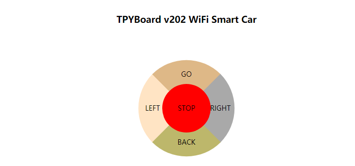

[Micropython]TPYBoard v202 智能WIFI远控小车
=============================================================================

前言
----------------------

之前有过用TPYBoard v102制作的各种各样功能的智能小车，比如自动寻迹、自动避障、手机蓝牙遥控等。想着还缺个WIFI控制的，那就用TPYBoard v202做一个吧。

设计思路
-------------------------

WIFI是目前最有广泛运用的一项无线网络传输技术，覆盖范围广，可远程。本次实现了远程WIFI控制，不仅可以在家里操作，还可以接入一些云平台，实现远程操控。具体思路如下:

1、TPYBoard v202作为整个小车的核心控制部分，连接L298N电机驱动模块，实现小车的基本方向控制；

2、TPYBoard v202接入网络，开启Socket服务实现web服务器功能；

3、手机接入同一局域网，可通过浏览器访问控制页面，进行小车控制。

所需器件
---------------------------------

- TPYBoard v202开发板 1块
- USB数据线（MicroUSB） 1条
- L298N电机驱动模块 1个
- 小车套件包（底板、电机等） 1个
- 18650电池 2节
- 18650电池盒 1个

程序源码
----------------------------------

TPYBoard v202 源代码(main.py)

.. code-block:: python

    import socket                 #导入socket通信库
    import machine
    from machine import Pin

    g4 = Pin(4,Pin.OUT)
    g5 = Pin(5,Pin.OUT)
    g12 = Pin(12,Pin.OUT)
    g13 = Pin(13,Pin.OUT)

    def Go():
        g4.value(1)
        g5.value(0)
        g12.value(1)
        g13.value(0)
    def Back():
        g4.value(0)
        g5.value(1)
        g12.value(0)
        g13.value(1)

    def Left():
        g4.value(1)
        g5.value(0)
        g12.value(0)
        g13.value(0)
    def Right():
        g4.value(0)
        g5.value(0)
        g12.value(1)
        g13.value(0)
    def Stop():
        g4.value(0)
        g5.value(0)
        g12.value(0)
        g13.value(0)
    #-----------------------HTTP Server-----------------------#
    #ap模式下，默认ip地址为192.168.4.1
    addr = ('192.168.4.1',80) #定义socket绑定的地址，ip地址为本地，端口为80
    s = socket.socket()     #创建一个socket对象
    s.bind(addr)            #绑定地址
    s.listen(5)             #设置允许连接的客户端数量
    print('listening on:', addr)
    while True:
        cl, addr = s.accept() #接受客户端的连接请求，cl为此链接创建的一个新的scoket对象，addr客户端地址
        print('client connected from:', addr)
        cl_file = cl.makefile('rwb', 0) #返回与socket对象关联的文件对象。rwb:支持二进制模式的读写操作 0:默认值，不支持缓存
        req = b''
        while True:
            line = cl_file.readline() #读取发送过来的数据，直到\r\n换行结束
            if not line or line == b'\r\n':
                break
            req += line
        print("Request:")
        req=req.decode('utf-8').split('\r\n')
        #http header 解析
        req_data=req[0].lstrip().rstrip().replace(' ','').lower()
        print(req_data)
        if req_data.find('favicon.ico')>-1:
            cl.close()
            continue
        else:
            req_data=req_data.replace('get/?','').replace('http/1.1','')
            index = req_data.find('key=')
            value = req_data[index+4:index+6].lstrip().rstrip()
            print('key:',value)
            if value == 'go':
                Go()
            elif value == 'ba':
                Back()
            elif value == 'le':
                Left()
            elif value == 'ri':
                Right()
            else:
                Stop()
        with open("control.html", 'r') as f:
            for line in f:
                cl.send(line)
        #cl.send(response)   #返回html网页的数据
        cl.close()          #关闭socket

硬件的连接
----------------------------

+---------------+-------------------+
| TPYBoard v202 | L298N电机驱动模块 |
+===============+===================+
| VIN           |  +5V              |
+---------------+-------------------+
| GND           |  GND              |
+---------------+-------------------+
| G5            |  IN1              |
+---------------+-------------------+
| G4            |  IN2              |
+---------------+-------------------+
| G13(MO)       |  IN3              |
+---------------+-------------------+
| G12(MI)       |  IN4              |
+---------------+-------------------+

+--------------------+-------------------+
| 两侧电机           | L298N电机驱动模块 |
+====================+===================+
| 车头朝前，右侧电机 |  OUT1,OUT2        |
+--------------------+-------------------+
| 车头朝前，左侧电机 |  OUT3,OUT4        |
+--------------------+-------------------+

*注：电机不分正负极，怎么接都可以，只不过就是正转和反转的问题。若在调试中电动转动方向不对，你可以修改程序或者将接线调换*

+-------------------+-------------+
| L298N电机驱动模块 | 电池盒      |
+===================+=============+
| +12V              | 正极(红线)  |
+-------------------+-------------+
| GND               | 负极(黑线)  |
+-------------------+-------------+

*注：可在电池正极与电机驱动之间外接一个按键开关模块，这样可以增加一个总开关功能。*

网页效果
-------------------------

    
    
演示效果
-------------------------

`点击观看视频 <http://mpvideo.qpic.cn/0bf2hqaaeaaaveaa3ui5h5pfapgdai6aaaqa.f10002.mp4?dis_k=75bc9f531e0fe018cfc344a63c5fdc1d&dis_t=1579070805>`_