使用Visual Studio Code进行MicroPython编程
===============================================

Visual Studio Code(以下简称VSCode)是一个轻量且强大的跨平台开源代码编辑器（IDE），支持Windows，OS 
X和Linux。内置JavaScript、TypeScript和Node.js支持，而且拥有丰富的插件生态系统，可通过安装插件来支持 
C++、C#、Python、PHP等其他语言。

准备工作
------------------
 - **TPYBoard v102 一块**
 - **可访问网络的Windows系统的电脑（本文以win10为例）**
 - **已安装VSCode编辑器**

*VSCode的相关地址*

官网地址 `https://code.visualstudio.com/ <https://code.visualstudio.com/>`_

GitHub地址 `https://github.com/Microsoft/vscode <https://github.com/Microsoft/vscode>`_

VSCode IDE下载 `https://code.visualstudio.com/?wt.mc_id=vscom_downloads <https://code.visualstudio.com/?wt.mc_id=vscom_downloads>`_

安装Pycom插件
---------------------------

Pycom插件需要node.js依赖项，所以先要安装node.js。`下载地址 <https://nodejs.org/en/>`_
安装完成后，通过CMD命令查看node版本号来确定是否安装成功。

.. code-block::c

    node -v
    
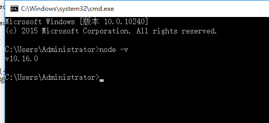

打开VSCode，点击左侧菜单栏 *Extensions* 扩展图标，进入插件搜索界面。

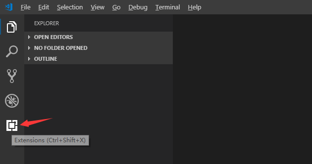

输入 *Pymakr* 进行相关插件搜索，点击 *Install* 进行安装。

.. image:: img/vs1.gif

安装完毕后，关闭VSCode。将TPYBoard v102插入电脑，设备管理器中确认是否已成功加载端口。

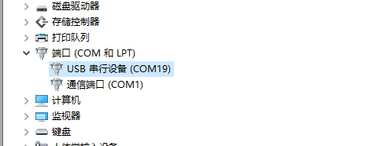

默认会自动打开 *pymakr.json* 配置文件，我们需要进行修改。软件下面的控制台也控制连接板子的REPL端口。

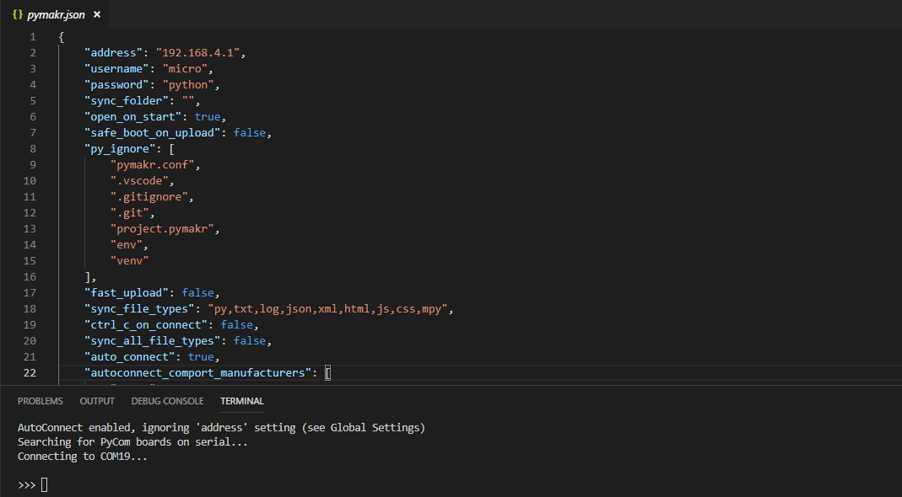

接下来把配置文件简化些，保留需要的部分。*pymakr.json* 配置文件内容如下：

.. code-block::c

    {
    "address": "COM19",
    "username": "micro",
    "password": "python",
    "sync_folder": "/flash",
    "open_on_start": false,
    "sync_file_types": "py,txt,log,json,xml,html,js,css,mpy",
    "ctrl_c_on_connect": false,
    }

Pycom插件：https://marketplace.visualstudio.com/items?itemName=dphans.micropython-ide-vscode

如何使用
---------------

每次启动VSCode时Pycom Console都会自动打开并去连接你设置的端口。

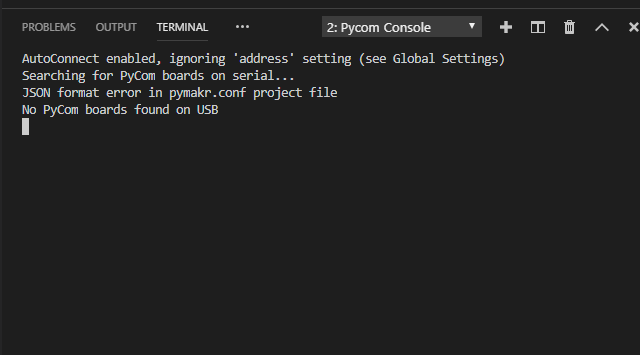

这时，插上开发板后会自动连接。REPL调试与PuTTY用法一样，CTRL+C：停止运行程序 CTRL+D：重新运行程序（软复位）。

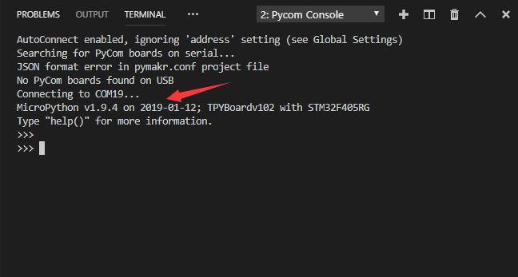

接下来，说明下文件下载功能的使用方法。首先，在VSCode左侧的资源管理中新建一个目录创建一个工程，新建一个main.py文件。

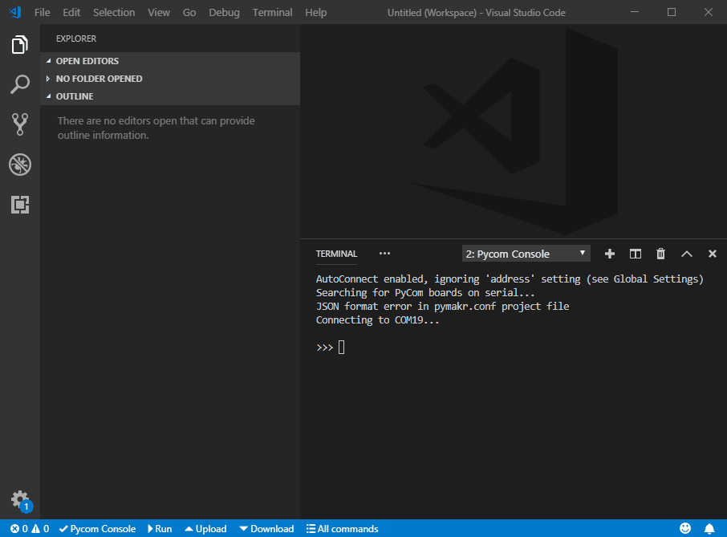

写一段简单的控制板载LED的程序用于测试。编写代码时，VSCode会提示错误，这是因为在我们本地没有pyb库，所以错误可以忽略，不影响功能。

.. code-block::python

    from pyb import LED
    
    for i in range(5):
        LED(4).toggle()
        print('-----',i,'-----')
        pyb.delay(350)

VSCode工具底部蓝色区域，有关于Pycom插件的几个快捷功能。

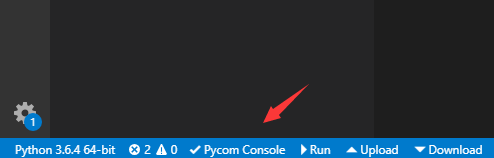

- Pycom Console:打开或关闭与板子的链接

- Run：运行当前文件

- Upload：上传工程文件到板子里

- Download：下载板子里的工程文件

点击 *Run* 运行当前的main.py，注意这只是运行一遍而已，并不会把main.py里的代码存储到开发板的FLASH中。

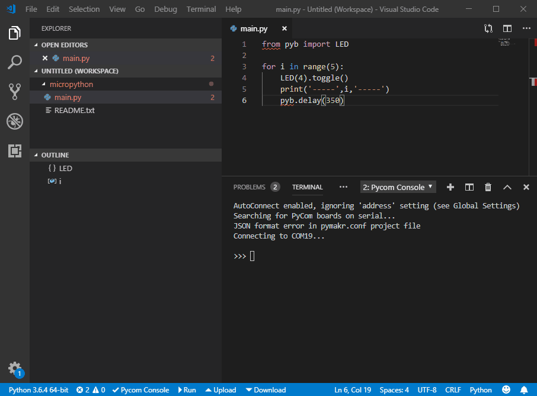

点击 *Upload* 将main.py上传到板子里，上传完毕后板子会自动重启并运行新的程序。这时会提醒你端口断开，不过它会自动连接的。

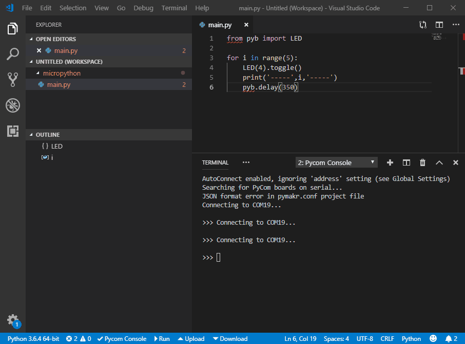

接下来试一下 *Download* 的功能，点击后它会提醒你发现了两个文件，是否只下载当前的文件还是全部下载。出现这个提示是因为板子里还有一个boot.py文件。选择那个都可以，这里我们选择全部下载。

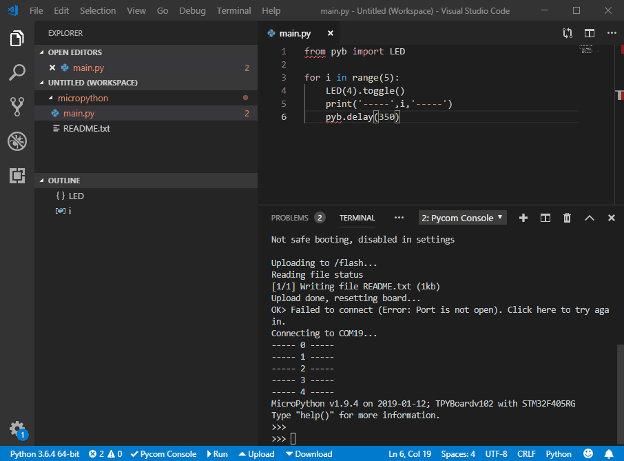

上面操作执行完毕后，链接断开了并没有自动连接上，出现了这样的提示 **> Failed to connect (Error: Port is not open). Click here to try again.** ，这时点击下 *Pycom Console* 就可以了。

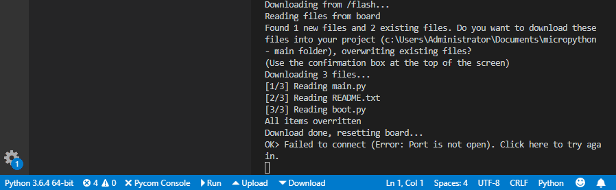

使用评价
------------------------

总体来说，还是挺不错的，不仅可以上传文件还可以下载。就是每次操作后，都会进行一次硬件复位，端口断开再重连，感觉不太友好。虽然我们在使用micropython中的模块时没有代码提示补全等功能，但是可以去安装Python插件，至少使用Python语法时会比较方便。
 

